<script type="text/javascript" async src="https://cdnjs.cloudflare.com/ajax/libs/mathjax/3.2.2/es5/tex-mml-chtml.min.js">
</script>
<script type="text/x-mathjax-config">
 MathJax.Hub.Config({
 tex2jax: {
 inlineMath: [['$', '$'] ],
 displayMath: [ ['$$','$$'], ["\\[","\\]"] ]
 }
 });
</script>

# マシニングデータ作成
## NCVCのインストール
  講習フォルダ&rarr;マシニング&rarr;ncvc415\_install64をインストール<br>
  (32bitの場合は[https://k-magara.github.io/](https://k-magara.github.io/)からダウンロードする)

## Solidedge側のデータ作成 (ドラフト)
### テンプレートの導入
1. マシニングフォルダ内にある「clear」 (もしくは「jis metric draft _mine」 )
という名前のファイルをコピーする．
2. エクスプローラーを開き，テンプレートが入っている JIS Metric というフォルダを開く．<br>
そのフォルダはPC&rarr;OS(C:)&rarr;Program Files&rarr;Siemens&rarr;Solid Edge 20XX (20XXは使用しているSolidedgeのバージョン)&rarr;Template&rarr;JIS Metricにある．<br>
その中にコピーしたファイルをペーストする．<br>

!!! Tip 
      ファイルパスは C:\Program Files\Siemens\Solid Edge 20XX\Template\JIS Metric である.<br>

3. Solidedgeを開いて新規作成の中にclear\_dft (もしくは「jis metric draft _mine\_dft」 )
が追加されていたら成功．

### データ作成
 
&uarr; データ作成の流れ．この操作の解説を行う．

 1. clear\_dftを開いて,切削したい板のパーツデータをドラフト上にドラッグする．このとき,尺度を1:1にする．
 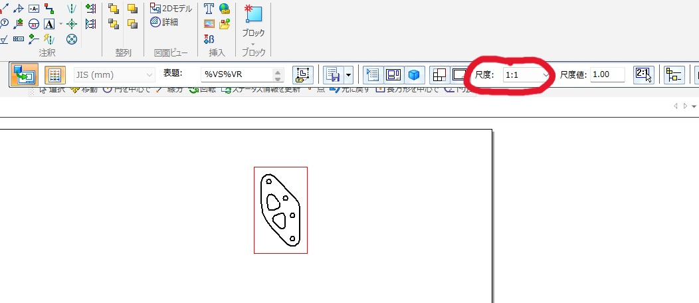

 1. レイヤに線を引いていく．ここで描いた点や線をMCがなぞる．そのため，**ここで間違えるとドリルやエンドミルを折る可能性があるため注意**．以下の順に描いていく．
    
    (1)  レイヤのCAM1をダブルクリックで選択する．これで「CAM1」というレイヤに線を描くことができる．
     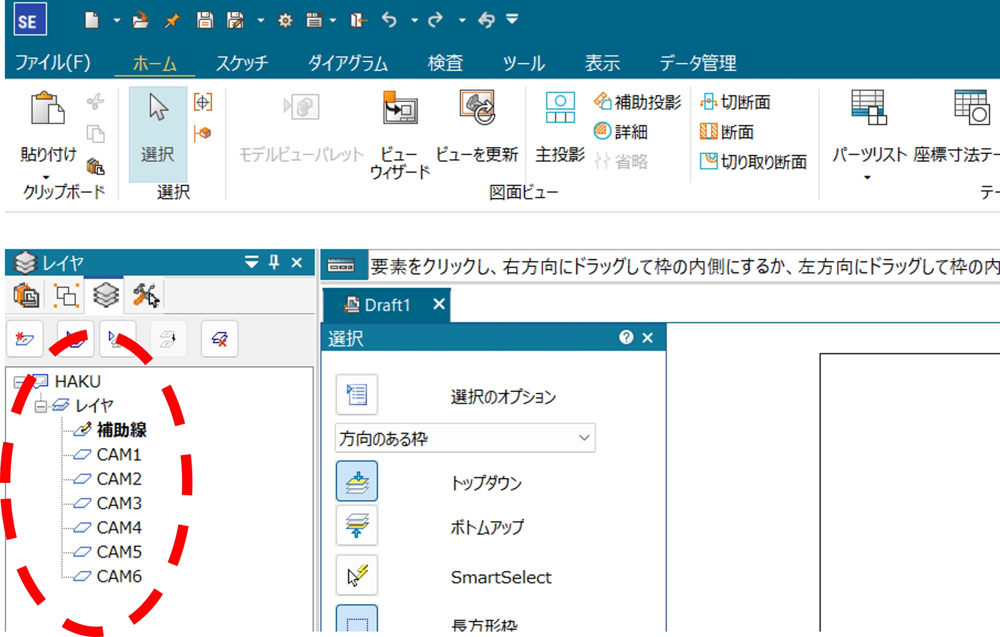<br><br>

    (2) 「スケッチ」の「線分」の下の小さな三角を押してから出てくる「点」を選び,ネジ穴をあける円の**中心に**点を描く．稀にずれるので注意．
     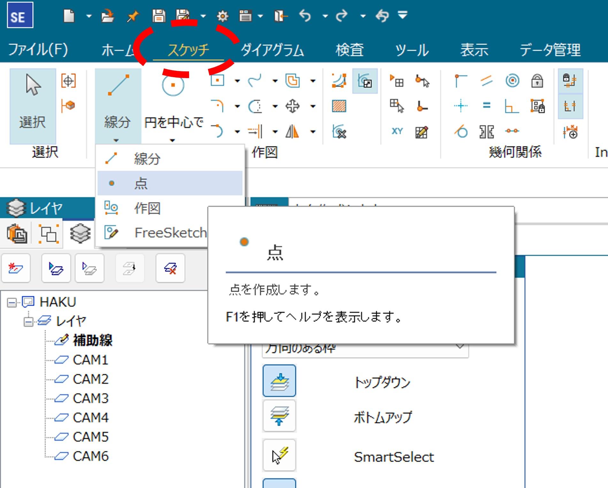<br><br>

    (3) <font color="red">**CAM2を選択する**</font>．**ここで選択するのを忘れるとドリルを折るため注意！**<br>
    スケッチの「オフセット」を選び,距離を1.47(または1.475 or 1.48 etc.)にしてパーツの<font color="red">外周以外の肉抜き部分を内側に描く</font>.
    
    !!! Danger
          外側の線を先に書くと加工する際に板が吹き飛んでエンドミルを折る可能性がある．そのため，<font color="red">**線は必ず内側から書くこと**</font>．
    
    !!! Tip
          このオフセットの値には様々な流派がある．このオフセットの値を大きくすると（例えば1.485）加工後の板に開いた穴が小さくなり，逆に小さくすると（例えば1.47）穴が大きくなる．そのため，ベアリングをはめる場合などに値が大きすぎるとはまらなくなり，逆に値が小さすぎるとがばがばになる．ちょうどいい値を探そう！

    (4) **CAM3を選択し**，オフセットでパーツの**外周を**外側に描く．


    (5) 「補助線」を選択し，元のパーツのビューを消す．<br>
    
    - オフセットは左クリックでオフセットしたい箇所を選択&rarr;右クリック&rarr;内側か外側を選んで左クリック&rarr;右クリックで完了とすると早い．左！右！左！右！
    - レイヤ ( 「レイヤ」，「CAM1」，「CAM2」など)にカーソルを合わせて右クリックすると「非表示」や「選択のみ表示」，「レイヤをすべて表示」などがあるので，それを利用してレイヤの確認を行うことができる．
    
    <br>

3. 複数パーツある場合はなるべくパーツ間の隙間が空かないように（外周の線は重なっても良いがトリムで消すのを推奨）並べ(下図),dxfファイルに変換する

 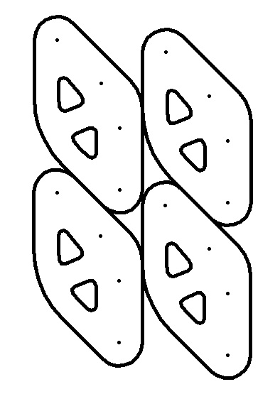


## NCVCでのデータ作成

1. NCVCを開き，NCVCで先ほど作成したdxfファイルを開く．dxfファイルからNCVCを開いてもOK．

2. エラーが出るがOKを押す
 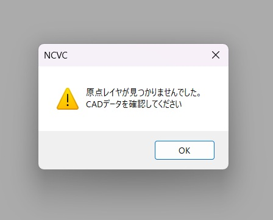


4. 左上の「編集」の「原点調整」から左上に設定する．OKを押すと左上に赤いプラスが表示される．
 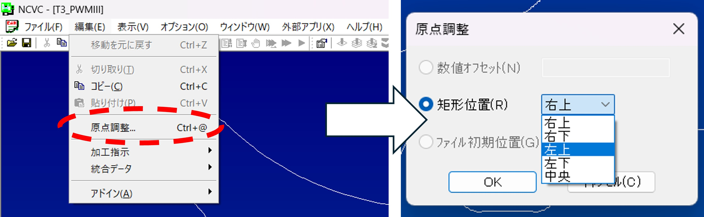


5. 下図のボタンを押す

 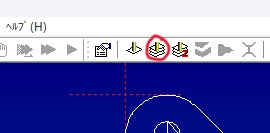

6. 「次へ」を押すと下図の画面が出てくる．この**CAM1**をダブルクリックする．
 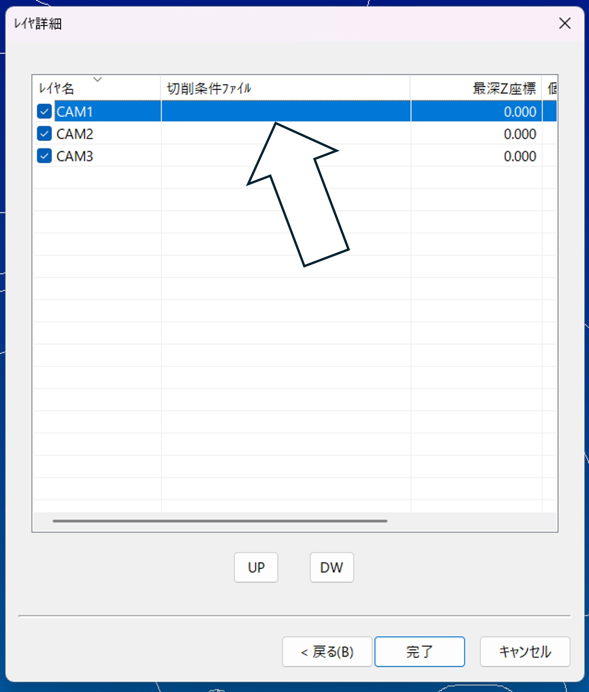


7. 切削条件ファイル名欄の「参照」を押す
 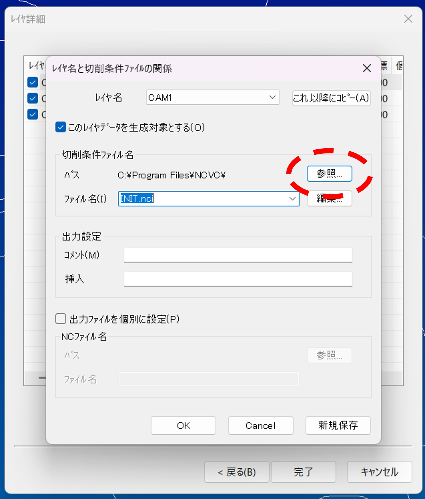


8. マシニングフォルダ内にあるNC切削条件ファイルの中からアルミt2(非貫通)(CNC&rarr;MCセット&rarr;Drill)を選び(切削する板の厚さが何mmでも基本これで大丈夫)，OKを押す

9. **CAM2**をダブルクリックし，「参照」を押す．その後アルミt2(NC切削条件ファイル&rarr;CNC&rarr;MCセット&rarr;Mill3)を選ぶ(t3の場合はアルミt3,t5の場合はアルミt5)

10. 編集を押すとステータスが確認できるので,不安であれば主軸回転数が5000,切削送りが250であることを確認する．<br>
これ以降に「コピー」を押す．
終わるとレイヤ詳細の画面に戻ってくるので<span style="background-color:gold"><font color="red">**最深Z座標が切削する板の厚さを超えていないことを確認する．**</font></span>**確認を怠ると定盤を掘る可能性が高まるため必ずやること！**<br>

!!! Tip
      CAM1で選択したファイルをもう一回探すのが面倒だと感じるならば，設定をいじるとよい．<br>
      (1) NCVCを開き，「オプション」を押す．押すと現れる「切削パラメータの設定」を選択する．
       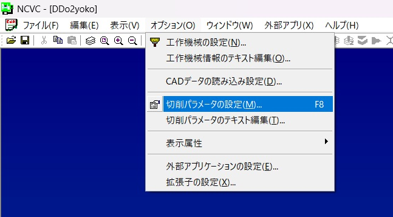
      (2) 使用したい切削条件ファイル(.nciファイル)を選択する．<br>
      (3) 下図のような切削条件ファイルの詳細が表示される．下の「OK」を押すと，デフォルトで先ほど選択したファイルが開かれるようになる．<br>
             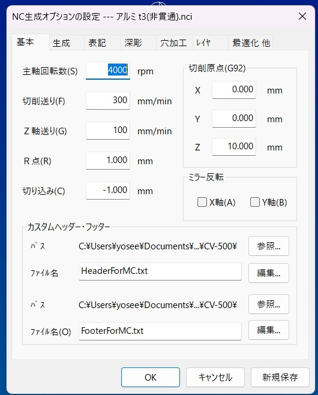


11. メモ帳マークを押すと，メモ帳上でncdファイルが開かれる．
 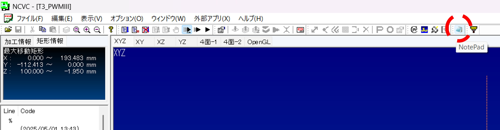
 <br>

1.  以下のような，%の下にある２行を消す．MCは全角文字を処理できないため，消す必要がある．
```gcode
(2025/05/01 13:43)
(Maizuru_Tarou MADE T3_PWMIII.ncd FROM T3_PWMIII.dxf AND アルミ t2(非貫通).nci)
```
<br>

1.  その下のG91~Z30.まで(Layer="CAM1" startの前まで)をコピーする．
```gcode
G91G30Z0M192
T18
M06
G90G54
G00X0Y0
G43Z100.0H18
S5000M03
M08
Z30.
```
<br>

1.  (Layer="CAM2" start)とその上のG80との間(G80の下)にM05,M09を入力し，13.でコピーした内容をペーストする．M05とM09は改行すること．(括弧内はコメントアウトなので消すこと)
```gcode
G80 (ここまでがCAM1)

M05
M09
G91G30Z0M192
T18
M06
G90G54
G00X0Y0
G43Z100.0H18
S5000M03
M08
Z30.

(Layer="CAM2" start) (ここからがCAM2)
```
<br>

15. CAM1の前のG91~Z30.の間の<span style="background-color:gold"><font color="red">**T18およびH18をT20,0H20に変える．これを忘れるとドリルやエンドミルを折るため注意！**</span></font>

```gcode
%
G91G30Z0M192
T20 (ここ)
M06
G90G54
G00X0Y0
G43Z100.0H20 (ここ)
S5000M03
M08
Z30.

(Layer="CAM1" start)
```
16. ncdファイルを閉じると「再読み込みしますか？」と出てくるので「はい」を押す．<br>
その後，ncdファイルをUSBに保存し，MCに持って行って加工を行う．MCで加工する場合，**慣れないうちは先輩についてきてもらうこと**．先輩をこき使おう！

## まとめ
データを作成する手順は
1. Solidedge上で .par ファイルを2次元データとして読み込む
2. CAM1に点を打つ
3. CAM2に切り替え，肉抜きの線のオフセットをとる(無ければ外形の線を描く)
4. CAM3に切り替え，外形の線のオフセットをとる
5. 作成したファイルを .dxf ファイルに変換する
6. NCVCで .dxf ファイルを読み込む
7. 原点を設定する
8. レイヤごとの切削条件ファイルを選択する
9. NCVCが .ncd ファイルを作成する
10. 最後にプログラムをちょっといじる

である．わからなかったら先輩に聞こう！


## おまけ
### MCはデータをどう処理するの？
ここではMCに送るデータの意味を解説する．
上記の文字面だけではわからない部分について解説する．

- MCは板を 「どう」 加工するのか<br>
以下に加工手順を示す．
1. 原点が決まる(x, y, z)
      - x,yの原点調整と高さ合わせで決定
2. 工具をドリルに交換する
      - T20がドリルを固定しているホルダーの番号
      - 点を打った場所にドリリングする
3. 穴を開ける場所にドリルを移動
4. ドリルで穴を開けていく
5. 工具をエンドミルに交換
      - エンドミルは工具の底と側面の両方で削ることができる工具
      - T18がエンドミルを固定しているホルダーの番号
6. 側面を少しずつ削る
      - 線を引いた場所を少しずつ切削していく(深さ0.5[mm]以下ずつ)
7. 機械原点に戻り，終了

- CAMってなんぞや<br>
簡単に言うと，CAMとはMCに与える命令の中の一節である．
フローチャートを見ればわかりやすいだろう．
MCは下図のように命令を実行していく．

 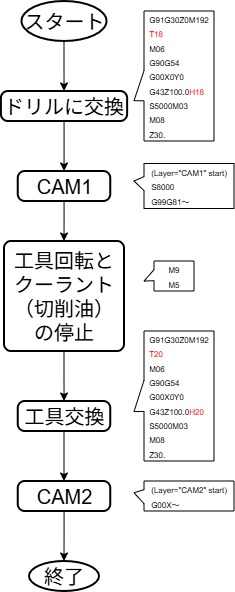


- なぜ線を描くときにオフセットをとるのか<br>
線を使うのはエンドミルで加工する時である．MCは，ドラフトで描いた線の通りにエンドミルを動かしていく．エンドミルの中心を線の中心に合わせるため，エンドミルの半径分だけオフセットをとる必要があるのだ．<br>
ここで，なぜオフセットの値が1.5ではないかという疑問が湧いた人もいるだろう．その理由は，工具の摩耗にある．いくら工具が硬い材料で作られていようと，使い続けると包丁のように摩耗し切れ味が悪くなっていく．その摩耗した分を考慮した数字が1.47付近なのである．

 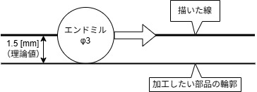
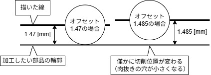


### 稀によく見るバグ（）
NCVCでncdデータを作った際，下図のようなバグがたまに発生する．
なお，図のバグは筆者が即席で作った．<br>

 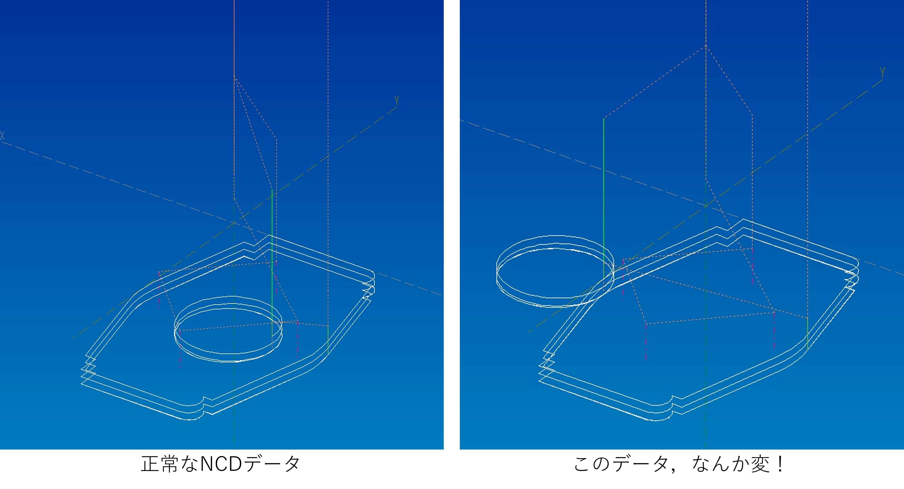

これはデータを生成する際に起こる．
CAM1からCAM2へ移行した時など，別のレイヤに切り替わる時にきちんとX，Y座標がリセットされていないために起こると考えられる．
そのため，生成されたコード内のX，Y座標をいじると直る．<br>
ただし，最初のうちは自分で直さず**先輩に聞くこと**．
慣れていないと更なるバグが生まれる可能性があるため注意．

### MCのコマンド集(Gcode)
以下のサンプルコードには読みやすくするためにスペースを入れているが，実際は不要である．
詳しくは制御科の2年の実験レジュメに記載されているため，そちらを参照されたし．

#### よく出てくる記号など
```gcode
; (End of block（EOB）,ブロックの終わり)

(comment) (括弧の中はコメントである．日本語を入力するとバグるので消すこと！)
```

#### Gコード：準備機能
```gcode
G90 (アブソリュート指令)
G91 (インクリメンタル指令)

G00 (早送り)
G01 (直線補間)
G02 (円形補間 CW (Clockwise，時計回り))
G03 (円弧補間 CCW (Counterclockwise，反時計回り))

G28 (原点復帰)
G30 (第二原点復帰)
G54～G59 (ワーク座標系 1～6 (基本G54のみ使用すること！))
G53 (機械座標系)

G43 (工具長補正)
G49 (工具長補正キャンセル)

(G17) (XY平面(電源投入時からすでに設定済み))
G40 (工具径補正キャンセル)
G41 (工具径補正左)
G42 (工具径補正右)
G80 (固定サイクルキャンセル)
G81 (スポットドリリングサイクル)
G83 (深穴ドリリングサイクル)
G84 (タッピングサイクル)

G98 (イニシャル点レベル復帰)
G99 (R点レベル復帰)
```

#### Mコード：補助機能
```gcode
M03 (主軸正転)
M05 (主軸停止)
M08 (切削油（クーラント）ON)
M09 (切削油（クーラント）OFF)
M30 (プログラム終了(M02も同じ機能))

M06 (工具交換)

M60 (パレット交換(MELDASのみ))
M192 (工具交換モードON(MELDASのみ))

M98 (サブプログラム呼び出し)
M99 (サブプログラム終了)
```

#### Tコード：工具番号を指令
```gcode
T[工具番号]; (例えばT18)
```

#### Sコード：主軸回転数を指令
```gcode
S[主軸回転数];
```
主軸回転数$N$は以下の式で与えられる．
$$
N = \frac{1000 \times V}{\pi \times D}
$$
$N$：主軸回転数[min $^{-1}$]<br>
$V$：切削速度[m/min]<br>
$\pi$：円周率(約3.14)<br>
$D$：工具の直径[mm]<br>

#### Fコード：送り速度を指令
```gcode
F[送り速度];
```
送り速度$F$は以下の式で与えられる．
$$
F = fZN
$$
$F$：送り速度[mm/min]<br>
$f$：1刃あたりの送り量[mm/刃]<br>
$Z$：工具の刃数<br>
$N$：主軸回転数[mm]<br>

#### Hコード：工具長補正番号を指令<br>
G43と同時に指令する．(確認のため，以下のように実行する)
```gcode
(G90) G00 G43 Z100.0 H[工具長補正番号];
```

#### Dコード：工具径補正番号を指令
G41(またはG42)と同時に指令する．

#### Oコード：プログラム番号を指令
```gcode
O[プログラム番号];
```
プログラム冒頭につける．パソコン等からデータを送りながら実行する場合はつける必要がないが，MC(マシニングセンタ)内のメモリにプログラムを登録する際には必須である．

#### Nコード：シーケンス番号を指令
```gcode
N[シーケンス番号];
```
各行の頭に，プログラムをわかりやすくするためにつける．無くてもよいが各工程の始まりの行などにつけるのが望ましい．

#### パレット交換のプログラム(CV-500Aのみ)(操作パネル上で実行)
XYZ軸が全て原点復帰状態(Z軸は第二原点復帰状態でも可)で入力
```gcode
M60;
```

#### 工具交換のプログラム
機械班は気がついたら暗記している．頑張って覚えよう！
- CV-500Aの場合
```gcode
G91 G30 Z0 M192; (Z軸第二原点復帰)
T[工具番号]; (工具呼び出し)
M06; (工具交換)
```
- NVX-5060の場合
```gcode
G91 G28 Z0; (Z軸原点復帰)
T[工具番号]; (工具呼び出し)
M06; (工具交換)
```
#### 一般的な切削準備のプログラム
NCVCで最後にいじるプログラムの意味はここを参照されたし．
```gcode
G90 G54; (アブソリュート指令＋ワーク座標系呼び出し)
G00 G43 Z100.0 H[工具番号]; (工具長補正＋Z100.0に早送り)
G00 X0 Y0; (ワーク座標系のX，Y原点に早送り)

S[主軸回転数]; (主軸回転数を設定)
M03; (主軸正転)
M08; (クーラントON)
G00 Z10.0; (Z10.0まで早送りで近づける)
```

#### 基本的な切削のプログラム
- 直線補間
```gcode
G01 X[終点のX座標(＊)] Y[終点のX座標(＊)] F[送り速度];
G01 Z[終点のZ座標(＊)] (＊アブソリュート指令の場合)
```

- 円弧補間その1(ＩＪ指令)
```gcode
G02(G03) X[円弧終点のX座標] Y[円弧終点のY座標] I[＊1] J[＊2] F[送り速度];
(＊1：円弧開始点から見た円弧中心までのX軸方向の相対座標)
(＊2：円弧開始点から見た円弧中心までのY軸方向の相対座標)
```

- 円弧補間その2(Ｒ指令)
```gcode
G02(G03) X[円弧終点のX座標] Y[円弧終点のY座標] R[円弧半径(＊)] F[送り速度];
(＊：円弧半径の値数値がプラスの場合は中心角180度以下の側の円弧，マイナスの場合は中心角180度以上の側の円弧を通る)
```

#### 固定サイクル(穴開け関連の加工を行うコード)
- スポットドリリングサイクル(基本的な穴開け)
```gcode
G98(G99) G81  X[穴位置のX座標] Y[穴位置のY座標] Z[穴位置のZ座標] R[R点のZ座標] F[送り速度];
```
!!! Tip 
      R点とは，加工前に早送りで工作物に接近させるための位置(Z高さ)である．<br>
      G98：加工後，プログラム実行前のZ高さまで戻る(イニシャル点高さに復帰)<br>
      G99：加工後，R点のZ高さまで戻る(R点高さへの復帰)


- 深穴ドリリングサイクル(深い穴を段階的に，切りくずを排出しながら開ける)
```gcode
G98(G99) G83  X[穴位置のX座標] Y[穴位置のY座標] Z[穴位置のZ座標] Q[一回当たりの切り込み量] R[R点のZ座標] F[送り速度];
```
- 固定サイクルの使い方
複数個所に同じ深さの穴を開けたい場合，一度固定サイクルの命令を実行した後，次のブロックは**X，Y座標のみのプログラムでよい**．<br>
例えば &#9312; (X,Y) $=$ ($-$ 30.0,30.0) と &#9313; (X,Y) $=$ (10.0,15.0)の2カ所にZ $=-$ 20.0の深さの穴をR点高さZ10.0，送り速度150[mm/min]でスポットドリリングサイクルの加工を行うプログラムは以下のようになる．
```gcode
G98 G81 X-30.0 Y30.0 Z-20.0 R10.0 F150; (1カ所目の加工)
X10.0 Y15.0; (2カ所目)
G80; (固定サイクルのキャンセル)
```
このように，固定サイクルは一度実行すると前回の加工内容が自動で記憶されるため，2行目は2カ所目のX，Y座標のみ指定すればよい．<br>
なお，G80は固定サイクル使用後に加工内容の記憶をリセットするために実行する．

#### 切削や固定サイクル後，工具交換の前に入れるプログラム
```gcode
(G80;) (固定サイクルを使用した場合，それをキャンセルする)
(G40;) (工具径補正を使用した場合，それをキャンセルする)
G00 Z100.0; (Z100.0まで主軸を逃がす)
M05; (主軸の回転を停止)
M09: (クーラントOFF，切削油を出している場合は止める)

(次の工程へ移る前に「工具交換のプログラム」と「一般的な切削準備のプログラム」を挿入)

(最後の工程の場合)
M30; (プログラム終了，プログラムの最後に必ず実行する)
%
```

??? Note
    著者:Iritani Yoshinari
        :Kosuga Makito