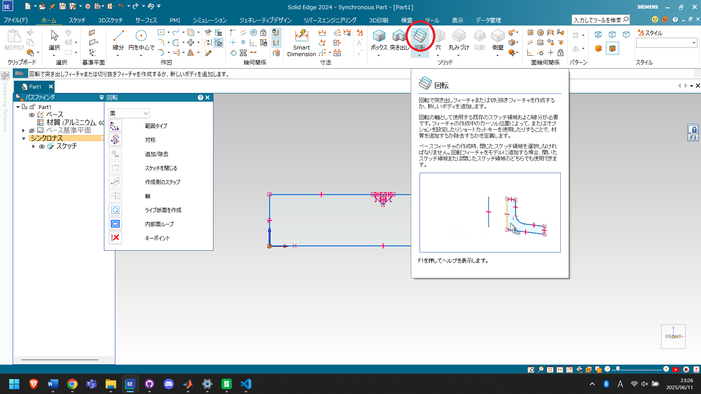

# SolidEdgeの基本操作1(チュートリアル)

画面の動かし方：
　マウスのカーソル前後で視点の拡大縮小，カーソルを押し込んで視点の回転．

## partファイル
### ファイルの新規作成
画面左上のアイコンをクリックし，使用したいファイルをダブルクリックする．ファイルは全てJIS Metricの中から選ぶ．(テンプレートファイルは先輩からもらってください)

パスファインダに「オーダード」と表示されている場合は文字の上で右クリックしてから，「シンクロナスに移行」をクリックする．これでシンクロナスでモデリングできるようになる．

!!! 設定 Tip
    開いた時，シンクロナスにするかオーダードにするかの設定は，画面左上の歯車マークの「オプション」から変更できる．
    

### スケッチ
角パイプなどのモデリングを行う場合，全て平面にスケッチを行ってからそれを立体におこしていく．
まず，スケッチを行う．「スケッチ」タブの四角いアイコンをクリックする．アイコンの上でカーソルをとめておくと，下の画像のように操作方法がアニメーションで出てくるので，わからなかったら確認すると良い．

スケッチを行う平面(基準平面)を選ぶため，カーソルをどれかしらの平面上に持ってきてからキーボード上の「F3」キーを押す．選択する平面はふちがオレンジになる．下の画像では，X-Z平面が選択できる状態となっている．

F3キーを押すと，平面のふちは下の画像のように茶色くなる．また，画面右端にF3の鍵マークが出るので，ここで平面を選択できたか確認できる．

!!! キーボード Tip
    基準平面が選択できない場合は，キーボード右下の「fn」キーを押しながら「F3」をクリックしてみて下さい．

選択できた平面にスケッチを行う．現在は「長方形を中心で」を選んでいるため，平面の中心をクリックした後，マウスをドラッグして長方形の範囲を広げる．

数値を入力する．青く選択されている部分の数値を入力し，enterを押す．長方形の縦と横，角度を順に入力する．(選択されている数値をbackspace等で一度消す必要はない．そのまま打ち込んでおｋ)　数値を入力中，マウスを動かすと入力した値がリセットされるため注意．

!!! 角パイプのスケッチ Tip
    9x9[mm]の角パイプをモデリングする場合，平面の同じ点を基準に9x9と7x7の四角を書くと作業が速くなる．

### 突き出し
画面上の「突き出し」をクリックし，先ほど書いたスケッチの面をクリックし選択する．

選択できた面は，緑色に光る．

右クリックを押すと，突き出しが行われて立体になる．数値を入力し，enterを押す．

突き出しできた面にスケッチを行い，角パイプに穴をあけていく．「スケッチ」の「線分」を選択した後，スケッチを行いたい平面にカーソルを持っていき，先ほどと同様F3キーを押して基準平面を選択する．角パイプの端に行き，中点から5[mm]の線を引く．
(必要に応じて視点の回転を行ってください)

引いた線を中心に，円を書く．「スケッチ」タブの「円を中心で」をクリックし，先ほど書いた線の端をクリック，マウスをドラッグする．

その後，数値を入力する．今回は3[mm]のねじを通す穴を開けたいため，3を入力し，enterを押す．円の数値はデフォルトで直径となっている．

!!! スケッチの赤い線 Tip
    スケッチの赤い線が邪魔な場合は，右クリックを押すと消える．

その後，突き出しを行う．「突き出し」をクリックしたあと，先ほど書いた円の上にカーソルを持ってくる．そのままでは角パイプの面を選択してしまうため，カーソルを止めて一瞬待つ．すると，謎のマウスマークが出てくる．(スクショの関係上，下の画像にはマウスマークはない)

その状態で右クリックすると，クイックピックというタブが出てくるので，この中から「領域」をクリックする．(なぜかスクショに映らないため写真．見づらくて申し訳ない)

選択できたら緑に光るので，この状態で右クリック．カーソルを奥に持っていくと，自動で切り取りされる．

!!! 突き出し・切り取りの変更 Tip
    突き出しと切り取りの変更は，「突き出し」のタブから変更できる．
    SolidEdge2024と少しUIが違うが，だいたい同じなので頑張って探してほしい．
    

### 回転

～ここからはSolidEdge2024でお送りします～

まず，以下のようなスケッチを行う．

これを回転させて，立体にしていく．「回転」をクリックし先ほど書いた面をクリックして選択する．

選択できたら，緑色になる．矢印の中心の青い部分をクリックすると回転中心を移動させることができる．今回の回転中心は，黒の実線部分となる．

矢印の周りの円をクリックし，角度を入力する．軸を作成する場合，通常は360と入力する．

このような状態ではまだ確定していないので，画面上の何もない空間をクリックしてあげる必要がある．

回転を行って，軸を作成することができました．

### フィーチャの移動・コピー
突き出しや回転などの動作を，フィーチャと言います．（パスファインだというタブがデフォルトで左にあり，その中にフィーチャがいます．）

角パイプの穴を移動する・増やすために，毎度スケッチからの突き出しを行うのはとても面倒です．

#### 穴の移動

まず，穴を一つ開けた角パイプを用意します．

この穴を，マウスのドラッグで範囲選択します．

緑になり，選択した状態が確認されたら，移動したい方向の矢印をクリックします．

移動距離を入力して「enter」キーを押したら完了です．今回は，50mm先に穴を移動したかったので50と入力しました．

移動ができました．

#### 追加

同じように，穴を一つ開けた各パイプを用意し，同じように範囲選択します．

「ctrl」を押しながら増やしたい方向の矢印をクリックし，数値を入力します．今回は50mm先に穴を増やしました．

フィーチャのコピーにより穴を追加することができました．

!!! 回転移動 Tip
    選択した後，矢印ではなく円をクリックし，角度を入力すると回転移動することができます．
