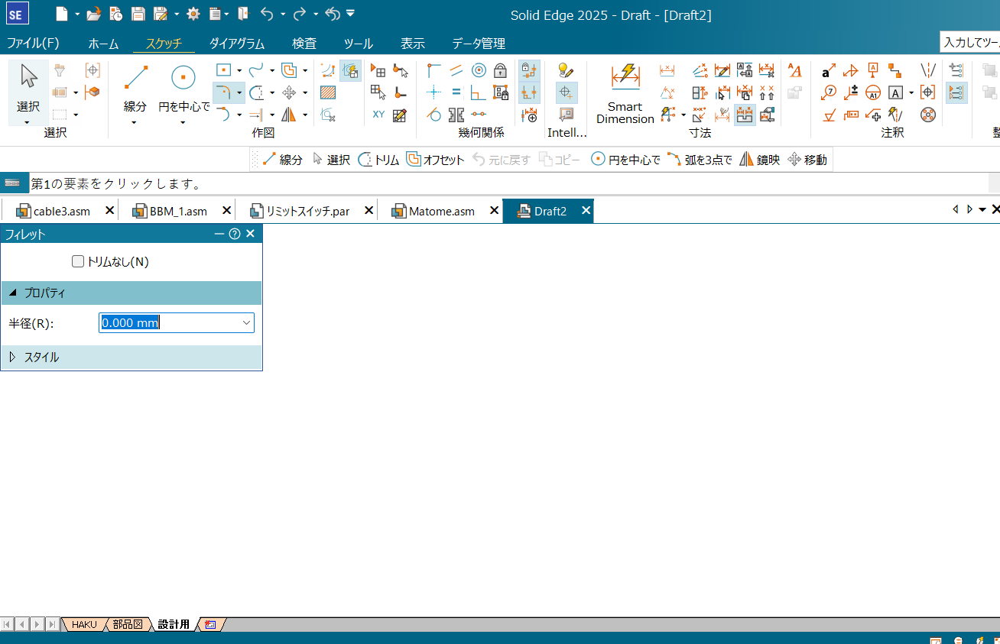
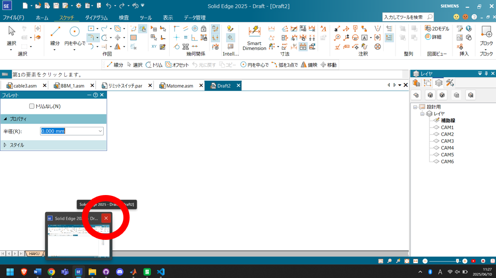
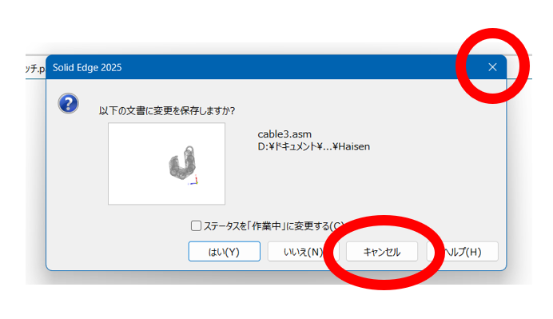
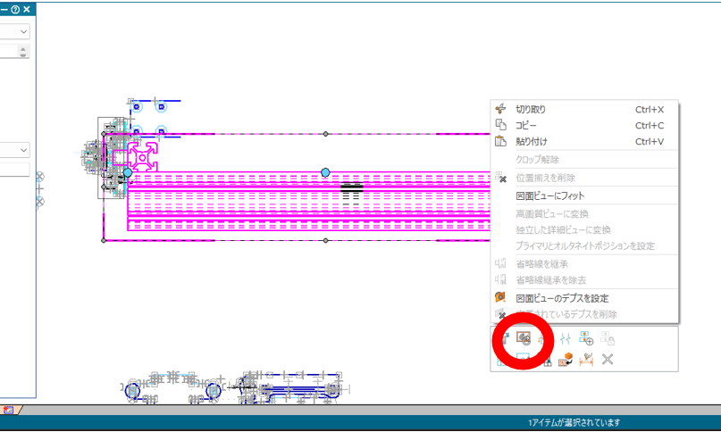

# SolidEdge2025をまともに使用するために

SolidEdge2025(以降SolidEdgeはSEと省略)は使いにくいです．
がんばりましょう．

## draft上の「フィレット」を選択した際のフリーズからの脱出
以下の画像のように，SE2025のdraftの「フィレット」タブをクリックするとSEは固まって操作を受け付けなくなる．

これから脱出する際は，下に表示されているタブのSEのアイコンにカーソルを持ってきて，赤丸で囲ったような，小さい画面の右上のバツマークをクリックする．

すると，以下のように「変更を保存しますか」と聞いてくるので「キャンセル」もしくは右上バツマークをクリックすると「フィレット」を選択する前の状態に戻ることができる．

ドラフト上でフィレットを使用する方法は見つけられておりません，申し訳ない．パーツファイル上では普通に使うことができるので，肉抜きのフィレットなどはそちらからかけるようにしましょう．

## draft上で，線をまとめて選択した後のdeleteが効かないときに

結論です．「ctrl」+「x」で代用できます．
多分画像を使って説明する必要ないのでこれでおわり．

## draftに落とした図面を更新するやつが変更されてました

SE2024まででは，draftに落としたアセンブリなどを右クリックすると文字で「ビューを更新」が出てきました．SE2025ではそれが記号になりました．以下の画像にその記号の位置を示します．

??? Note
    著者:Mio Saito
