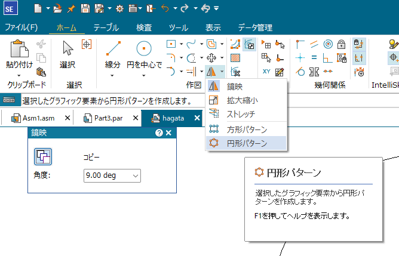

# SolidEdgeでのギヤ（歯車）の作成方法
## ギヤの種類
高専ロボコンなどで主に使うギヤの種類を以下に示す．

よく使うのは平歯車・ラック＆ピニオン・かさ歯車なので，最低限これだけは覚えてあげてね．（写真で示したもの以外にも，やまば歯車，ハイポイドギヤ，ねじ歯車なんかがあるので，興味がある人は調べてみて）

歯車の特徴(読み飛ばしてもおｋ)：

平歯車：一番よく使う．減速や加速，動力の伝達に使用．

かさ歯車：回転の向きを変えることができる．普通は90度．

ウォームギヤ：大きな減速比を得たい場合に使う．出力軸からの入力はできない（ロックされる）．伝達効率が悪い．

ラック＆ピニオン：回転運動→直線運動の変換もしくはその逆で使用．

はすば歯車：平歯車の遊び(がたつき)がなくなる優れもの．あまり使用しない．

## 計算方法
歯車には，「ピッチ円」という概念がある．ピッチ円とは歯車の基準となる直径のことである．歯車を設計する際，このピッチ円直径を直径とした円柱を考え，この円柱同士が接するように設置してあげる必要がある．

ピッチ円は，以下の式で計算することができる．

!!! ピッチ円計算式 Tip

    ピッチ円直径D ＝ モジュールM × 歯数Z

モジュールとは，歯車の歯の大きさを示す単位のようなもので，高専ロボコンでは基本的に1～2を使用する．数字が大きければ歯も大きくなり，強度も向上する．しかし，歯車の「遊び」が大きくなる傾向にあるため，大きければ良いというものでもない．
以下の画像に，左から順にモジュール1から3のギヤを示す．歯数は全て30である．

!!! ピッチ円直径を計算する演習 Tip

    上の画像の歯車の，ピッチ円を計算してみましょう．回答はすぐ下．
    (1)モジュール1，歯数30のピッチ円直径
    (2)モジュール22，歯数30のピッチ円直径
    (3)モジュール3，歯数30のピッチ円直径

    回答
    (1) [モジュール]1 × 30[歯] = 30[mm]
    (2) [モジュール]2 × 30[歯] = 60[mm]
    (3) [モジュール]3 × 30[歯] = 90[mm]

演習で計算したように，歯数は同じでもモジュールが変わるとピッチ円直径もかなり変化することがわかる．

### ラック＆ピニオン
ラック＆ピニオンの，ラックについて説明する．ラックは直線なのでピッチ円ではなく規準線がある．ラックは基準線を高さとした角柱として考え，その角柱にピニオン(歯車)が接触するよう設計する．

SE上で生成しそのまま印刷する場合は，生成されたラックの基準線を測ってからpartファイル内で調整し取り付けを行うと良い．
部室に転がっている青いフレキラックを使用する場合，モジュールによって基準高さが違うため注意すること．

ミスミでフレキラックを検索し，詳細情報の欄に移動する．

この画像の中の「かみ合い高さ」の欄がラックの基準となる高さになる．つまり，モジュール1であれば3.3，モジュール1.5であれば4.2の高さの角柱を考えればよい．

## SEでの生成方法

実際にSolidEdgeで生成していく．
まず，左上の「連結ウィンドウ」をクリックし，「Engeneering Reference」をクリックする．

Engeneering Referenceタブの中から，作りたい歯車をダブルクリックする．今回は，平歯車を生成する．

アセンブリが保存されていない場合，「アセンブリを保存してください」というメッセージが表示される．保存してから続行する．すると，以下のようなウィンドウが開かれるので，右下「オプション」をクリックする．

入力条件を「中心距離検出」に変更し，「OK」をクリックする．

パラメータの入力項目が変わったので，上で計算した内容を入力できるようになった．
今回はモジュール1，ギヤ1が歯数20，ギヤ2が歯数30の歯車を生成したいので，ギヤ比(直径の比)は1.5となる．
SE上ではギヤ比(歯数比)は1以上でないと入力できない．そのため，計算のパラメータには小さい方のギヤの歯数を入力する．その後ギヤ比を入力すると，もう片方の歯数も見えるようになる．
また，「取り付け穴径」がデフォルトで20mmとなっているので，変更する．現実的に可能な値であれば問題ないが，わからなければ4mmとでも入力しておく．
そして，最後に「面幅」を変更する(しなくても良い)．これは歯車の厚みである．後々変更するとPCが重くなって面倒な場合はこちらで変更しておく．
変更する項目をアンダーラインで示した．

その後，下の「計算」をクリックすると，下の画像のような画面に移行する．「作成」をクリックして作成する．が，だいたいの場合クリックできない．これは，SE上の要件を満たす強度を持っていないかららしい．「設計パラメータ」をクリックしてさっきの画面に戻る．

パラメータを調整しても良いが，毎回やるのは面倒なので，右下「材質」をクリック．赤丸で囲った部分の数値を全て9999に変更する．４か所変更できたら，OKをクリックして閉じる．

その後，もう一度「計算」を行い，「作成」を行う．
ギヤを2個生成しているので二回ほど保存を求められるので，わかりやすい場所に保存する．

このようなギヤがアセンブリに生成された．ギヤのパーツファイルを開くと分かるが，「オーダード」になっているため編集がしづらい．これを「シンクロナス」で編集できるようにする．

まず，ギヤを右クリックしてパーツファイルで開く．

下の画像内の緑に光っている項目を選択する．「オーダード」と書かれている下の，「Base」をクリックした後，shiftを押しながら「パターン1」をクリックする．

その後，選択したものの上で右クリックして，「シンクロナスに移動」をクリックする．

さっきまで「オーダード」と書かれていた部分が「シンクロナス」となることがわかる．これで，歯車の種類をシンクロナスに変更することができた．
編集方法をシンクロナスにする．「ツール」タブをクリックする．

左上の「シンクロナス」をクリックする．これで，普通のパーツファイルと同じように編集することができるようになった．

!!! PCを重くしないために Tip
    ギヤの厚みを変更する際は，ギヤの面で突き出しを行うのではなく(画像左)，横向きに領域を作ってから突き出しを行った方がPCは重くならない(画像右)．
    

## KHKのサイトを使った生成方法
小原歯車の計算サイトからギヤを設計する方法を解説する．
まず，「KHK　歯車計算サイト」などと検索する．

開くとこのようなページに入るはず．
こちらで，作りたい歯車をクリックする．例として，平歯車を選択する．ログインを求められるので，新規登録もしくはログインする．

このような画面になる．ここで，モジュールの横の「大きさ」欄と歯数を入力する．（SEと違って一個だけしか生成しないので，入力は一種類だけでよい）その後，「歯型計算」のタブをクリックする．

「DXF出力」をクリックしDXFを保存し，SEのドラフトで開く．SEで開く際はファイル→開く→参照で保存したファイルを開く，もしくはファイル→発見→学習 のページに行き，エクスプローラからドラッグ＆ドロップする．

下の画像のような新規作成ページが出てくるので，「.dft」で終わるファイルをクリックする．(draft_mine.dftなどが望ましい)

このような図形を開くことができる．歯の形は，それぞれ入力した数値に基づいて生成されている．この曲線を円弧でなぞって，歯車の形にしていく．

「弧を三点で」というツールを使用し，なぞる．歯車のインボリュート曲線を完全になぞることはできないので，ほどほどに．

なぞり終わったものがこちら．わかりやすく色をシアンにしている．あまり線を増やすとPCの動作が重くなるので，今回は6本の円弧で近似した．

これを，「鏡映」ツールで線対象にコピーする．鏡映ツールをクリック．

「コピー」と書かれている横が青くなっているのを確認し，先ほどなぞった歯型を範囲選択する．そして，鏡映の基準となる二点をクリックする．今回は円の中心と，歯型の一番端を選ぶ．

歯型が一つだけできた。

この一つだけの歯型を，「円形パターン」でコピーする．「円形パターン」ツールをクリックする．

歯型を範囲選択で選択し，パターンの中心をクリック．歯車の中心となる部分をクリックしたら良い．その後「個数」で歯数を入力し，「角度」が360になっていることを確認する．
できたら，完了をクリックもしくは何もない場所を右クリックする．

このような図形が書けた．

書けた図形を範囲選択し，「ctrl」+「c」でコピーする．
新規作成から新しいパーツファイルを作成し，「ctrl」+「v」でペーストする．
突き出しを行って，ギヤの作成完了．

!!! KHKのサイトを使用するメリット Tip
    SEのギヤを作成する方法では，歯数が12以下のギヤは作成できない．そのため，6歯のギヤを作成したい場合に使用すると良い．\
    

    
??? Note
    著者:Mio Saito
