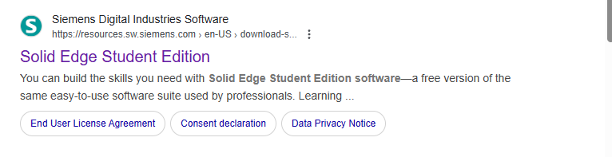
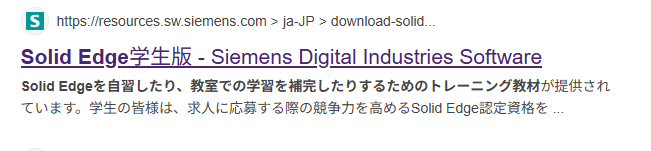
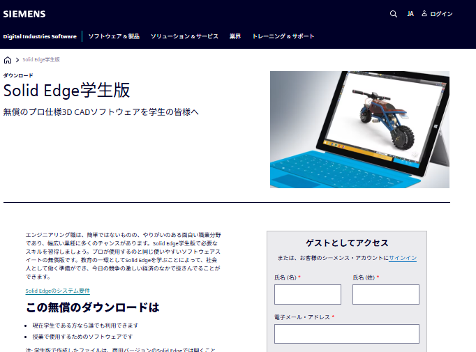
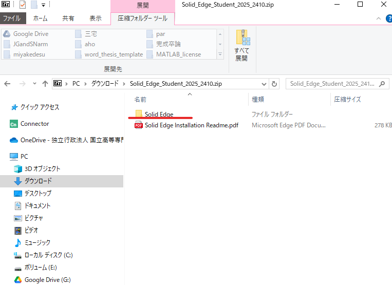
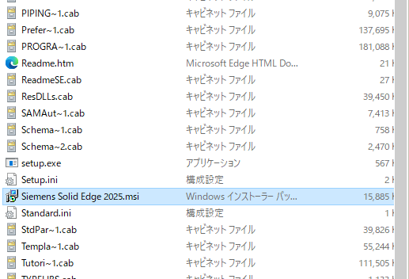
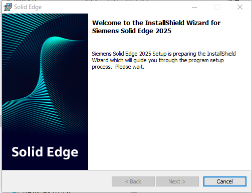
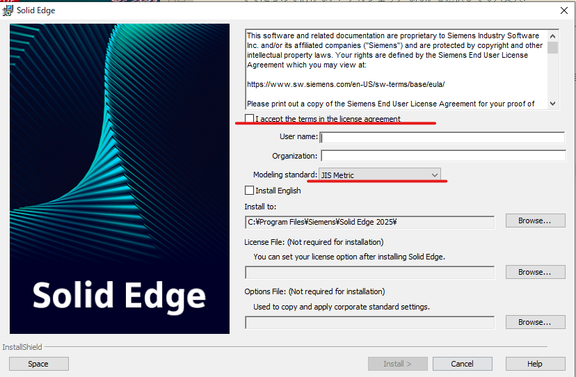
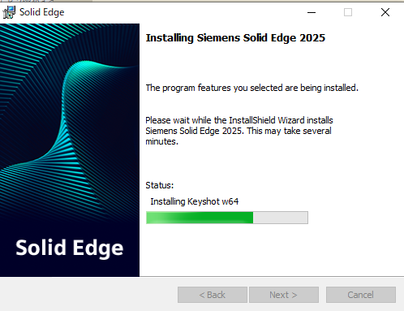
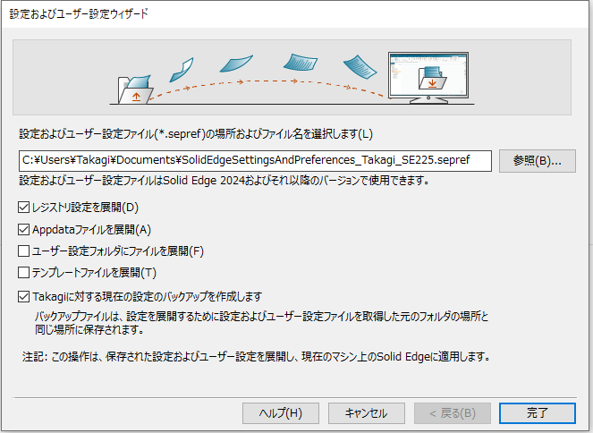

# Solid Edgeのインストール方法

## solid edge とは
創造技術研究会(通称s-ken)で使用している3DCADソフト．他高専で使っている人を見たことがないくらいマイナー．
## インストール手順
①インストーラのダウンロード

②開く
### 1．インストーラのダウンロード
まず，chrome等の検索エンジンで「solidedge student」を検索し，siemensのサイトをクリックする．勝手に翻訳されてる場合もある．

このような画面が表示されるはず．

この画面の右下の欄を適当に埋めて，インストーラをダウンロードする．氏名，メールアドレス，国，会社，市区町村，郵便番号などを聞かれるが，すべてでたらめで構わない．アルジェリアなんかを選択しても大丈夫．

一番下のダウンロードボタンを押すと，5GB近くあるファイルがインストールされる．かなりギガを食うので，寮などのWIFIにつないでから開始することをお勧めする．
### 2. 開く
ZIPファイルがダウンロードされるので展開し， Siemens solid Edgeで始まるファイルを探しダブルクリックする．

>もしダウンロードされたファイルが「Solid Edge 2025.exe」のような.exeで終わるファイルだった場合，それをクリックする．

以下のような画面が一瞬出た後，

このような画面が出る．赤でアンダーラインを引いた部分にチェックをいれ，「JIS　Metric」になっていることを確認し，右下の「install」をクリックする．

「このアプリがデバイスに変更を加えることを許可しますか？」ではいを押し，しばらく待つ．

以下のような画面が出るかもしれないが，押せるなら「完了」を押し，無理だったら「キャンセル」を押す．

その後最初の画面がでるので，「Finish」を押して終了．(スクショ撮り忘れた)

インストールが完了しました！！！