# ベアリング
## はじめに
ベアリングにかかる力を**荷重**と呼ぶ．
軸に対して垂直にかかる力を「ラジアル荷重」，平行にかかる力を「**アキシアル荷重**」または「**スラスト荷重**」という．

 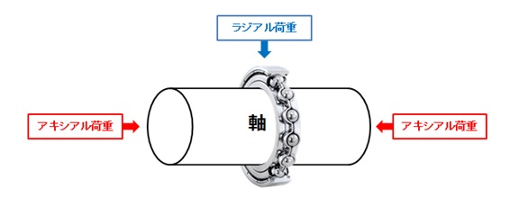

 ベアリングは、支えることができる荷重方向と、転動体の形状から下表および下図のように大きく４つに分類することができる。
 設計者は主にこの４つの中から、適したベアリングを選定する必要がある。

  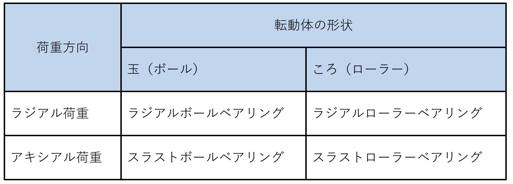
 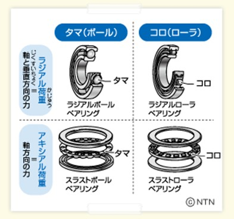

## ベアリングの型番
ベアリングの型番は左から順に「ベアリングの種類」、「直径（外径）」、「内径」、「シールドの種類」を表している。
1. 形式番号
形式番号はベアリングの種類を表している。

 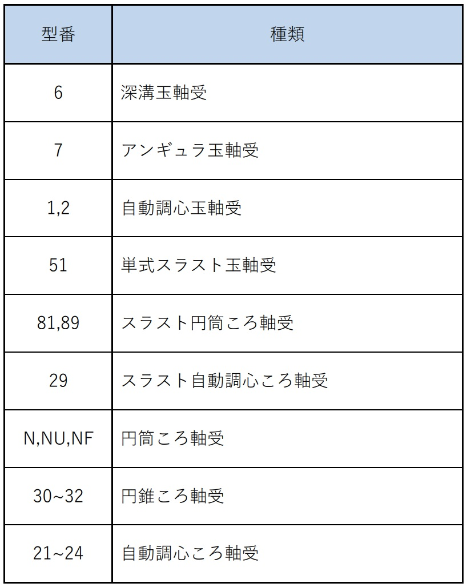

2. 直径系列番号
直径系列番号は内径に対する外径の大きさを意味している。**７，８，９，０，１，２，３，４**の8種類があり、左から順に内径と比較した際の外径が大きくなる。 
**※数字の大きさが外径と一致したり、比例して大きくなるわけではない。**

3. 内径系列番号
　内径系列番号は内径の寸法を表している。以下に例を示す．
- 00：10mm
- 01：12mm
- 02：15mm
- 03：17mm
- 04：20mm
- 05：25mm
- 06：30mm

4. シール・シールド記号
シール、シールド記号はベアリングのシールドの種類を表している。シールドとはベアリングの可動部に粉塵などが入り込むことなどを防ぐために付けられたカバーのようなものである。

 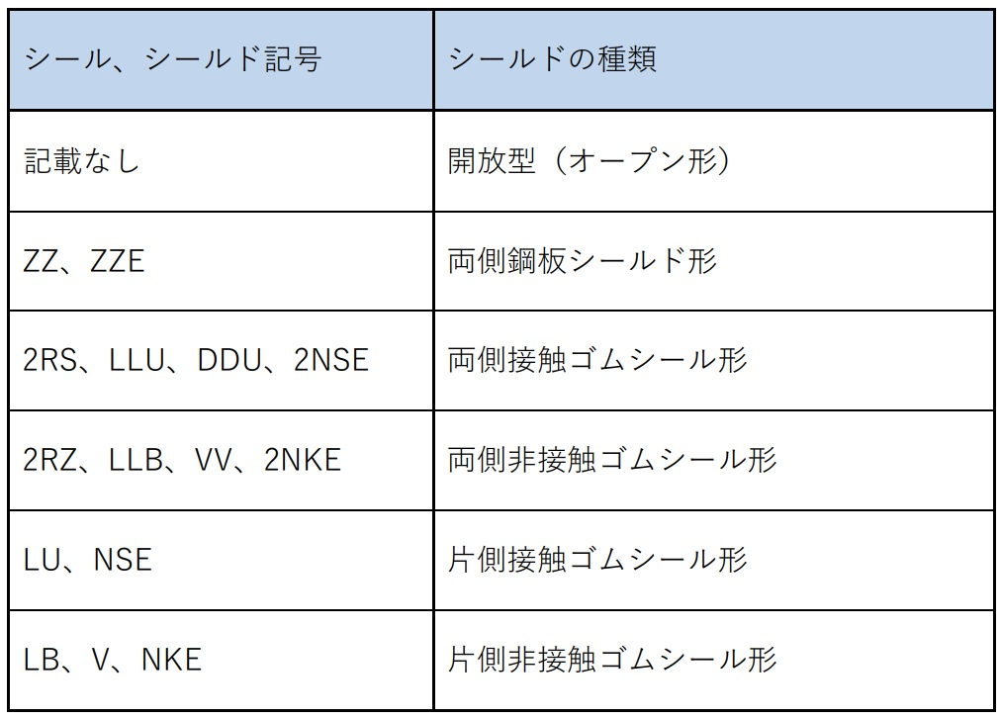

## ベアリングの種類
### 深溝玉軸受
 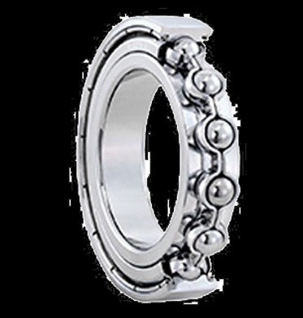

深溝玉軸受はラジアルボールベアリングに分類されるベアリングである。また、ベアリングの中でも最も多く使われている形式のベアリングである。深溝玉軸受が支えるのは主にラジアル荷重だが、ある程度のアキシアル荷重も支える事が可能である。

### アンギュラ玉軸受
 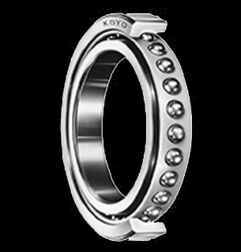

アンギュラ玉軸受も同じくラジアルボールベアリングに分類されるベアリングである。アンギュラ玉軸受が支えるのは主にラジアル荷重だが、大きな一方向のみのアキシアル荷重も支える事が可能である。アンギュラ玉軸受が耐えられるアキシアル荷重の方向は、下図に示した方向である。

 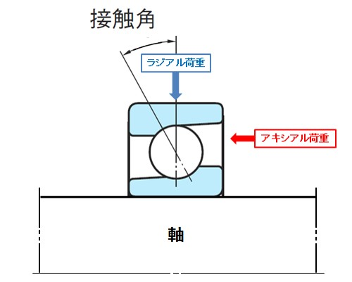

アンギュラ玉軸受を用いて大きな双方向のアキシアル荷重を支えるためには２つ以上のアンギュラ玉軸受を図6のように組み合わせて使用する。

 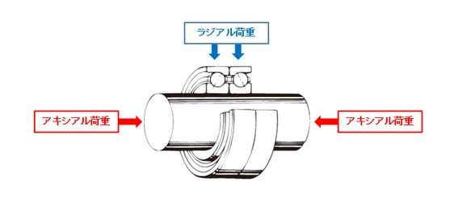

### 円筒ころ軸受け(シリンドリカルローラーベアリング)
 

円筒ころ軸受は、「円筒ころ」が転動体に使われている、ラジアルローラーベアリングに分類されるベアリングである。円筒ころ軸受は深溝玉軸受（ラジアルボールベアリング）より大きなラジアル荷重を支える事ができる。また、衝撃にも強い。ただし、アキシアル方向の荷重に弱いため、荷重方向に注意が必要である。

### 針状ころ軸受け
 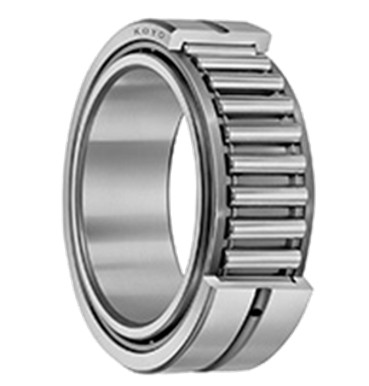

針状ころ軸受は、「針状ころ」が転動体に使われている、ラジアルローラーベアリングに分類されるベアリングである。針状ころは円筒ころよりも径が小さいので図9で比較したように、ベアリングの断面高さが小さい。そのため、機械の小型軽量化が可能である。円筒ころ軸受と同様、アキシアル方向の荷重に弱い。

 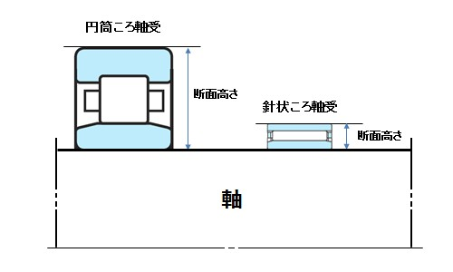

### 円錐ころ軸受け
 

円錐ころ軸受は円錐台形の「円すいころ」が転動体に使用されているベアリングである。円すいころ軸受はローラーベアリングの中では最も多く使われており、ラジアル荷重と一方向のみのアキシアル荷重を同時に支えることができる。両方向のアキシアル荷重を支えるためにはアンギュラ玉軸受と同じく、２つ以上の円すいころ軸受を組み合わせて使用する。組み合わせた場合の図を下図に示す。

 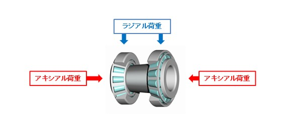

### ラジアル自動調心ころ軸受
 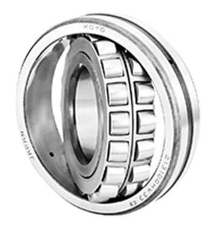

自動調心ころ軸受とは樽形の「凸面ころ」が下図のように外輪軌道面と内輪軌道面との間に転動体として組み込まれているベアリングである。そのため、内輪、転動体、保持器が外輪に対して傾いた状態でも回転することが可能である。この特性を生かし、大きな負荷がかかって軸がたわみやすい機械などで使用されている。上図に示したのはラジアル荷重を支える自動調心ころ軸受である。

 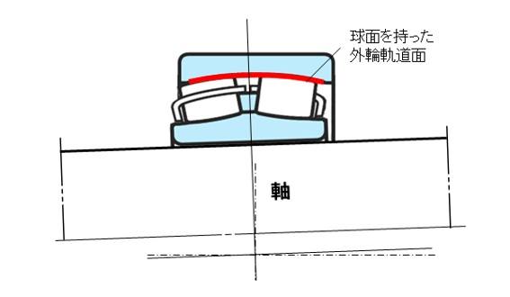

### スラスト玉軸受
 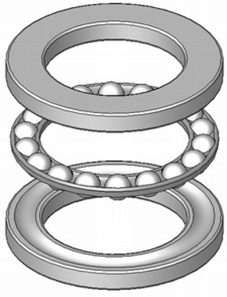

スラスト玉軸受はスラストボールベアリングに分類されるベアリングである。スラスト玉軸受は主にアキシアル方向の力を支えるベアリングである。使用例としてはすば歯車やねじ歯車、そしてかさ歯車などがあげられる。なぜなら、これらの歯車は、負荷のかかる回転時に、かみ合いを減らす方向にアキシアル荷重を生み出すからである。

### スラストころ軸受け
 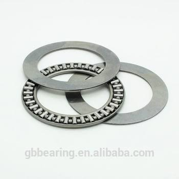

スラストころ軸受はスラストローラーベアリングに分類されるベアリングである。スラスト玉軸受と同じく、アキシアル荷重を支える。スラスト玉軸受は高速回転に向いているのに対して、スラストころ軸受は大きな力を支える事が可能である。これはボールベアリングとローラーベアリングの大きな違いでもある。

### スラスト自動調心ころ軸受
 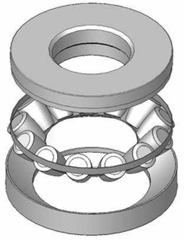
 
自動調心ころ軸受とは樽形の「凸面ころ」が図13のように外輪軌道面と内輪軌道面との間に転動体として組み込まれているベアリングである。そのため、内輪、転動体、保持器が外輪に対して傾いた状態でも回転することが可能である。この特性を生かし、大きな負荷がかかって軸がたわみやすい機械などで使用されている。図12に示したのはアキシアル荷重を支える自動調心ころ軸受である。
