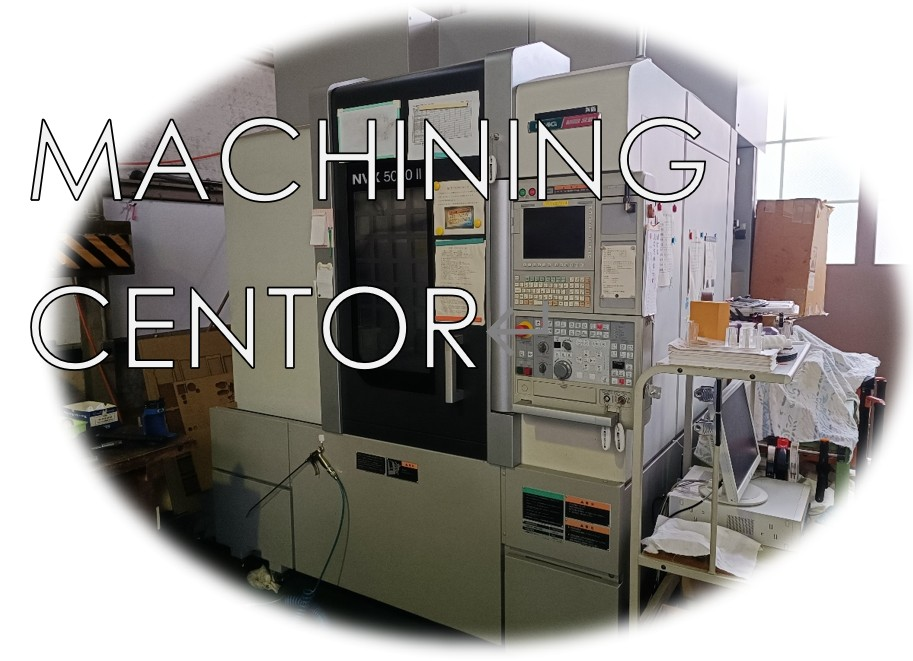
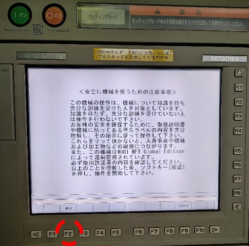
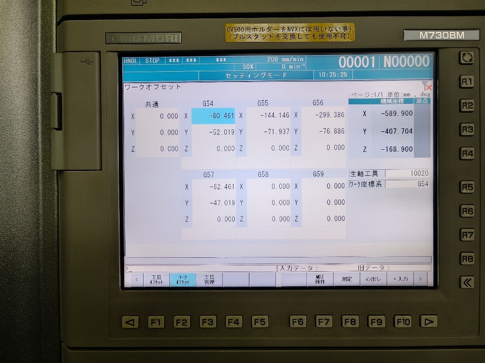
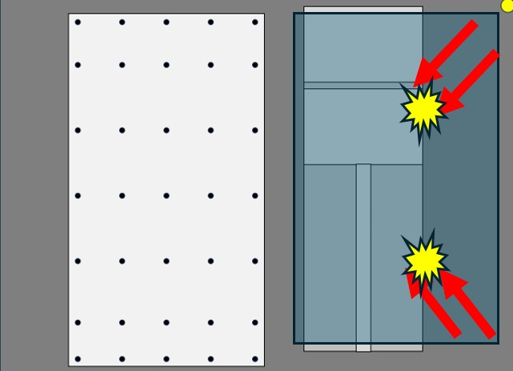

# 機械班&emsp;NVX-5060の使い方ガイド

## 概要
### 本記事の概要
本記事はS-kenの機械班のためにポイントを押さえてNVX-5060についての使用方法を伝授するのを目的としている． 
また，本記事は金子氏が製作したWord文書を著者がMarkdownに移植してきたもののため，所々書式が変な点があるが，容赦していただきたい．

元ファイルはGithubに上がっている．参考にされたし．
[https://github.com/SkenHub/mechanic-library](https://github.com/SkenHub/mechanic-library)
  

### NVX-5060について
VX-5060は森精機製作所株式会社が製作したNVX5000シリーズの小モデルである．5060の60はx軸の加工範囲が600mmあることを意味する．他には5080，5100，5700がある．加工範囲はx軸は600mm，y軸は530mm，z軸は510mmとなる．

- テーブルサイズ：900 mm × 600 mm
- 最大積載重量：800 kg
- 主軸回転数：13,000 rpm 
&emsp;←私たちが使用できるのは8000まで
- 主軸モーター出力：15.0/11.0 kW
- 早送り速度：30,000 mm/min
- ATC（自動工具交換装置）
&emsp;←収納本数：30本（オプションで60本，90本も選択可能）
- 本体重量：6,000 kg
- 価格：地方なら一戸建てが買える額，食費1日1万で3年持つ額
  

## 使い方(ハードウェア)
### 起動
起動方法はCV-500と変わらない．まずはコンプレッサーの電源をつけて，バルブを閉める．
本体電源は右から回った裏手にある．電源は引っかかりを越えるまで右回りに回す．

なぜ非常停止ボタンを先に押すの？の疑問は Q&A1 を参照(P.21)． MAPPS の画面から分かる通り，操作パネルは専用OSではなく，わざわざ GUI 型の OS の中に，ソフトとして駆動させている．

!!! Tip
      この時間の間にはドアを開けることができるので，この時間中にワーク(加工物)をセットアップするといい．使用ネジはφ4で平衡を出すために必ず4点で固定すること．
 

“オン”を押してから 5 分ぐらい待つと次の画面が現れる．“確認”の F2 ボタンを押す．
 

作業者確認としてドアの開け閉めが要求されるので，ドアを開けて敷いてある布を取り除く．
 

!!! Tip 
      ドアを開くのみであれば左のドアロック解除のみで良い．ドアを開けた状態で工具やワークベースを動かしたい場合は右下のインタロックモードを“セッティング”に回す．ドアが開いていれば“ドアロック解除”が光り，インタロックモードになっていれば上のセッティングランプが点滅，警告音が鳴る．インタロックモード中は加工ができないため，加工前には“通常”に回すこと．
      

### 工具交換
 NVX-5060 を使い始めるときや途中の T18 と T20 の交換時に工具交換を行う必要がある．こ
こではワークオフセットでxy座標を決めるときに見やすいようにT29からT20へ交換を行う．

まず MDI モードに移行して，その中のプログラムモードに移る． 
 

 工具交換の呪文をキーボードから入力する． 
 

入力が完了したら，キーボード右側の“挿入”を押す．以下の画像では EOB を Z0 の前にも入
れている．

!!! Tip
      打ち間違えたときは“キャンセル”ボタンを押せば1つ文字を消すことができる. 
工具交換においてNVX特有のショートカット呪文が存在する...かも？T20;M06;だけで工具交換!?

操作パネル左下の“起動”を押すと工具交換が始まる．

### ワークオフセット
xy座標の補正原点をワークオフセットで設定する．NVX-5060はマシンバイスと追加で設
置した定盤がある．そのため，考慮する点が多い．

1. マシンバイスが横に設置してある
   - 課題：大きい工具の運用に難．横に出た板の加工が干渉
   - 解決：横が 300mm を超えないようにワークを用意する．

2. 機械原点が右奥 
   - 課題：右上を原点として，ワークオフセットが正常にできていない場合，加工をしようとする時に工具がマシンバイスに当たる．“何を言ってんの？”&rarr;Q&A2
   - 解決：原点を“左下”か“左上”に設定する．

3. 定盤がマシンバイスの平面部よりも0.1mmほど低い 
   - 課題：加工範囲外を含む，横に長い板をマシンバイスに乗せたときに板が傾く．
   - 解決：横が300mmを超えないようにワークを用意するか，定盤の左側 に板を出す

これらを踏まえて，板を左手前に設置し，工具を板の“左下”か“左上に”持っていく．
早送りは事故する可能性が十分に高いため，ここではハンドルでの移動を教える．

ハンドルモードは“×100”や“×10”を押すと起動する．ハンドルの移動方向と移動ス
ケールを選択した後，ハンドルを回すと工具とワークベースが移動する．A，B，C は NVX の
追加オプションである 4 軸や 5 軸用のものだが，こちらのものはそんなものは搭載されてい
ない．

!!! Danger
     ワークオフセット座標に綺麗に持っていきたいときに工具を板にギリギリまで近づけるのはいいが，板に30mmぐらいまで近づいたときはハンドル全体を掴んで繊細に動かすこと．

 板と工具の xy 軸を“正しい”位置に設置出来たら，“オフセット”に移る． 
 

そうすると以下の画面が現れる．変更する箇所はG54のXとYであるCV500 のように1ボタンですぐに設定できるわけではなく，いちいち直打ちで現在の絶対座標をG54に入力しなければならない．“工具オフセット”が表示されたら左下の“ワークオフセット”を押す． 
 

以下の画像は X を入力後に Y を入力中である．入力の際は以下を念頭に置くこと． 
“**入力先が合っているか**” 
“**間違えて共通に入れていないか**” 
“**G54 の座標は絶対座標と符合も含めて間違えていないか**” 
“**Z は入れていないか**” 
共通や Z に値を入れるとその分の補正もかかるため，事故やエラーが発生する．
記入欄で入力したら，キーボード右側の“入力”を押して値を入力する． 
 

入力後も上記の4点を確認すること．間違えていたりしていたら矢印キーで選択して，キーボード右側の“削除”で消える．無理であれば0の入力で上書きする． 
 
 

### 工具長補正
工具長補正は“オフセット”の“工具オフセット”で入力する．
 

NVX-5060 では工具が自動的に選択される．随時工具を交換する．S-ken が使用できるのは
T18，T20 のみ．他は工場長と要相談． 
 

!!! Tip
      板は 4 方のネジかクランプで締めているため，どうしても板の真ん中が浮いてしまう．そのため，ベースマスターを中心とネジの間か，ネジ寄りに設置して工具長補正を行うと，綺麗に加工ができる．
       

NVXは-1.972mm(T2の場合)で行ってほしい．定盤が非常に平なため，養生テープによるかさ増しは必要なく，板の防護フィルムのみで設置し**-1.990などそこまで深く切削しないでただきたい**．

 セッティングが完了したら，工具オフセットで F8 の“長測定”から実行までをして工具長補正の入力を行う．終わったら，必要な工具のすべてに工具長補正を行ったことを確認すること． 
  

### データ入力
ワークオフセットと工具長補正のセッティングが完了したら，USB による NC データの入
力を行う．NCVC で作成したデータの.ncd を USB に入れて USB 挿入口の上の口に入れる． 
下の口は反応しないので注意．

 

USB を入れてから以下の表示が出てくるが，これが消えるまで待つ．（10 秒程度） 
 

“DNC”&rarr;“プログラム”&rarr;“一覧”へ行く．絶対にメモリを押してはならない&rarr;（Q&A3）
 

この画面は MC の HDD を参照しているようなものである．ここに USB のファイルをコピーす
る必要がある．USB を参照するには“パンチ／リード”を押す． 
 

“リード”を押す．“パンチ”は MC のファイルを USB に書き込むもの．リードは読み込み．
 

USB の画面は次のようになる．加工したいファイルを探す．フォルダを開きたい場合は入力を押す． 
この作業がだるかったら，加工したいファイルのみを入れた USB を用意すること． 
 
欲しいファイルが見つかったら“実行”を押す．  
これで USB のファイルが MC 側の HDD にコピーされた． 

コピーされたファイルは最新に置かれるため，矢印キーの上を押してリスト最新に飛ぶ．
 

ここでキーボード右側の“入力”を押すと加工確認フェーズに移される．しかし，以下のエラーが出る場合がある．

- **運転中です。** 
キーボード左上の“リセット”を押してからまた入力を押せばいける． 
 

- **ファイルフォーマットが正しくありません。** 
NCVC でちゃんとメモ帳の施しをしていなかったらそうなる．
（ヘッダーの日時,名前の削除など）
 

あとは左下の“実行”を押して加工を開始する．加工時間は分からないため，事前に CV500
や自分の PC で確認し，タイマーをセットすること． 
 
 

### 加工
最初に工具交換してからドリル・エンドミルが板に近づいて加工を始めるが，その時にあ
らぬ方向に動く場合に備えて赤い“停止”ボタンに指を置くこと．穴加工するときに T20 も
使う場合は，T18 のφ3 のエンドミルを使用するまで MC から離れてはならない．
加工が終わると，警告音がなるのでパネル左上の“リセット”を押して止める． 
  

### 使用後
加工が終わったら，エアーで吹き飛ばし，板を取り出す．その後は使用前に近いぐらい綺麗にバリと切削油を吹き飛ばす．ワークベースは X300, Y0 に 工具は Z0 に戻すこと．
  

 最終的には以下の形にすること． 
  

- **電源オフ** 
非常停止を押す &rarr; 左上の“オフ” &rarr; 後ろの本体電源を回す 
  
  

## 使い方(ソフトウェア)
### データ入力・変換
ここでは SolidEdgeから変換された.dxfから.ncdができるまでに抑えておくポイントのみを説明する．CV-500の.ncdファイルが作成できるほどの知識があることが前提である．

!!! Tip
      Solidedgeの初期設定では“幾何学関係を維持”という機能がデフォルトでオンになっているが，これはエラーの元となる．これを一切出さなくする．メリットとしては見やすくなる，エラーが発生しない．オフセットの値は 1.47 にすると丁度良い．1.485 は板を嚙合わせるときにがばがばになる． このオフセット分野では一個ずつ試して最適な値を見つけてくれる有志を探している．
       
       

1. **原点は左下か左上に**． 
これは工具がマシンバイスに当たらない，板が設置しやすいなど
の利点を持つ．逆に右上か右下はやめて欲しい．
   

2. **参照先を早く見つけたい場合**は，“オプション”&rarr;“切削パラメータの設定”で任意の切
削パラメータ押して，OK を押すと，次から下のレイヤと切削条件ファイルとの関係で参
照先が任意のファイルに飛んでくれる．
   

3. **絶対にNVX-5060のフォルダ内の切削条件ファイルを使うこと**． 
これを間違えるとMCが止まりえぐいことが起こる．これは二度確認すること.
CV-500も同様．
 これをミスると NVX はうるさい警告音を鳴らし，入力を受け付けなくなる．
   

4. **T5の場合は-4.975のように975でやっていただきたい**． 
CV と違って平衡が取れているため，養生を追加で貼る必要もない．（1 枚のみで OK）
   

5. **メモでの編集はCV-500と変わらないが，できればM9M5は改行していただきたい**． 
普通は 1 行に運転プログラムが 2 つ入れることはご法度で，エラーが吐かれる．しかし，
舞鶴高専の MC らは“オートセパレート機能”をオプションで付けているため，そのよう
なコマンドを打っても自動で改行し，エラーが出ないようにしてくれている．

   

## Q&A集
#### Q&A1：なんで非常停止を先に引くの?(&rarr;2.1章)
電源オンの時にマシンが暴走した万が一のために，先に非常停止を引く．

#### Q&A2：なんで加工原点を左上や左下にしないといけないの?(&rarr;2.2章)
NVX-5060 では機械原点が上から見て右奥にあるため，右上や右下を原点に置いて加工を左に
行うとき，ワークオフセットをしていなかった場合にマシンバイスに当たる可能があるから．
  
 要は，ちゃんとワークオフセットを行っているのであれば右上でも右下でも良い．逆に，左や左下にもデメリットはあり，.dxf ファイルデータ自体間違えたときに，加工範囲違いで左からマシンバイスに工具を当ててしまう点が挙げられる．
   

#### Q&A3：なんで"メモリ"を押してはいけないの?(&rarr;2.4章)
NVX-5060では加工プログラムを保管する場所としてマシン本体に搭載の“メモリ”と外部メモリの“DNC”で構成されている．メモリでは数バイトしか入らないため，.ncdファイルを入れると最悪MCが動かなくなる．DNCは横に併設されている PC でサーバを介してMC側に加工ファイルを移すことは可能．
 

## 終わりに
Q&Aなどは直接こちらのLINEかメール（tsuchi0175@gmail.com）で受け付けており，そ
の質問と回答をQ&Aに記す．  

??? Note
    著者:Iritani Yoshinari
        :Kaneko Takuma 