# リンク講習：リンク機構の基礎と歩行機構の設計

## 1. リンク機構とは

リンク機構とは、変形しない物体（**リンク**）が可動部分（**ジョイント**）で接続され、1つ以上の閉路を構成するものです。

* **リンク（節・リンケージ）**: 骨組みとなる物体。
* **ジョイント（関節）**: リンク同士を繋ぐ可動部。
* **構造物（トラス）**: 自由度が0で動かないもの。

リンク機構は入力を異なる出力（動作、速度、加速度）に変換し、機械的倍率を与えます。

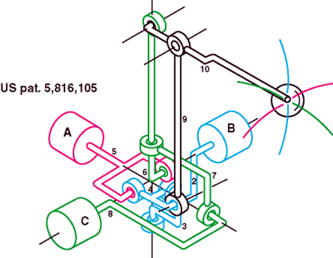
*図1: ジョイスティックに見られる空間リンクの例*

## 2. 自由度と対偶

### 自由度（可動度）
ある物体が動くことができる独立した方向の数です。

### 対偶（たいぐう）
2つのリンクが相対的な自由度を残して結合したものです。2次元リンクでは主に以下の4種類（または移動対偶を含めた6種類）があります。

* **回転対偶**: ピン結合。
* **すべり対偶**: スライダ。
* **ネジ対偶**: ボルトとナット。
* **球対偶**: ボールジョイント。

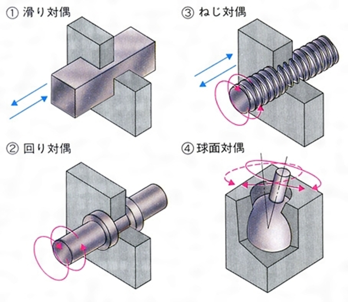
*図2: 対偶の種類*

### クッツバッハ・グルーブラー方程式
2次元リンク機構の自由度 $m$ を求める計算式です。

$$m = 3(n - 1) - 2f$$

* $n$: リンクの数（地面も1つと数える）
* $f$: 1自由度の動作部の数（ピンやスライダの数）

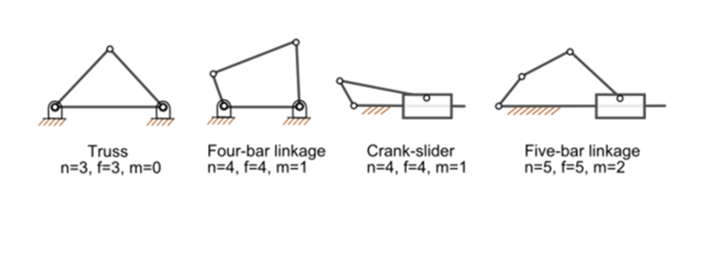
*図3: リンク数と自由度の計算例*

!!! info "四節リンクの重要性"
    自由度0は「トラス（構造物）」、自由度2以上は「不限定動作（動作が1つに決まらない）」となります。そのため、制御が容易で確実な動作をする**自由度1の四節リンク**が広く用いられます。

## 3. 四節リンクの基本

### グラスホフの定理
「最短リンクと他一つのリンクの長さの和が、残りの二つのリンクの長さの和より小さいか等しい」ときに、リンクが完全に回転できる条件を満たします。

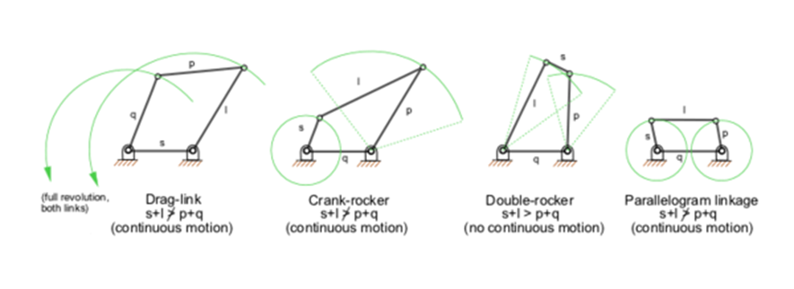
*図4: 四節リンクの運動パターン*

### 用語解説
* **クランク**: 360度回転するリンク。
* **揺動リンク（ロッカー）**: 一定の角度内を往復運動するリンク。
* **従動リンク**: 他のリンクに引かれて動くリンク。
* **スライダ**: 直線運動などを行うガイド構造。

## 4. リンク機構の種類

### アーム機構
平行リンクを基本とし、先端のハンドが一定の向きを保ったまま動く機構が一般的です。

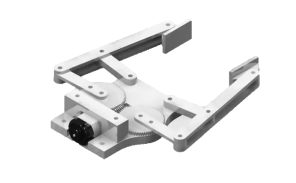
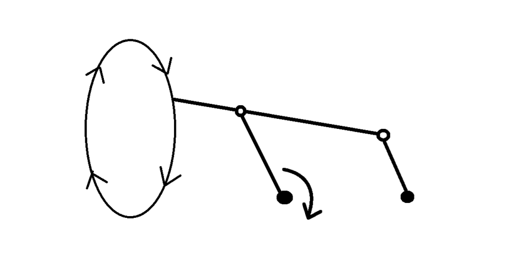
*図5: アーム機構の例（かわロボ等の攻撃用機構を含む）*

### 歩行機構
平面リンクで足先の軌跡を制御し、効率的な歩行を実現します。

1. **チェビシェフリンク（ホーキンスリンク）**: 直線運動を含む軌跡を描く。
2. **チェビシェフ ＋ 平行リンク**: 高専ロボコンで定番。構造が簡単だが機構が大型化しやすい。
3. **チェビシェフ ＋ スライダ**: 低重心でコンパクト。
4. **拡大リンク ＋ チェビシェフ**: 二足歩行等に用いられる、生き物のような動き。
5. **ヘッケンリンク**: わロボで多用。上方向に場所を取らないが、軌跡の調整が難しい。
6. **スライダーヘッケン脚（うしとら脚）**: 足先を完全な円軌道に補正した発展型。

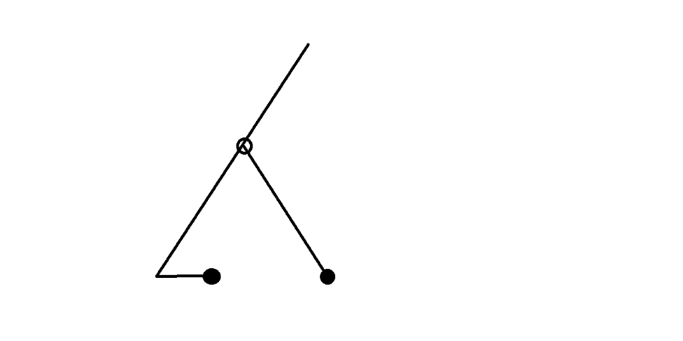
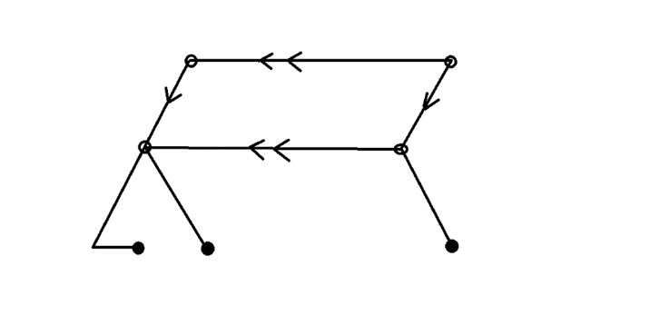
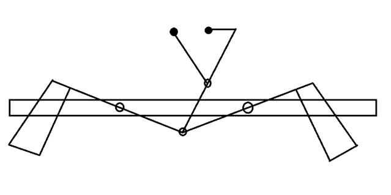
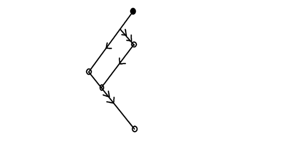
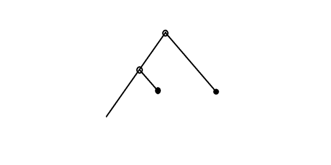
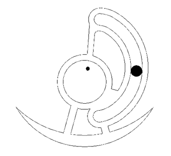

### その他の機構
* **パンタグラフ**: 展開機構。剛性確保が難しく、位置制御には注意が必要。
* **スライダクランク**: 回転を直動に変える（エンジンのピストン等）。
* **スコットラッセルの厳正直線運動**: 厳密な直線を描く。

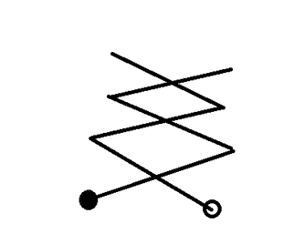
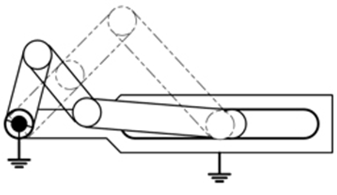
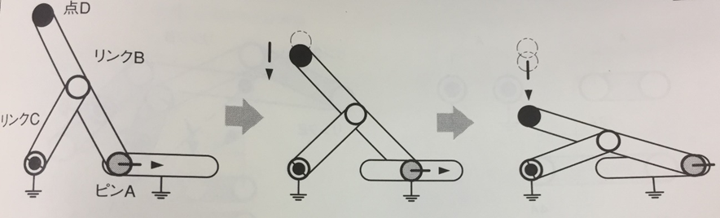

## 5. リンクの構成部品の変換（高度な設計）

軌道を維持したまま、リンクの一部をスライダ等に置き換えて機構をコンパクトにする手法です。

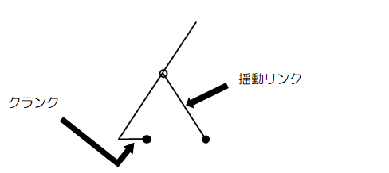

### 変換のステップ
1. **揺動リンクの特定**: 円弧運動をしているリンクを探す。
2. **位相の調査**: 振れ角の最大・最小位置を確認する。
3. **切り返し点の作図**: ジョイント中心を結ぶ円弧を特定する。
4. **スライダ化**: 揺動リンクを削除し、円弧状のスライダガイド等に置き換える。

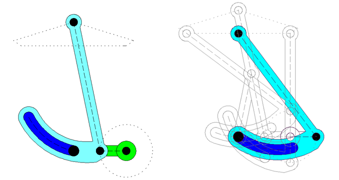
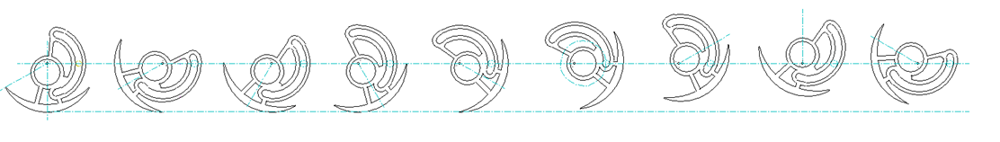
*図6: ヘッケンリンクから完全円軌道の脚機構への変換例*

??? Note
    著者:Shion Noguchi
