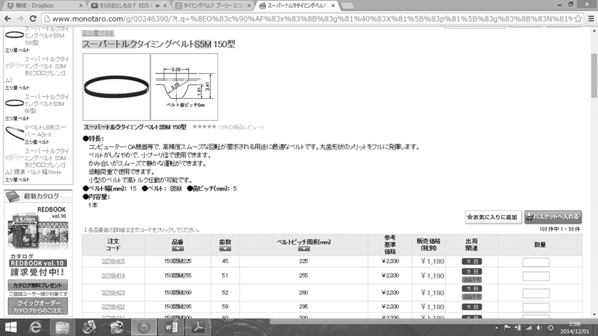
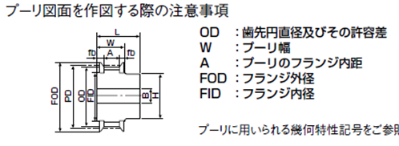
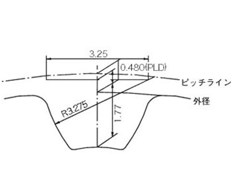
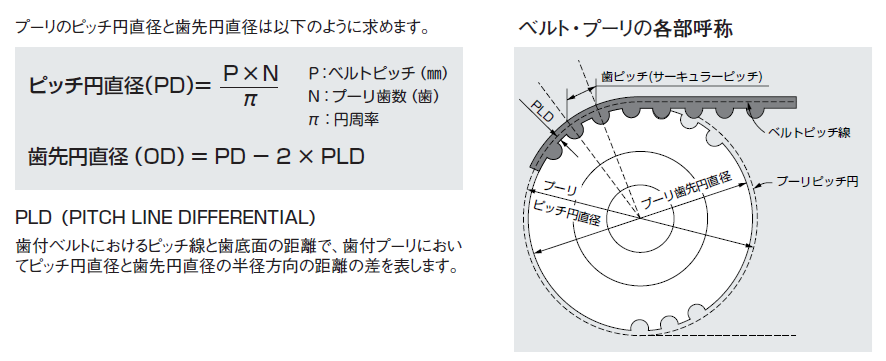

# 伝達講習：動力伝達機構の基礎とタイミングベルト設計

## 1. はじめに

モータなどの動力源により発生したエネルギーを伝えなければ、機械は動作しません。動力伝達機構の代表的なものとして、以下の3つがあります。

* **チェーン機構**: スプロケットとチェーンを使用。
* **ベルト機構**: プーリとベルトを使用。
* **ギヤ機構**: ピニオンとギヤを使用。

これらを使用目的によって適切に使い分けることが重要です。

## 2. 伝達機構の比較と選定基準

各機構の特徴を比較し、設計目的に合ったものを選定します。

| 選定基準 | ギヤ機構 | ベルト機構 | チェーン機構 |
| :--- | :--- | :--- | :--- |
| **1. 軸間距離** | 短い | 長い | 長い |
| **2. 伝達動力(強度)** | **最強**。出力側に適す | 3種類の中で最弱 | ギヤの次に強い |
| **3. メンテナンス性** | 基本フリー。重荷重時はグリス飛散対策が必要 | **メンテナンスフリー**（タイミングベルト等） | 頻繁な注油とテンション調節が必要 |
| **4. 伝達効率** | 90～98% | 80～90% | 70～85% |
| **5. 減速比** | ウォーム等で1段50も可能 | 不向き（長距離伝達専門） | 不向き |
| **6. 伝達方向** | 入出力で逆（平歯車） | 入出力で同じ | 入出力で同じ |

## 3. タイミングベルトの選定と設計（実践）

### 3.1 ベルト型の読み方（例：S5M）

スーパートルクタイミングベルトの型式における「S」と「M」の間の数字は、歯車の**モジュール**に相当します。

* **2以下**: 軽荷重用。
* **3**: 標準的。
* **5**: **重荷重用**。クローラ等、ロボ研での推奨サイズ。
* **8以上**: 極めて大型のため通常は使用しない。

!!! info "ベルト幅について"
    型式の後半の数字（2桁または1桁）は、**ベルトの幅**を示します。

### 3.2 設計の流れ

1. 仮の軸間距離、プーリ歯数、ベルト幅を決定する。
2. プーリのピッチ直径とベルト周長を求め、規格に合うベルトを選択する。
3. 選択したベルトの周長に合わせ、軸間距離を微調整する。

つづいてベルトを調べてみることです。
ロボ研で主に使用しているタイミングベルトは三ツ星ベルトのスーパートルクタイミングベルトです。入手先はMonotaROで入手できます。

ここを使用する理由として
- ベルト幅、ベルト周長、歯の部分の大きさ形状がすぐにわかり設計しやすい。
- プーリの図面もサイトからCADデータが入手できたり、MonotaROにのっているのでそこからCADを書いて自分で好きな葉数、安価、軽量なプーリが自作できる。

### 3.3 計算式

プーリの設計には以下の計算式を用います。

$$ピッチ円直径 (PD) = \frac{P \times N}{\pi}$$

$$歯先円直径 (OD) = PD - 2 \times PLD$$

* $P$: ベルトピッチ (mm)
* $N$: プーリ歯数
* $PLD$: ピッチ線と歯底面の距離（ベルトの心線の位置）

## 4. タイミングベルト使用上の注意点

!!! warning "重要事項"
    * **張力**: 基本的に強く張る必要はありません。
    * **フランジ**: ベルトの脱落（脱調）を防ぐため、必ず装着してください。クローラの場合はベルト内側より0.5mm程度大きくします。
    * **テンショナ**: 原則として「ゆるみ側」に配置します。小プーリの跳ね上がり防止にはプーリ付近に置くと効果的です。
    * **横荷重**: 脱落の原因となるため、ガイドを設けるなどの対策が必要です。

### クローラの特有事項
軸間が長いと張力が変化しトルク不足になります。中央に「コロ」を配置し、旋回時の摩擦も考慮して軸間を長くしすぎないようにします。

## 5. その他の伝達機構

### ギヤトレイン
ベルトを使うまでもない距離をギヤで繋ぐ方法です。

* **利点**: 高強度、メンテナンスフリー、微調整的な減速も可能。
* **欠点**: 段数が増えると効率が低下し、加工・予備パーツの管理が煩雑になる。
* **原理**: 中間のギヤは減速比に影響せず、初段と最終段の歯数比で決まります。

### ひも伝達
非常に軽量で、軸がねじれた位置にあっても伝達可能です。

* **素材**: 耐久性の高いナイロン製などが推奨されます。
* **注意**: 消耗しやすいため交換可能な構造にし、重荷重には使用しないでください。

??? Note
    著者:Shion Noguchi
