# 材料講習：ロボット製作における材料選定と設計

機械班にとって材料選定は極めて重要です。不適切な選定は、部品の**破断、割れ、曲がり**といった致命的な故障を招きます。

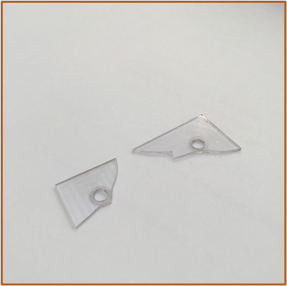

## 1. 金属材料の特徴と用途

### 鋼鉄材料（ステンレス・炭素鋼）
強度が必要な回転軸や構造部に使用します。

| 材料名 | 特徴 | 主な用途 |
| :--- | :--- | :--- |
| **SUS303** | アルミより高強度。ステンレスの中では加工しやすい。 | 軸（旋盤などの手加工用） |
| **SUS304** | アルミより高強度。加工はしづらい。 | 平行ピン、スリットカラー、ワッシャー |
| **S45C** | ステンレスよりも高強度。炭素鋼。 | 歯車、ネジ、スリットカラー |

SUS303

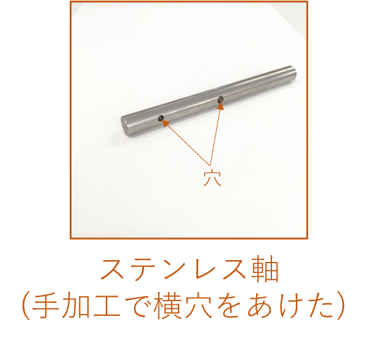

SUS304

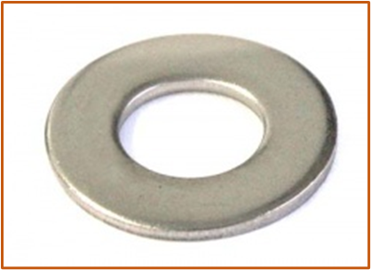

S45C

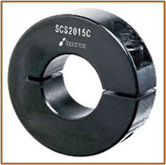

### 銅材料
* **CAC系**: 鉄より重いが、耐圧性・耐摩耗性に優れる。用途：ウォームホイール。

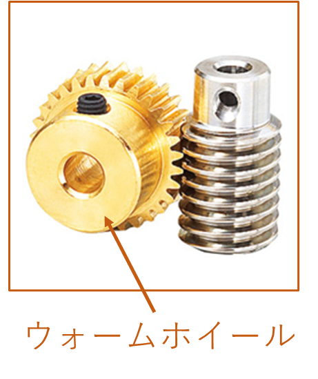

* **黄銅（真鍮）**: 鉄より重く、加工性に優れる。用途：スペーサー。

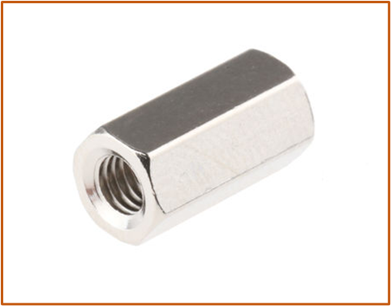

### アルミニウム合金
アルミは番台（JIS規格）によって性質が大きく異なります。

* **A1000系**: 純アルミ。強度が低くNC加工不可。ロボコンではほぼ不採用。

* **A2017 (ジュラルミン)**: 強度が高くNC加工に適す。用途：NC部品、軸。

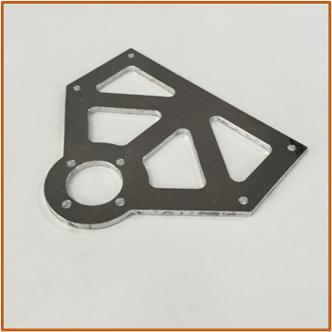

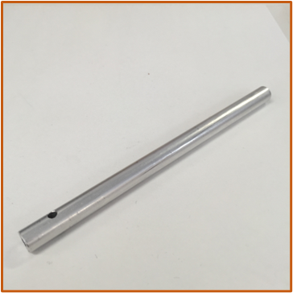

* **A5000系**: 溶接可能で加工しやすいがNC加工には不向き。用途：自作シリンダ部品。

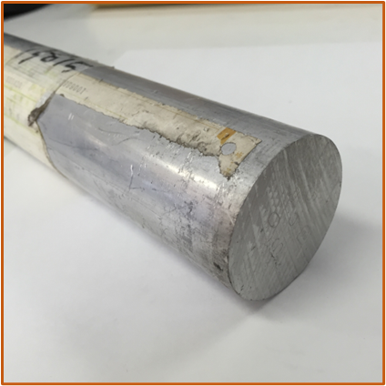

* **A6000系**: 耐食性に優れる。用途：角パイプ、丸棒などの市販形状。

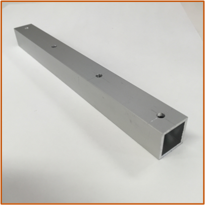

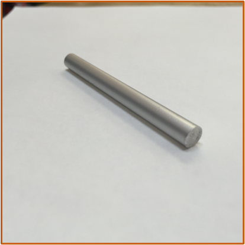

* **A7075 (超々ジュラルミン)**: アルミの中で最強だが高価。用途：高負荷な平板NC部品。

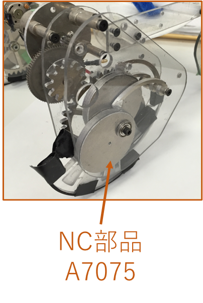

## 2. 樹脂・複合材料の特徴と用途

### 一般樹脂
* **ABS**: 耐衝撃性に優れ加工しやすい。用途：3Dプリンタ用フィラメント。

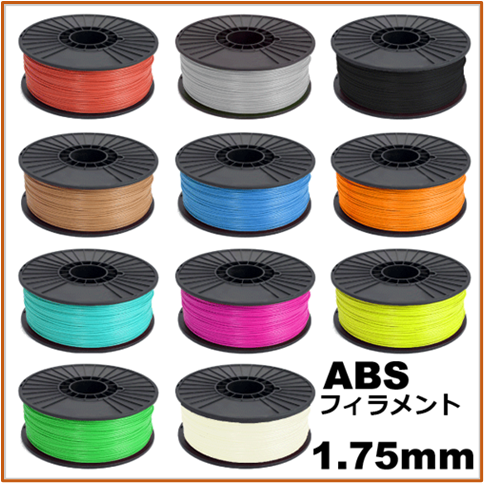

* **MCナイロン**: 耐摩耗性に優れる。用途：青い歯車、スライドパーツ。

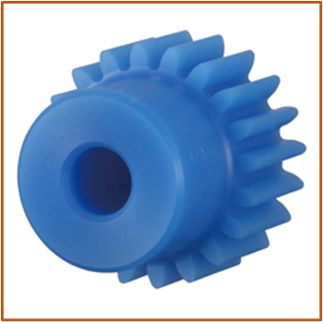

* **アクリル**: 透明度が高いが衝撃に弱く割れやすい。用途：看板、外装。

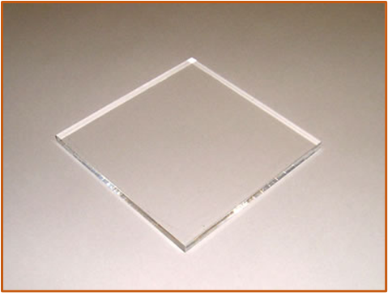

* **ポリカーボネート**: 高強度・高耐衝撃性で透明。用途：透明なNC部品（機体カバーなど）。

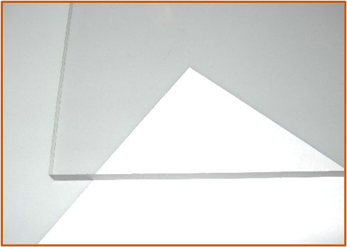

* **ジュラコン (POM)**: 切削性が極めて高く滑りが良い。用途：スペーサー、滑り軸受。

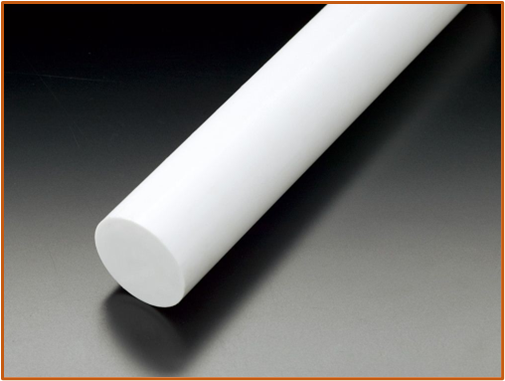

* **塩化ビニル**: 安価で加工しやすい。用途：NC部品、自作エアシリンダ。

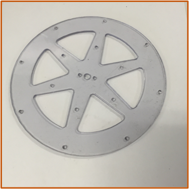

### 樹脂複合材料
* **CFRP (炭素繊維強化プラスチック)**: 極めて軽量かつ高強度だが、高価で加工が困難。用途：パイプ、軽量フレーム。

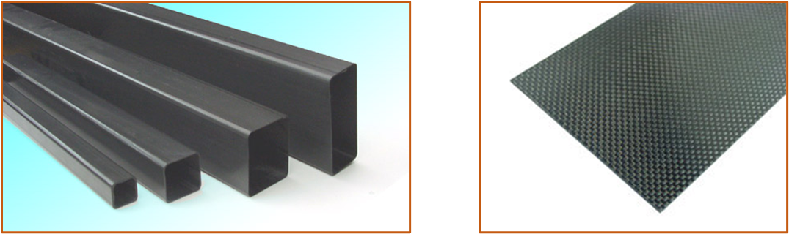

## 3. 設計と「たわみ計算」

材料は、機構の設計完了後に「かかる力」や「場所」を考慮して仮選択します。重量オーバーなどの問題があれば適宜変更します。

### たわみ計算による検証
設計段階で「どのくらい力をかけると、どのくらいたわむのか」を計算することが重要です。

!!! tip "計算の手順"
    1. **支持方法の選択**: 「両端固定」（ネジ締め等）か「両端支持」（置いているだけ）か。
    2. **断面形状の選択**: 角パイプ、丸棒、L字アングルなど。
    3. **定数の入力**: 比重、ヤング率（材料固有の値）、および寸法を入力。

## 参考サイト
* [らくちん設計.com](https://rakutin.himegimi.jp/): 梁のたわみ、重量計算、シリンダ流量計算などがブラウザ上で行える設計支援サイト。

??? Note
    著者:Shion Noguchi
