# 歯車講習：基礎知識と設計・選定のガイドライン

## 1. 歯車（ギヤ）とは
伝動車の周囲に歯形を付け、確実な動力伝達を可能にした機械要素です。JIS表記では「ギヤ」と呼ばれます。主な用途は減速・増速、回転方向の変換、動力の分割などです。

## 2. 歯車の種類

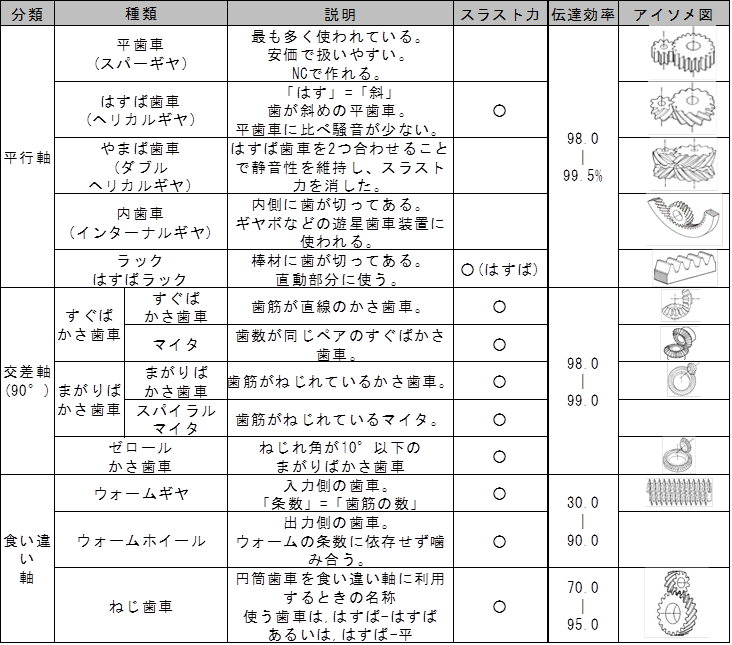

## 3. 歯車の基本用語と計算式

歯の大きさの単位には、主にISO規格の**モジュール**が使われます。

### モジュール ($m$)

* **噛み合い条件**: 同じモジュール同士の歯車のみが噛み合います。
* **ピッチ ($p$)**: 歯から次の歯までの長さ。 $p = \pi m$

| モジュール ($m$) | ピッチ ($p$) |
| :--- | :--- |
| $m = 1$ | $p \approx 3.14$ |
| $m = 2$ | $p \approx 6.28$ |
| $m = 4$ | $p \approx 12.57$ |

### 歯車の直径と計算式

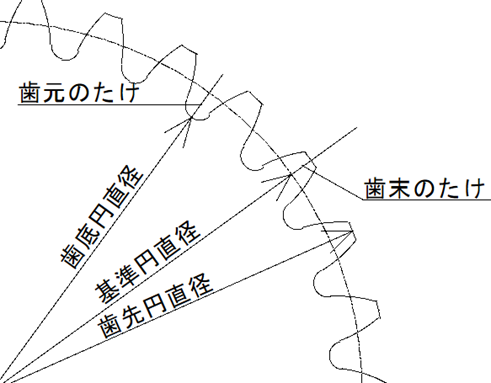

設計時の噛み合いは「基準円」をベースに考えます。

* **基準円直径**: $d = zm$ （$z$: 歯数）
* **歯先円直径**: $da = d + 2m$
* **歯底円直径**: $df = d - 2.5m$

!!! tip "モジュールの逆算法"
    部室にある正体不明の歯車は、以下の式からモジュールを特定できます。
    $m = d / z = (da - d) / 2$

## 4. 歯車の入手先・作り方

* **KHK（小原歯車工業）**: 標準歯車のラインナップが豊富。DXFデータも入手可能。
* **協育歯車**: KHKに次いで一般的。
* **ラジコンショップ (洛西モデル等)**: 小型ピニオン等の入手に向く。
* **自作**: NC、ホブ盤、マシニング、3Dプリンター等。

!!! info "選定のポイント"
    値段、入手性、材料強度、追加工のしやすさを考慮して選びましょう。

## 5. 歯車の計算

### 減速比

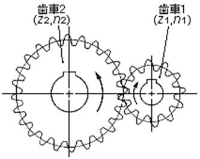

* **1段歯車対**: $R = \frac{z_2}{z_1}$ （駆動側 $z_1$, 被動側 $z_2$）
* **2段歯車列**: $R = \frac{z_2}{z_1} \times \frac{z_4}{z_3}$

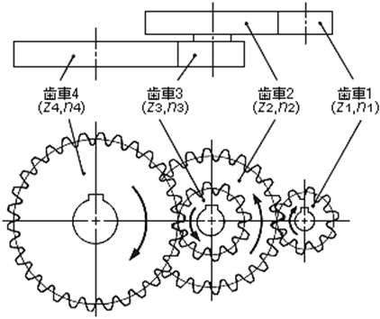

### 伝達トルクと効率

トルクは減速比に比例して増大しますが、摩擦による**伝達効率**（減衰）を考慮する必要があります。

| 駆動歯車 | 被動歯車 | トルクの増減 |
| :--- | :--- | :--- |
| 小 | 大 | **増加**（減速） |
| 大 | 小 | **減少**（増速） |

!!! warning "効率の減衰"
    多段ギヤやウォームギヤでは効率が50%程度まで落ちることがあります。
    **出力トルク = 入力トルク × 減速比 × 伝達効率**

    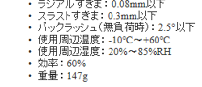

    *IG32 1:100ギヤヘッド(朱雀技研より)*

    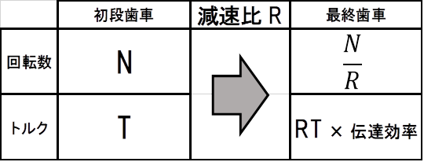

## 6. 設計上の注意

### 歯車にかかる力（スラスト力）

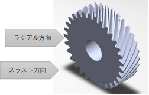

ヘリカルギヤやウォームギヤなどの「ねじれ」がある歯車では、軸方向の力（スラスト力）が発生します。
* **対策**: ラジアルベアリングだけでなく、**スラストベアリング**等を併用して荷重を受け止めましょう。

### バックラッシ（遊び）

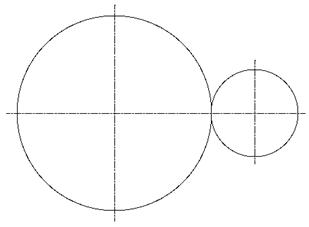

基準円同士を完全に密着させると「焼き付き」の原因になります。

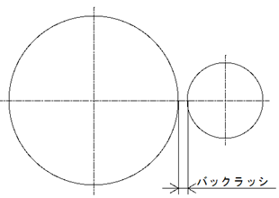

意図的な微小な遊び（バックラッシ）が必要です。

#### 設定方法

1. **メーカーのデータシート**: KHK等のページにある「バックラッシ上限・下限」を利用。

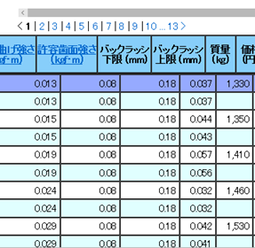

2. **組立距離**: かさ歯車等は、指定の距離で組むと適切な遊びが確保されます。

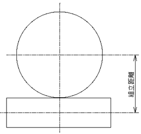

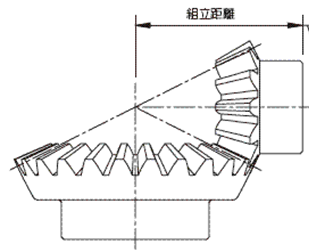

## 7. 特殊な歯車

### ウォームギヤ

* **特徴**: 大減速比、軸の90度変換、**セルフロック**（出力側から回せない）。
* **計算**: 減速比 = ウォームホイール歯数 / ウォーム条数。

### かさ歯車

* **特徴**: 伝達方向を90度変更。軸方向の遊び管理が重要。

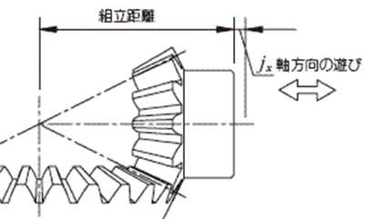

## 8. ギヤボックスとギヤヘッド

### 設計・製作のコツ

* ギヤボックス単体で取り外しを容易にする（メンテナンス性）。
* 軸方向のガタをスペーサー等で抑える（目標精度 0.1mm）。
* 軸受には可能な限りベアリングを使用する（効率向上）。

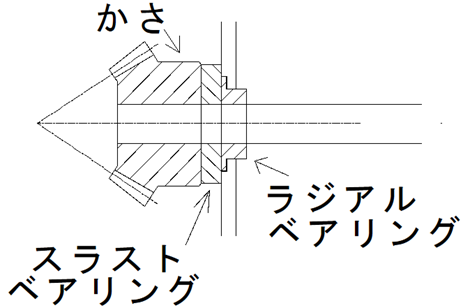

### 市販ギヤヘッドの種類

* **タミヤ**: 安価だが欠けやすい。

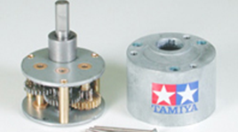

* **ツカサ電工 (KUシリーズ)**: 頑丈だがピニオンの予備が作りにくい。

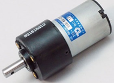

* **IGシリーズ (Shayang)**: 出力軸が中心にあり使いやすい。

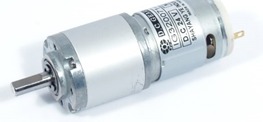

??? Note
    著者:Shion Noguchi