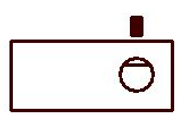
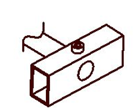
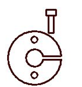
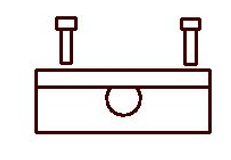
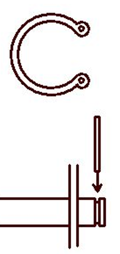
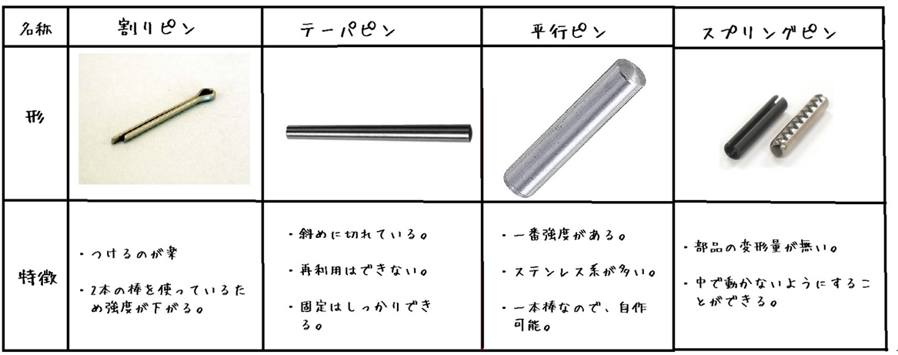
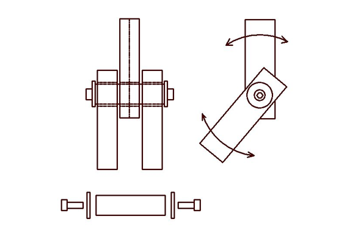

# 軸締結手法の比較と特徴

ロボット製作における軸と部品（プーリ、ギヤ、アーム等）の締結方法について、それぞれの利点・欠点をまとめます。

## 1. 代表的な締結手法

### いもネジ ＋ Dカット
軸の一部を平らに削り（Dカット）、止めねじ（いもねじ）で固定する方法です。

* **利点**: 手軽でコンパクト。着脱が容易で、安価に構成できる。
* **欠点**: 固定力が弱く、高トルクがかかる場所には不向き。

### 全貫通 ＋ ネジまたはピン
軸と部品を貫通させ、ボルトやピンを通す方法です。

* **利点**: 強度が高く、部品点数を少なく抑えられる。
* **欠点**: 軸と穴の両方に高い加工精度が求められる。穴が広がるとガタつきの原因になるため注意が必要。

### スリットカラー（クランプ方式）
部品に切り込みを入れ、ネジの締め付け力で軸を保持する方法です。

* **利点**: 軸への接触面積が広く保持力が高い。軸の加工が不要で、着脱も容易。
* **欠点**: 部品単価が高い。締めすぎると本体やネジを破損させる恐れがある。

### 穴のDカット
部品側の穴形状そのものをD型にする方法です。

* **利点**: 非常に強度が高く、バランスが良い。
* **欠点**: 加工難易度が高く時間がかかる。部品が重くなりやすく、着脱にも手間がかかる。

## 2. 抜け止め・固定用パーツ

### Cリング（止め輪）
軸の溝にはめ込んで横方向の移動を制限します。取り付け・取り外しには専用工具（スナップリングプライヤー）が必要です。

* **特徴**: 相当な負荷がかかっても耐えられる。Dカットやタップ加工よりも工程が楽な場合がある。
* **注意**: 旋盤での溝加工（突っ切り）をミスするとリカバリーが困難。

### ピンの種類と特徴
用途に応じて使い分けます。

| 名称 | 特徴 |
| :--- | :--- |
| **割りピン** | 取り付けが楽だが、2本の棒を曲げて使うため強度は低い。 |
| **テーパピン** | 斜めに切れており、しっかりと固定できる。再利用は不可。 |
| **平行ピン** | 強度が最も高い。一本の棒なので自作も可能。ステンレス製が多い。 |
| **スプリングピン** | 部品の変形を抑えつつ、中で動かないように固定できる。 |

## 3. 特定部位の設計ノウハウ

### リンクの関節部分
* 角パイプ等の間に必ず**ワッシャー**を挟むこと。これがないと滑りが悪くなり、動作に支障が出ます。
* 端部には必ずワッシャーを2枚挟み、クリアランスを適切に管理します（例：0.25mm × 2 = 0.5mm）。

### 軸へのタップ加工
* 軸の端面にネジ穴を立てる方法。旋盤のみで完結するため工程が楽です。
* POMなどの樹脂軸の場合、ある程度の柔軟性を持たせられ、着脱も容易になります。

!!! warning "注意事項"
    材料によって最適な加工方法が異なるため、初めて作業を行う際は、必ず経験のある先輩に指導を仰いでください。

??? Note
    著者:Shion Noguchi