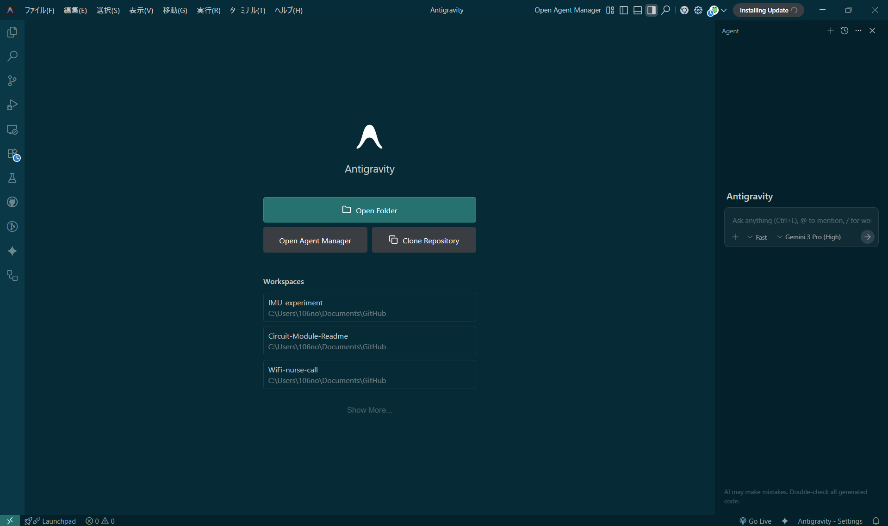
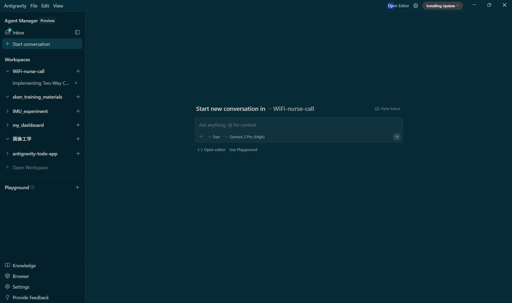
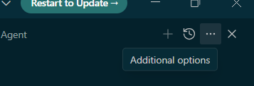
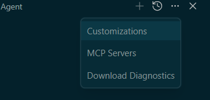
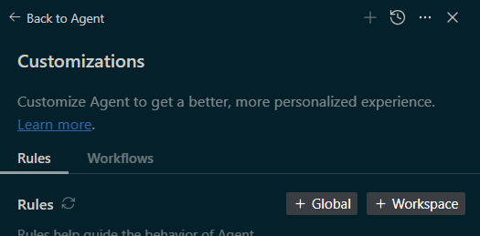

# [Google Antigravity](https://antigravity.google/?hl=ja)
## 初めに

エージェント指向の開発プラットフォームである [Google Antigravity](https://antigravity.google/?hl=ja)（以降、このドキュメントでは Antigravity と表記）について説明します。Antigravity は、IDE をエージェント ファーストの時代へと進化させます。

行を自動補完するだけの標準的なコーディング アシスタントとは異なり、Antigravity は、計画、コーディング、ウェブの閲覧まで可能な自律型エージェントを管理するための「ミッション コントロール」を提供し、構築を支援します。

Antigravity は「エージェント ファースト」のプラットフォームとして設計されています。これは、AI がコードを記述するツールではなく、人間の介入を最小限に抑えながら、複雑なエンジニアリング タスクの計画、実行、検証、反復処理を行うことができる自律的なアクターであることを前提としています。


- 必要なもの
　現在(2025/12/19)、Antigravity は個人用の Gmail アカウントでプレビュー版としてご利用いただけます。最上位モデルを使用するための無料割り当てが付属しています。
　Antigravity はシステムにローカルにインストールする必要があります。このプロダクトは、Mac、Windows、特定の Linux ディストリビューションで利用できます。ご自身のパソコンに加えて、次のものが必要です。

- Chrome ウェブブラウザ
- Gmail アカウント（個人用 Gmail アカウント）

詳しく解説している[こちら](https://codelabs.developers.google.com/getting-started-google-antigravity?hl=ja#0)をご覧ください。

## ルールについて
今回はAntigravityに設定するルールについて説明します.
詳しくは[こちら](https://codelabs.developers.google.com/getting-started-google-antigravity?hl=ja#8)



これがホーム画面です。
ここで「Ctrl+e」でAIエージェント画面を開くことができます。



ルールはホーム画面で行います



右上にある ... をクリックして Customizations を選択すると、Rules と Workflows が表示されます。





そうするとこのような画面が開けます。
Globalで設定するとすべてに適応されます。
例えば以下のように設定します

```md
# 基本的な振る舞い (General Behavior)
- エージェントは常に **日本語** を使用して応答してください。
- 思考プロセス、分析、ユーザーへの提案もすべて日本語で行ってください。

# 計画・タスク管理 (Planning & Tasks)
以下の成果物を作成する際は、必ず日本語で記述してください：
- **タスクリスト (Task Lists)**
- **実施計画 (Implementation Plans)**
- **コードのウォークスルー (Walkthroughs)**
- ステップバイステップの手順解説

# ドキュメント作成 (Documentation)
- README.md、仕様書、設計書などのドキュメントは日本語で記述してください。

# コードとコメント (Code & Comments)
- コード内のコメントアウト（説明書き）は、英語ではなく **日本語** で記述してください。
- 変数名や関数名は一般的な英語の命名規則（snake_caseやCamelCaseなど）に従いますが、その説明は日本語で行ってください。
```

> ルールは、エージェントの動作をガイドするのに役立ちます。これらは、エージェントがコードとテストを生成する際に従うように指定できるガイドラインです。たとえば、エージェントに特定のコードスタイルに従うことや、常にメソッドを文書化することを求めることができます。これらをルールとして追加すると、エージェントが考慮します。

> ワークフローは、エージェントとのやり取り中に / でオンデマンドでトリガーできる保存済みのプロンプトです。また、エージェントの動作をガイドしますが、ユーザーがオンデマンドでトリガーします。


「ルールは英語の方がいいか？」と思われるかもしれませんが、今回のケースでは「日本語」で記述することをお勧めします。

- 目的が「日本語での出力」の徹底だからです
プロンプト（指示書）自体が日本語で書かれていること自体が、AIに対する「日本語を使う」という強いバイアス（数ショット学習的な効果）として機能します。「日本語で書いて」と英語で指示するよりも、日本語で指示した方が、ニュアンスや文体（「〜してください」など）まで含めて伝わりやすくなります。

- Geminiの日本語理解能力が高いからです
Geminiを含む最新のモデルは日本語の指示を非常に正確に理解します。特に今回のような「振る舞い」や「フォーマット」に関する指示であれば、翻訳の齟齬を避けるためにも、ユーザー自身が書きやすい言語（日本語）で書く方が意図通りの制御がしやすくなります。

- 補足：英語の方が良いケース
非常に複雑な論理的推論を要するタスクや、プログラミングコード自体の生成精度を極限まで高めたい場合（特に英語圏のライブラリを多用する場合など）は、英語で指示を書いた方がモデルの内部処理的にパフォーマンスが良い場合があります。


??? Note
    著者:Shion Noguchi
