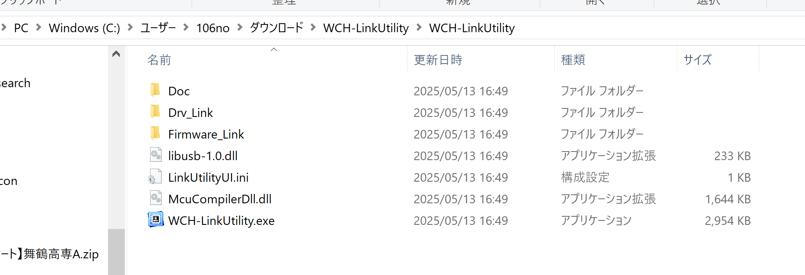
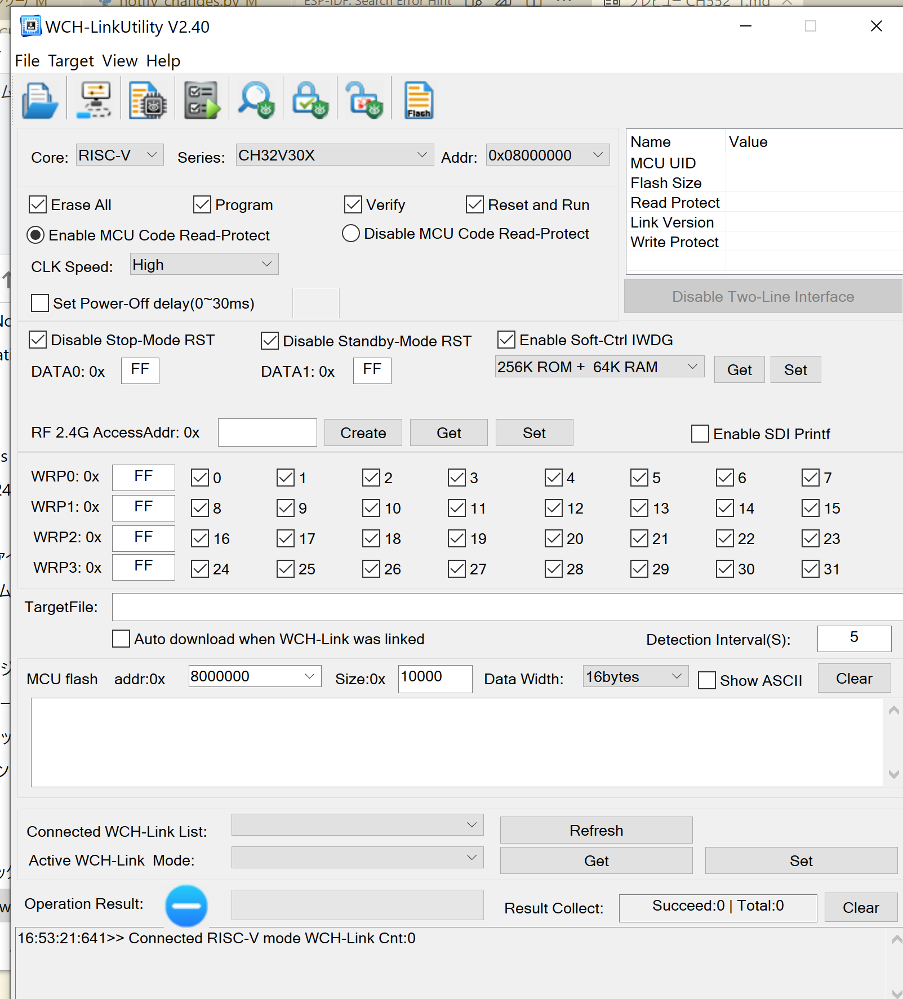

# CH552で始める Arduino スタイル開発ガイド

## 開発環境を整える
### ドライバー
PCにドライバーを入れていきます．

[こちら](https://www.wch.cn/download/file?id=418)でZIPファイルをダウンロードして，
展開してください．



すると，WCH-LinkUtility.exeをダブルクリックで実行します．
すると以下のような画面が出ると思います．
ひらいたら，右上のバツ印で閉じてもらって大丈夫です．

このとき，いくつか聞かれますが「はい」を選択しておいてください．
自動的にドライバーがPCに入ります．



### ArduinoIDE
CH552をArduino開発環境で扱うには、少し準備が必要です。  
まずArduino IDEをインストールし、「ファイル」→「基本設定」を開きます。  
「追加のボードマネージャのURL」欄に次のURLを追加してください。

```
https://raw.githubusercontent.com/DeqingSun/ch55xduino/ch55xduino/package_ch55xduino_mcs51_index.json
```

!!! Tip
    すでに他のURLがある場合は、カンマ区切りで追加してください．

設定を保存したら、「ツール」→「ボード」→「ボードマネージャ」を開きます。  
検索欄に「CH55xduino」と入力し、表示されたパッケージをインストールしましょう。

これでCH552がArduino IDE上で使えるようになります。


## ボード設定とオプション

ボードの種類は「CH552 Board」を選びます。  
特別な事情がない限り、他の設定はデフォルトのままで問題ありません。

通常はUSB経由でプログラムを書き込んだりシリアル通信したりするので、通信モードは「Default CDC」を選びます。  
もしCH552のHID機能（USBキーボードやマウスエミュレーション）を使いたい場合は、「USER CODE w/ 148B USB ram」などに設定して、USB用にRAMを確保しましょう。

## プログラムの書き込み方法

CH552は直接パソコンと接続します。  
特別な書き込み器は必要ありません。

書き込みの際、基板のSWを導通させてブートローダーモードに切り替えます。Arduino IDEからプログラムを書き込むと、自動的に転送が始まります。  
書き込みエラーが出た場合は、USBドライバが正しくインストールされているか、ケーブルがデータ通信用かどうかを確認してみましょう。

## サンプルコード

ここでは、LEDを点滅させるプログラムを作成します。  
以下のコードをArduino IDEに入力し、CH552に書き込んでみましょう。

```cpp
#define LED_BUILTIN 15 // P1.5に接続されたLEDを使う

void setup() {
  pinMode(LED_BUILTIN, OUTPUT); // LED_BUILTIN を出力モードに設定
}

void loop() {
  digitalWrite(LED_BUILTIN, HIGH); // LEDを点灯
  delay(500);                      // 500ミリ秒待機
  digitalWrite(LED_BUILTIN, LOW);  // LEDを消灯
  delay(500);                      // 500ミリ秒待機
}
```

このプログラムは、CH552のP1.5ピンに接続されたLEDを500ミリ秒ごとに点滅させます。  
Arduino標準の`pinMode()`、`digitalWrite()`、`delay()`を使っているため、ほかのArduinoボードと同じ感覚で開発できます。


PWMの例
```cpp
void setup() {
  pinMode(15, OUTPUT); // 15はP1.5（PWM対応）
}

void loop() {
  for (int i = 0; i <= 255; i++) {
    analogWrite(15, i); // PWMデューティ比を0〜255で変化
    delay(10);
  }

  for (int i = 255; i >= 0; i--) {
    analogWrite(15, i);
    delay(10);
  }
}


```

## プログラミング

では外部のLEDを動かしてみましょう．
ピンはP3.4,p3.3を使います．

- P3.4，P3.3ピンにLEDのアノード（長い脚）を接続します。
- LEDのカソード（短い脚）は330Ω程度の抵抗を通してGNDに接続します。

LEDを直接接続するとCH552に負荷がかかるため、必ず抵抗を入れるようにしましょう。


以下のコードを使用して、P3.2とP1.4に接続された外部LEDを交互に点滅させるプログラムを作成します。

```cpp
#define LED1 34 // P3.4に接続されたLED
#define LED2 33 // P3.3に接続されたLED

void setup() {
  pinMode(LED1, OUTPUT); // LED1を出力モードに設定
  pinMode(LED2, OUTPUT); // LED2を出力モードに設定
}

void loop() {
  digitalWrite(LED1, HIGH); // LED1を点灯
  digitalWrite(LED2, LOW);  // LED2を消灯
  delay(500);               // 500ミリ秒待機

  digitalWrite(LED1, LOW);  // LED1を消灯
  digitalWrite(LED2, HIGH); // LED2を点灯
  delay(500);               // 500ミリ秒待機
}
```

このプログラムでは、P3.4とP3.3に接続されたLEDが交互に点滅します。  
`digitalWrite()`関数を使用して、各ピンの出力を制御しています。

!!! Note
    **電流制限抵抗の使用**  
    LEDを直接ピンに接続すると、CH552のピンに過剰な電流が流れ、故障の原因となります。必ず330Ω以上の抵抗を使用してください。

    **ピンの電流制限**  
    CH552の各ピンには最大電流制限があります。複数のLEDを同時に点灯させる場合は、合計電流が制限を超えないように注意してください。


??? Note
    著者:Shion Noguchi
