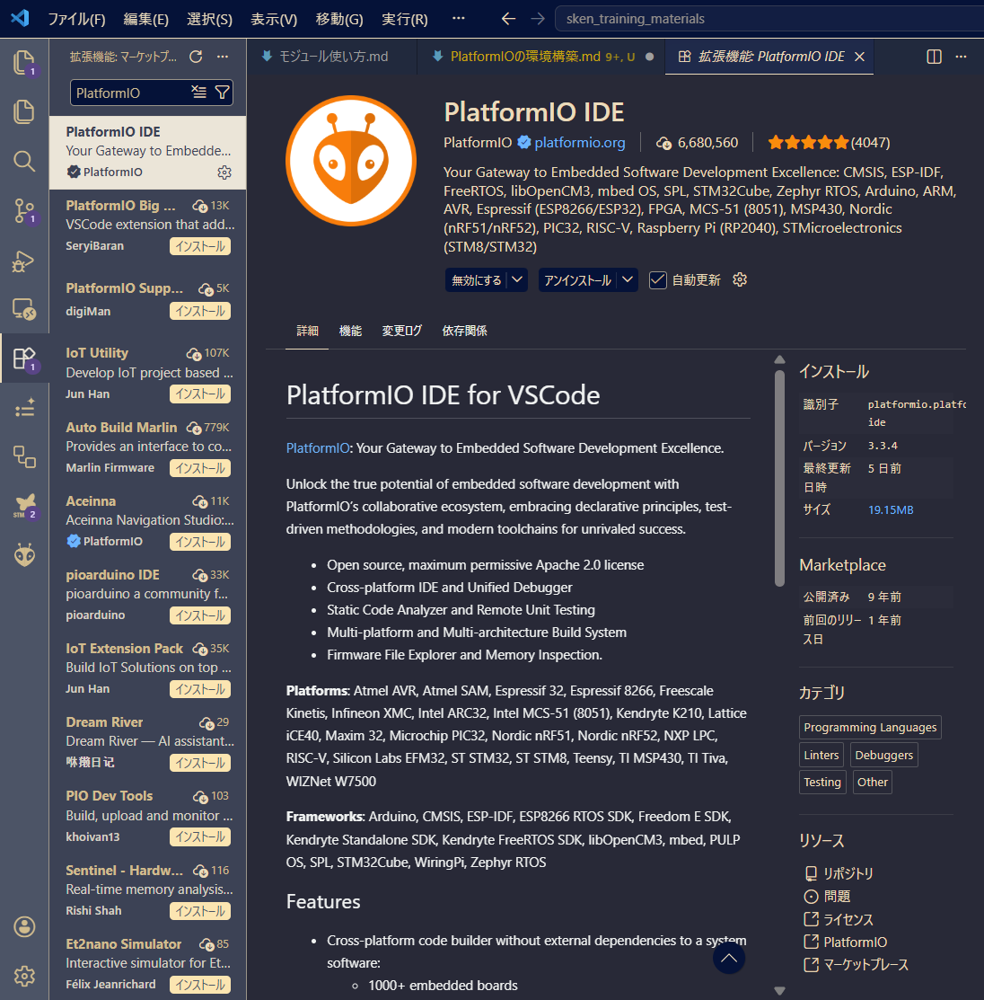
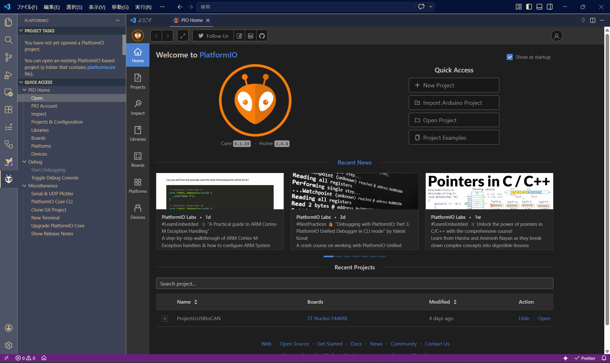
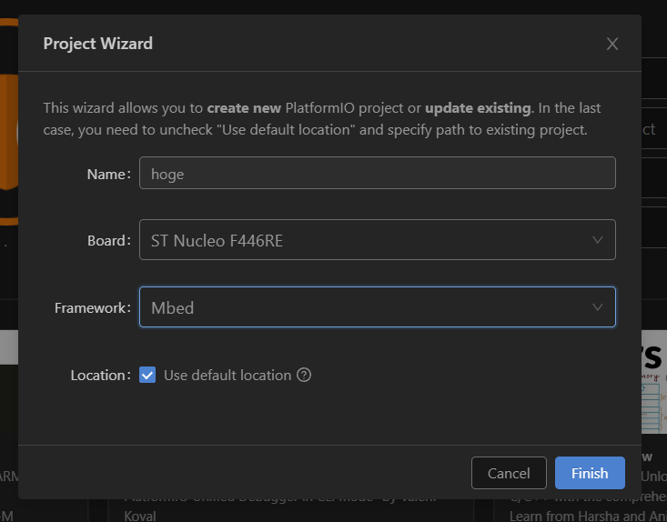
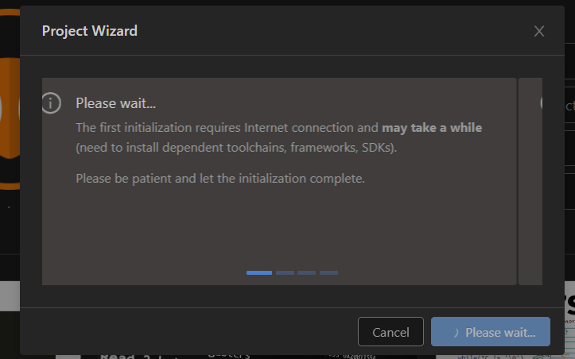
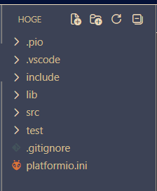

# VS Code + PlatformIO による Mbed 開発環境構築ガイド

VS Code上で **PlatformIO (PIO)** を利用すると、Mbed Studioよりも軽量で、かつ強力なコード補完やライブラリ管理機能を備えた開発環境を構築できます。

## 1. 必要なツールのインストール

まず、ベースとなる環境を整えます。

* **Visual Studio Code**: 本体がインストールされていること。
https://code.visualstudio.com/download

* **Python**: PlatformIOの動作に必要です（3.6以降を推奨）。
https://altairu.github.io/sken_training_materials/training_materials/%E8%AC%9B%E7%BF%92%E8%B3%87%E6%96%99/python3/python3_%E4%BA%8B%E5%A7%8B/

* **Git**: プロジェクト管理やライブラリ取得に使用します。(必須ではない)

## 2. PlatformIO IDE 拡張機能の導入

!!! Warning
    プロキシ環境下ではVScodeに特別な設定が必要です


[公式ドキュメントはこちら](https://docs.platformio.org/en/latest/integration/ide/vscode.html)

1.  VS Codeを起動し、左側の **拡張機能アイコン（Extensions）** をクリックします。
   
2.  検索窓に `PlatformIO IDE` と入力します。
   
    
   
3.  表示された公式の拡張機能を **Install** します。
   
4.  インストール完了後、左側に **アリのアイコン（PlatformIOロゴ）** が表示されるのを待ちます（初回はツールチェーンのダウンロードに数分かかる場合があります）。
    

    !!! Tip
        構築には時間がかかります．人によっては30分ほどかかる場合も

## 3. プロジェクトの作成

1.  PIOメニュー（アリのアイコン）から **PIO Home > Open** をクリックします。
   
    

2.  **+ New Project** ボタンを押します。
   
3.  プロジェクト設定を以下のように入力します：
    * **Name**: プロジェクト名（例: `hoge`）
    * **Board**: 使用するマイコンボードを選択（例: `ST Nucleo F446RE`）
    * **Framework**: `mbed` を選択
       
  
4.  **Finish** をクリックします。
    * ※初回はMbedのフレームワーク一式をダウンロードするため、時間がかかることがあります。
    
    
    
    !!! Tip
        構築には時間がかかります．人によっては30分ほどかかる場合も

## 4. プロジェクト構造の理解

作成されたプロジェクトは以下のような構成になります。



* **`platformio.ini`**: プロジェクトの設定ファイル（これが最も重要です）。
* **`src/`**: ソースコードを配置する場所。ここに `main.cpp` を作成します。
* **`lib/`**: プロジェクト固有のライブラリを入れる場所。
* **`.pio/`**: コンパイル済みのバイナリやダウンロードされたライブラリが格納されます（触る必要はありません）。

```
.
├── include/
│   └── README
├── lib/
│   └── README
├── src/
│   └── main.cpp
├── test/
│   └── README
└── platformio.ini
```

## 5. コードの記述 (Lチカ)

`src` フォルダ内に `main.cpp` を作成（または編集）し、以下のテストコードを記述します。

```cpp
#include "mbed.h"

// main関数はプログラムのエントリーポイントです
int main() {
    // 初期化コード

    while (true) {
        // メインループ
    }
}
```


## 6. ビルドと書き込み

VS Codeの画面最下部にある **ステータスバーのアイコン** を使用して操作します。

1.  **Build (チェックマークアイコン)**: コードをコンパイルします。
2.  **Upload (右矢印アイコン)**: マイコンボードにプログラムを書き込みます。
3.  **Serial Monitor (コンセントアイコン)**: `printf` などの出力を確認します。


## 7. `platformio.ini` のカスタマイズ

シリアル通信のボーレート設定など、よく使う設定例です。

```ini
[env:nucleo_f401re]
platform = ststm32
board = nucleo_f401re
framework = mbed

; シリアルモニタの通信速度設定 115200にしてもよい
monitor_speed = 9600

; 特定のライブラリを追加する場合
; lib_deps = 
```
## 💡 トラブルシューティング

* **ビルドが遅い**: Mbedは非常に巨大なフレームワークであるため、初回のビルドは数分かかります。2回目以降は変更点のみビルドされるため高速になります。
  
* **IntelliSense（赤波線）が出る**: PIOがバックグラウンドでインデックスを作成している最中かもしれません。少し待つか、コマンドパレット（`Ctrl+Shift+P`）から `PlatformIO: Rebuild IntelliSense Index` を実行してください。
  
* **書き込みエラー**: ボードが正しく認識されているか、USBケーブルがデータ転送対応か確認してください。

