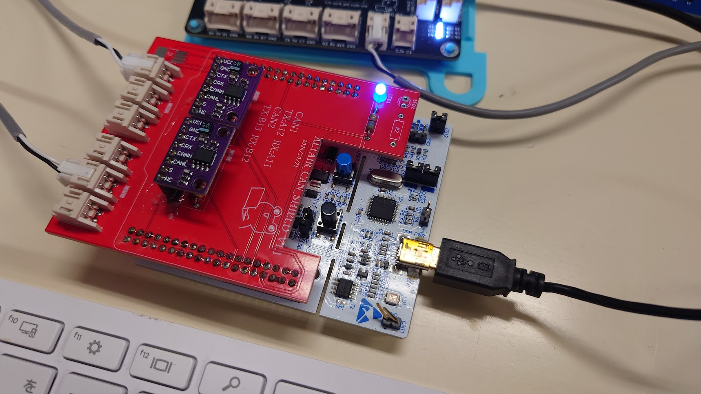

# はじめてのMbed

## 概要
プラットフォームIOでMbedを使用して開発を始める際の基本的な手順と、Mbedの主要な機能について説明します。

## プロジェクトの設定

1. **プラットフォームIOをインストール**
   - VSCodeをインストールし、拡張機能からPlatformIOを追加します。

2. **Mbed OSプロジェクトを作成**
   - PlatformIOのホーム画面から「New Project」を選択し、ボードタイプとしてMbed対応のマイコン（例：NUCLEO-F446RE）を選択します。
   - フレームワークとして「Mbed」を選択し、プロジェクトを作成します。

## 基本的な書き方

### メインファイルの構成

Mbed OSプロジェクトでは、通常 `main.cpp` にプログラムを書きます。Mbed OSを使用する際は、次のような構成になります。

```cpp
#include "mbed.h"

// main関数はプログラムのエントリーポイントです
int main() {
    // 初期化コード

    while (true) {
        // メインループ
    }
}
```

## 信号の出し方

### デジタル出力

デジタル出力ピンを制御するには `DigitalOut` クラスを使用します。

```cpp
#include "mbed.h"

DigitalOut led(LED1); // LED1はデフォルトのLEDピン

int main() {
    while (true) {
        led = 1; // LEDをON
        ThisThread::sleep_for(500ms);
        led = 0; // LEDをOFF
        ThisThread::sleep_for(500ms);
    }
}
```

### デジタル入力

デジタル入力ピンの状態を読み取るには `DigitalIn` クラスを使用します。

```cpp
#include "mbed.h"

DigitalIn button(USER_BUTTON); // USER_BUTTONはボードのデフォルトボタンピン

int main() {
    while (true) {
        if (button == 1) {
            printf("Button is pressed\n");
        } else {
            printf("Button is not pressed\n");
        }
        ThisThread::sleep_for(500ms);
    }
}
```
回数により認識する場合
```cpp
#include "mbed.h"
#include <chrono>

// 高解像度クロックを使用
using namespace std::chrono;

DigitalIn button(USER_BUTTON); // USER_BUTTONはボードのデフォルトボタンピン
int button_press_count = 0;    // ボタンが押された回数
bool button_pressed = false;   // ボタンが押されているかを追跡

int main() {
    auto pre = HighResClock::now();  // 前回のタイムスタンプ
    while (true) {
        // 現在の時間を取得
        auto now = HighResClock::now();
        
        // 500ms経過しているか確認
        if (duration_cast<milliseconds>(now - pre).count() >= 500) {
            pre = now;  // タイムスタンプを更新
            
            // ボタンが押されているか確認
            if (button == 1 && !button_pressed) {
                // ボタンが押された瞬間を検知
                button_pressed = true;
                button_press_count++; // ボタンの押下回数をカウント
                printf("Button pressed %d times\n", button_press_count);

                // カウントが偶数回の場合に動作
                if (button_press_count % 2 == 0) {
                    printf("Even press count, performing action.\n");
                    // ここに偶数回目の押下時の動作を記述
                }
            }

            // ボタンが離された状態を確認
            if (button == 0 && button_pressed) {
                // ボタンが離されたことを確認
                button_pressed = false;
            }
        }
    }
}
```

### プルアップとプルダウン

デジタル入力にプルアップまたはプルダウンを設定するには、`DigitalIn` クラスの初期化時に指定します。

```cpp
DigitalIn button(USER_BUTTON, PullUp);   // プルアップ抵抗を有効にする
DigitalIn button(USER_BUTTON, PullDown); // プルダウン抵抗を有効にする
```

### PWM出力

PWM信号を生成するには `PwmOut` クラスを使用します。

```cpp
#include "mbed.h"

PwmOut pwmPin(PD_9); // 任意のPWM出力ピンを指定

int main() {
    pwmPin.period(0.001f); // PWM周期を1ms (1000Hz) に設定
    pwmPin.write(0.5f);    // デューティサイクル50%

    while (true) {
        // メインループ
    }
}
```

### タイマーの使用

タイマーや遅延を実装するには、`Timer` クラスや `ThisThread::sleep_for` を使用します。

```cpp
#include "mbed.h"

Timer t;

int main() {
    t.start(); // タイマーを開始

    ThisThread::sleep_for(2000ms); // 2秒待つ

    t.stop(); // タイマーを停止
    printf("Elapsed time: %f seconds\n", t.read()); // 経過時間を表示
}
```

## CAN通信

### 1. CAN Busの初期化

まず、CAN Busを初期化します。`CAN` クラスを使用して、CAN通信の設定を行います。

```cpp
#include "mbed.h"

// CANオブジェクトの初期化。CAN通信のRXピンとTXピン、通信速度を指定します。
CAN can1(PA_11, PA_12, 1000000); // RX, TX, ボーレート1000kbps
```

- `CAN can1(PinName rd, PinName td, int hz = 1000000)` という形式で、CAN Busを初期化します。
  - `rd` はCANのRXピン、`td` はTXピンです。
  - `hz` はCANのボーレート（ビットレート）で、例として1000 kbpsを指定しています。

### 2. CANMessage構造体の作成と初期化

CAN通信で送受信するメッセージは、`CANMessage` 構造体を使用して作成します。`CANMessage` 構造体を初期化する際に、メッセージID、データ、データ長を一度に設定できます。

#### `uint8_t` データの場合

```cpp
// 送信データの作成
uint32_t id = 0x200;
uint8_t data[8] = {0x00, 0x01, 0x02, 0x03, 0x04, 0x05, 0x06, 0x07};

// CANMessage構造体の作成
CANMessage msg{id, data, sizeof(data)};
```

- `CANMessage msg{id, data, sizeof(data)}` により、`uint8_t` 型のデータ配列を直接渡すことができます。

#### `int16_t` データの場合

```cpp
// 送信データの作成 (int16_t型)
uint32_t id = 0x200;
int16_t data[4] = {4000, 2000, 0, -5000};

// CANMessage構造体の作成
CANMessage msg{id, reinterpret_cast<const uint8_t *>(data), sizeof(data)};
```

- `int16_t` 型のデータを送信する場合は、`reinterpret_cast<const uint8_t *>(data)` を使用して `uint8_t` 型にキャストします。

### 3. CANメッセージの送信

CANメッセージを送信するには、`CAN::write` メソッドを使用します。

```cpp
#include "mbed.h"

CAN can1(PA_11, PA_12, 1000000); // CANの初期化 (例: PA_11:RX, PA_12:TX, 500kbps)
uint32_t id = 0x200;
int16_t data[4] = {4000, 2000, 0, -5000};
CANMessage msg{id, reinterpret_cast<const uint8_t *>(data), sizeof(data)};

int main() {
    // メッセージの送信
    if (can1.write(msg)) {
        printf("Message sent: ID=0x%X\n", id);
    } else {
        printf("Error sending message\n");
    }

    while (true) {
        // メインループ
    }
}
```

- `can1.write(msg)` により、CANメッセージを送信します。送信が成功した場合は `true` を返し、失敗した場合は `false` を返します。

### 4. CANメッセージの受信

CANメッセージを受信するには、`CAN::read` メソッドを使用します。

```cpp
#include "mbed.h"

CAN can1(PA_11, PA_12, 1000000); // CANの初期化 (例: PA_11:RX, PA_12:TX, 500kbps)
CANMessage msg;

int main() {
    while (true) {
        // メッセージを受信
        if (can1.read(msg)) {
            printf("Message received: ID=0x%X, Data=", msg.id);
            for (int i = 0; i < msg.len; i++) {
                printf("%02X ", msg.data[i]);
            }
            printf("\n");
        }

        ThisThread::sleep_for(100ms); // 100ms待機
    }
}
```

- `can1.read(msg)` により、CANメッセージを受信します。受信したメッセージは `CANMessage` 構造体に格納され、メッセージIDやデータを処理できます。

### 説明

1. **CAN Busの初期化**:
   - `CAN` クラスを使用して、指定したRXピンとTXピンでCAN Busを初期化します。ボーレートはオプションで設定できます。

2. **CANMessage構造体の作成と初期化**:
   - `CANMessage` 構造体は、メッセージID、データ、およびデータ長を初期化時に設定します。
   - `uint8_t` 型以外のデータを送信する場合は、`reinterpret_cast` を使って `uint8_t` 型にキャストします。

3. **CANメッセージの送信**:
   - `CAN::write` メソッドを使用して、CANメッセージを送信します。送信が成功した場合は `true` を返し、失敗した場合は `false` を返します。

4. **CANメッセージの受信**:
   - `CAN::read` メソッドを使用して、CANメッセージを受信します。受信したメッセージは `CANMessage` 構造体に格納されます。

### CANBUSプログラム

CAN1にきたものをCAN2に送る，CAN2にきたものをCAN1に送るプログラム

```cpp
#include "mbed.h"

CAN can1(PA_11, PA_12, 1000000); // CANの初期化 (例: PA_11:RX, PA_12:TX, 1Mbps)
CAN can2(PB_12, PB_13, 1000000); // CANの初期化 (例: PB_12:RX, PB_13:TX, 1Mbps)
CANMessage msg;

int main() {
    while (true) {
        // CAN1で受信 → CAN2へ転送
        if (can1.read(msg)) {
            can2.write(msg);
        }

        // CAN2で受信 → CAN1へ転送
        if (can2.read(msg)) {
            can1.write(msg);
        }
    }
}

```


??? Note
    著者:Shion Noguchi