# 環境構築

STM32の開発といえば「STM32CubeIDE」が主流でしたが、最近では公式の拡張機能により **Visual Studio Code (VS Code)** での本格的な開発が可能になりました。
環境構築からプロジェクト作成、デバッグ実行までの流れを解説します。
公式の以下Youtubeとサイトを参考に構築するとわかりやすいです．

https://www.youtube.com/watch?v=aWMni01XGeI

https://qiita.com/usashirou/items/98f006b6f51844814669


## 1. 必要なツールのインストール

VS CodeでSTM32を扱うには、以下の3つのコンポーネントが必要です。

1.  **STM32CubeMX**: プロジェクト生成・周辺機能設定ツール。
2.  **STM32CubeCLT (Command Line Tools)**: コンパイラ(GCC)、デバッガ(GDB)、書き込みツールを含むコマンドラインツールセット。
3.  **STM32 VS Code Extension**: VS Code用の公式拡張機能。

STM32の開発といえば「STM32CubeIDE」が主流でしたが、最近では公式の拡張機能により **Visual Studio Code (VS Code)** での本格的な開発が可能になりました。
本記事では、環境構築からプロジェクト作成、デバッグ実行までの流れを解説します。


### 手順
1.  **VS Code 拡張機能のインストール**
    * VS Codeの拡張機能マーケットプレイスで「**STM32CubeIDE for Visual Studio Code**」を検索してインストールします。

    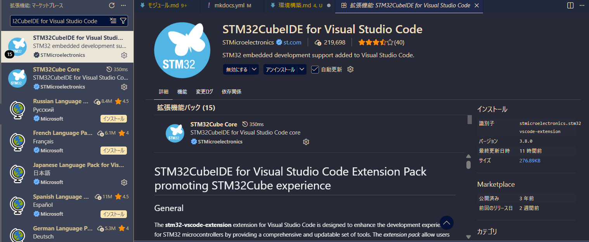

2.  **STM32CubeCLTのインストール**
    * [STマイクロ公式サイト](https://www.st.com/ja/development-tools/stm32cubeclt.html)からインストーラーをダウンロードし、画面の指示に従ってインストールします。
   
    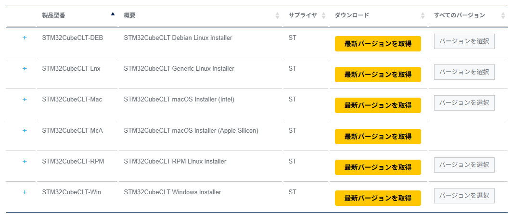

3.  **STM32CubeMXのインストール**
    * [STマイクロ公式サイト](https://www.st.com/ja/development-tools/stm32cubemx.html)から入手してインストールします。

    > (画像の上側) 
    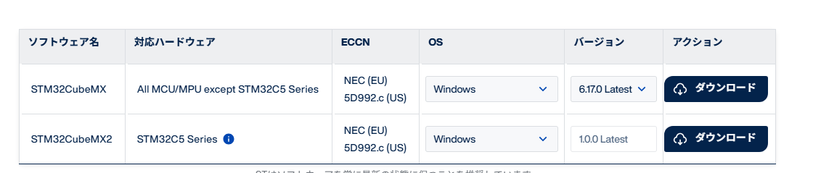

## 2. プロジェクトの作成 (STM32CubeMX)

VS Codeで読み込むためのプロジェクトファイルを生成します。

1.  **STM32CubeMXを起動**し、「ACCESS TO BOARD SELECTOR」を選択後MCU/MPU Selectorからチップを選択します．

    

    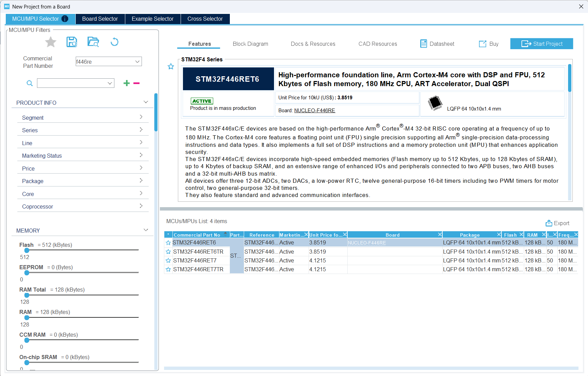

    選択したら右上のStart Projectを選択

2.  **Project Manager** タブを開き、以下の設定を行います。

    * **Clock Configuration**: クロック設定
  
    
  　
    以下の画像のように設定します．

    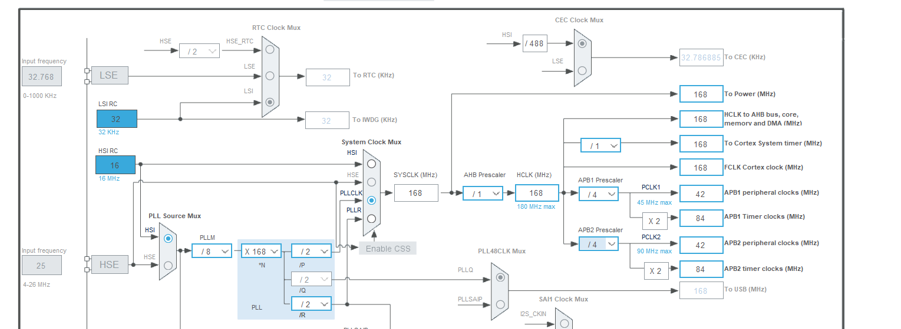

    PLLM: / 8 に設定します（ここで2MHzになります）。

    PLLN: * 168 に設定します（ここで336MHzになります）。

    PLLP: / 2 に設定します。

    System Clock Mux: PLLCLK を選択します。これで SYSCLK（マイコンの脳の速さ）が168MHz になります。

    APB1 Prescaler (PCLK1): / 4 を選択してください。

    結果として、その右側の APB1 peripheral clocks が 42 MHz になれば成功です。


    * **Pinout ＆ Configuration**: ピン設定を行います．
    
    
    
    * 以下はAltair_MDD_V3の設定です．

    
    > encoder

    * A0 A1 TIMER5
    
    * B3 A15 TIMER2
    
    * B6 B7 TIMER4
    
    * C6 C7 TIMER3

    > MD

    * B14(TIMER12 CH1) B15(TIMER12 CH2)
    
    * A8(TIMER1  CH1)     A9(TIMER1  CH2)
    
    * A6(TIMER13 CH1)     A7(TIMER14 CH1)
    
    * B8(TIMER10 CH1)     B9(TIMER11 CH1)

    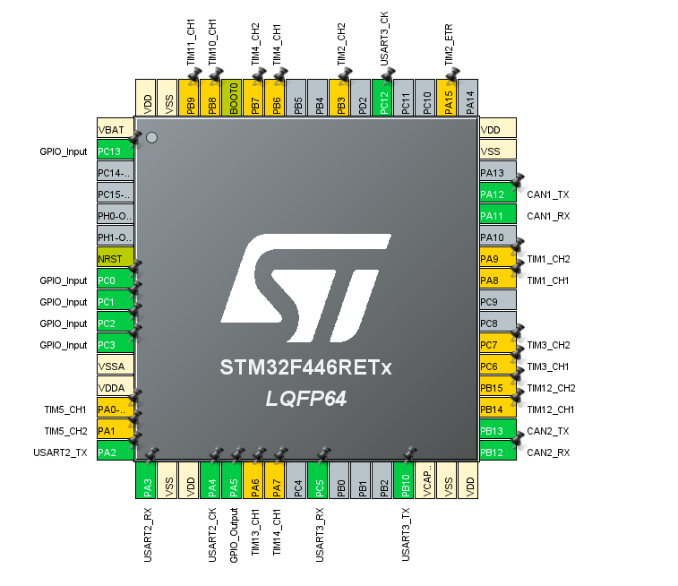

    このピンがオレンジの状態では設定が完了していません．そこで左のタブのTimerをあけて設定します

    エンコーダーの場合はつぎの画像のようにピンは何も触らず,Combined ChannelsをEncoder Modeに設定します．

    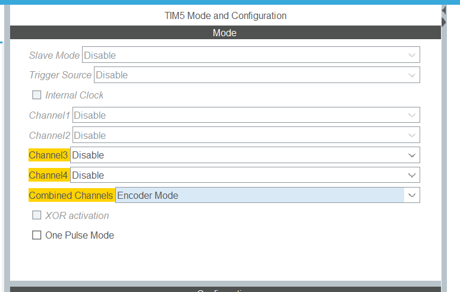

    PWMピンの場合はピンを一個ずつ設定します．
    使用するチャンネルをPWM Generation CH1などと設定します．

    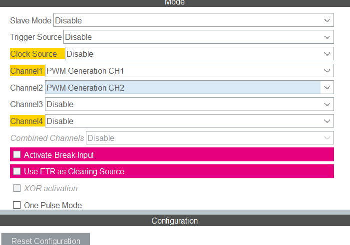

    タイマー１０以降はActicatedにチェックを入れる必要があります（１２以外）
    
    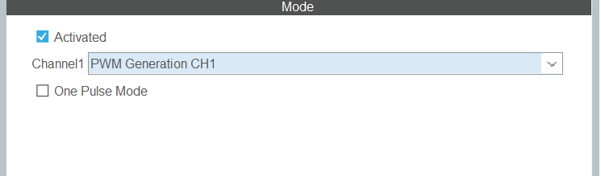
    
    すべて完了するとピンがすべて緑になるはずです．

    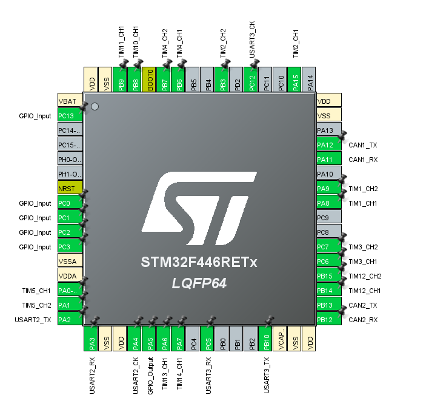

    続いてCAN通信の設定を行います．
    左のConnectivityを開いてCAN1,CAN2を開き設定します

    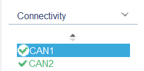


    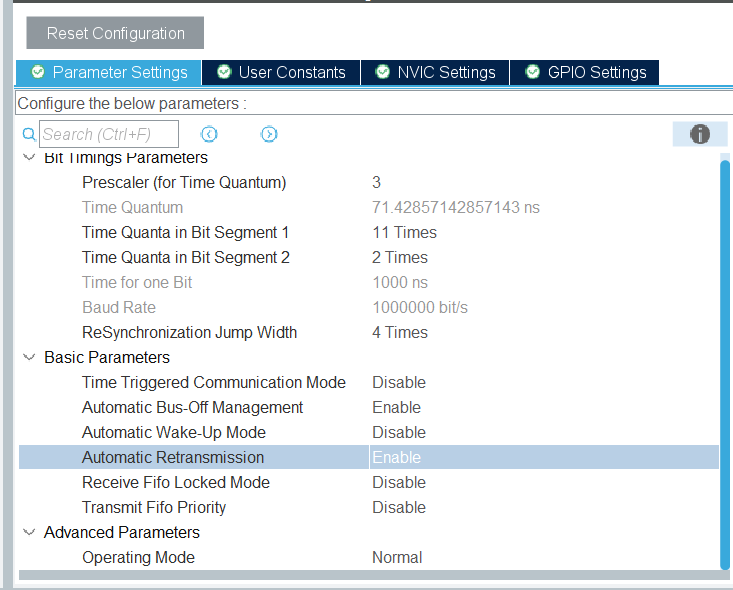

    [NVIC] タブ  CAN1 RX0 interrupt にチェックを入れる
    
    

    以下ようにエラーが出るときはいったんPrescalerに８を入れBit 1 Bit2 を設定してから３に戻すとエラーがなくなります．
    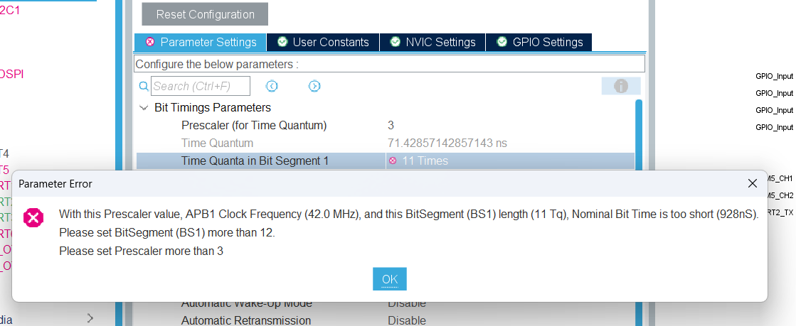

    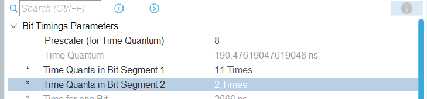
    
    * **Project Manager**: プロジェクト設定

      * **Project Name**: 任意のプロジェクト名を入力。
      * **Toolchain / IDE**: ここで必ず **「CMake」** を選択してください（※重要）。
  
    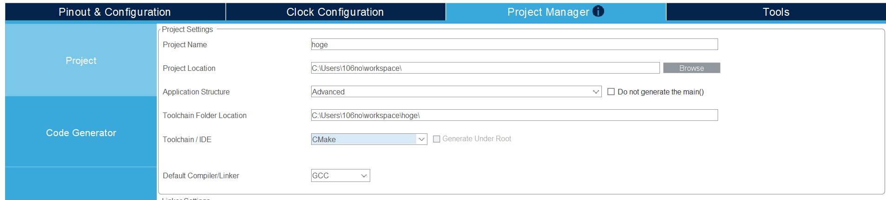
  

3.  「**GENERATE CODE**」をクリックしてコードを生成します。
4.  
     

     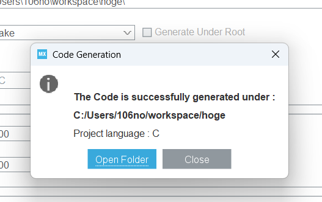

     これでたらOK

     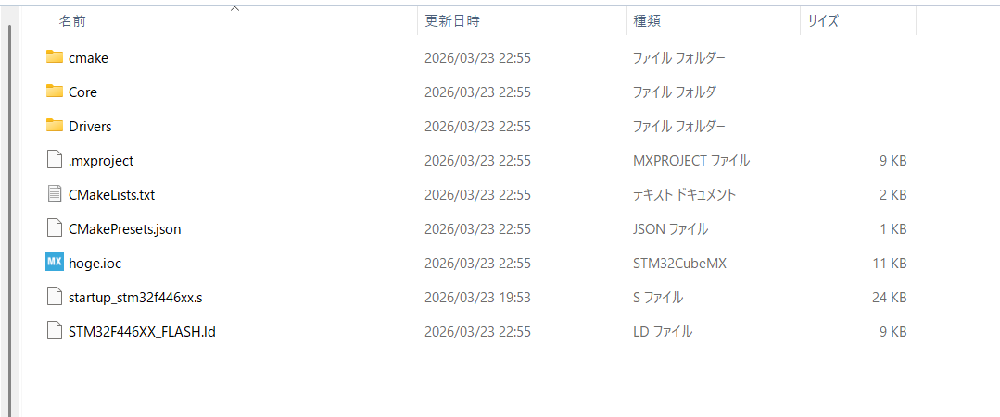

## 3. VS Codeでのインポートとビルド

1.  VS Codeを開き、フォルダーを開くから先ほどCubeMXで作成したフォルダを開きます．
2.  
    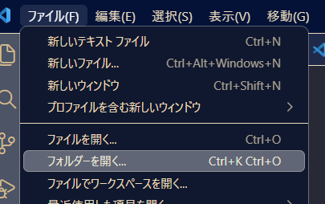

    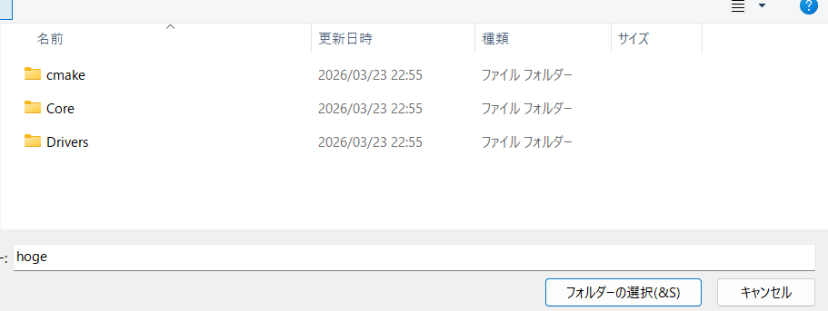


3.  プロジェクトが開くと、通知が出る場合がありますが、STM32プロジェクトとして構成を許可（Yesを選択）します。


     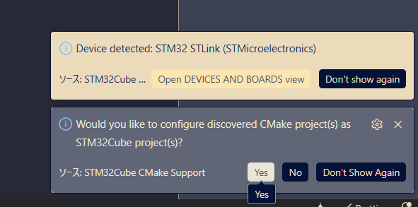

3.  プロジェクトが開くと、事前構成を聞かれるとDebugを選択します
     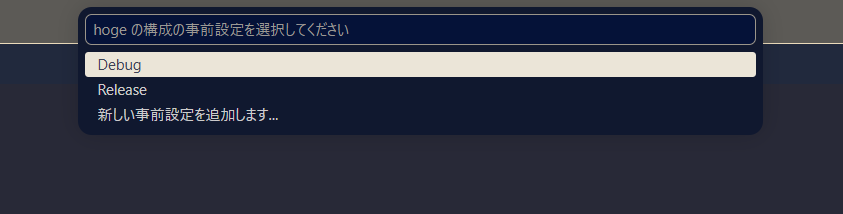
 
4. ライブラリはCoreの中のIncに入れます．


    - リポジトリをダウンロード

    [https://github.com/Altairu/Altair_library](https://github.com/Altairu/Altair_library) よりダウンロードします。

    

    - フォルダをコピー

    `Altair_library_for_CubeIDE` フォルダを選択してコピーします。

    

    - プロジェクトに配置

    STM32CubeIDE プロジェクトの `Core/Inc` 内に貼り付けます。

    ```
    Core/
    └── Inc/
        └── Altair_library_for_CubeIDE/   ← ここに配置
            ├── altair.h
            ├── can_lib.h / can_lib.c
            ├── encoder.h / encoder.c
            ├── kinematics.h / kinematics.c
            ├── motor_driver.h / motor_driver.c
            ├── pid.h / pid.c
            └── serial_lib.h / serial_lib.c
    ```

    

    - CMakeLists.txt を編集

    `cmake/stm32cubemx/CMakeLists.txt` を以下のように編集します。

    ```cmake
    # STM32CubeMX generated include paths
    set(MX_Include_Dirs
        ${CMAKE_CURRENT_SOURCE_DIR}/../../Core/Inc
        ${CMAKE_CURRENT_SOURCE_DIR}/../../Core/Inc/Altair_library_for_CubeIDE  # ← 追加
        ${CMAKE_CURRENT_SOURCE_DIR}/../../Drivers/STM32F4xx_HAL_Driver/Inc
        ${CMAKE_CURRENT_SOURCE_DIR}/../../Drivers/STM32F4xx_HAL_Driver/Inc/Legacy
        ${CMAKE_CURRENT_SOURCE_DIR}/../../Drivers/CMSIS/Device/ST/STM32F4xx/Include
        ${CMAKE_CURRENT_SOURCE_DIR}/../../Drivers/CMSIS/Include
    )

    # STM32CubeMX generated application sources
    set(MX_Application_Src
        ${CMAKE_CURRENT_SOURCE_DIR}/../../Core/Src/main.c
        ${CMAKE_CURRENT_SOURCE_DIR}/../../Core/Src/stm32f4xx_it.c
        ${CMAKE_CURRENT_SOURCE_DIR}/../../Core/Src/stm32f4xx_hal_msp.c
        ${CMAKE_CURRENT_SOURCE_DIR}/../../Core/Src/sysmem.c
        ${CMAKE_CURRENT_SOURCE_DIR}/../../Core/Src/syscalls.c
        ${CMAKE_CURRENT_SOURCE_DIR}/../../startup_stm32f446xx.s
        # ↓ 使うライブラリの .c を追加
        ${CMAKE_CURRENT_SOURCE_DIR}/../../Core/Inc/Altair_library_for_CubeIDE/can_lib.c
        ${CMAKE_CURRENT_SOURCE_DIR}/../../Core/Inc/Altair_library_for_CubeIDE/encoder.c
        ${CMAKE_CURRENT_SOURCE_DIR}/../../Core/Inc/Altair_library_for_CubeIDE/kinematics.c
        ${CMAKE_CURRENT_SOURCE_DIR}/../../Core/Inc/Altair_library_for_CubeIDE/motor_driver.c
        ${CMAKE_CURRENT_SOURCE_DIR}/../../Core/Inc/Altair_library_for_CubeIDE/pid.c
        ${CMAKE_CURRENT_SOURCE_DIR}/../../Core/Inc/Altair_library_for_CubeIDE/serial_lib.c
    )
    ```

    

    

    - main.c にインクルード

    `main.c` の先頭に以下を追加するだけで全ライブラリが使用可能になります。

    ```c
    #include "Altair_library_for_CubeIDE/altair.h"
    ```

5.  サイドバーの「Build」ボタン、または画面下のステータスバーにあるビルドアイコンをクリックしてコンパイルを実行します。
    * 成功すると、フラッシュやRAMの使用量が表示され、`.elf` ファイルが生成されます。
    
    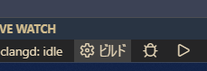
    ```
    [main] フォルダーのビルド中: C:/Users/106no/workspace/hoge/build/Debug 
    [build] ビルドを開始しています
    [driver] 注: プリセット Debug を使用してビルドしていますが、VS Code設定から適用されるオーバーライドがいくつかあります。
    [proc] コマンドを実行しています: cube-cmake --build C:/Users/106no/workspace/hoge/build/Debug --
    [build] [1/2] Building C object CMakeFiles/hoge.dir/Core/Src/main.c.obj
    [build] [2/2] Linking C executable hoge.elf
    [build] Memory region         Used Size  Region Size  %age Used
    [build]              RAM:        2520 B       128 KB      1.92%
    [build]            FLASH:       15316 B       512 KB      2.92%
    [driver] ビルド完了: 00:00:00.429
    [build] ビルドが終了コード 0 で終了しました
    ```


## 4. デバッグと書き込み

1.  PCにSTM32ボードを接続します。
   
2.  VS Codeの「**実行とデバッグ**」ビュー（Ctrl+Shift+D）を開きます。
   
3.  STlinkのアップデート
   
    PCにSTlinkを接続してください。（マイコンに電源も入れてください）

    

    実行とデバックを開いてSTM32CUBE DEVICES AND BOARDSからファームウェアをアップデートしてください。


    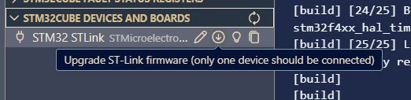

4.  デバッグ構成で「**STM32 CORTEX DEBUG**」または「**STLink GDB Server**」を選択して実行（F5）します。

    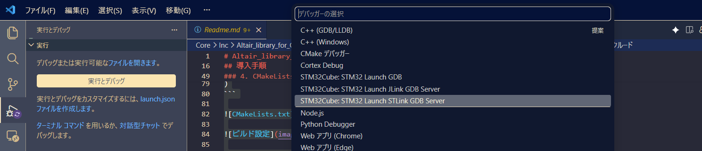

5.  プログラムがボードに書き込まれ、`main()` 関数の先頭で一時停止します。
   
6.  ツールバーの「続行（Continue）」ボタンを押すと、プログラムが動作し始めます。
   

一度書き込むと次からはマイコンに電源が入ると勝手に実行されます（PCから実行とデバックを使わなくても）

### 参考資料
* [Qiita: STM32 VS code extensionを使ってみよう](https://qiita.com/usashirou/items/98f006b6f51844814669)
* [YouTube: Get started with STM32Cube for VS Code](https://www.youtube.com/watch?v=aWMni01XGeI)
