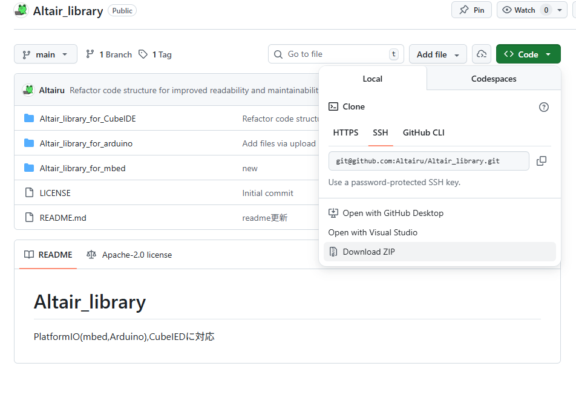
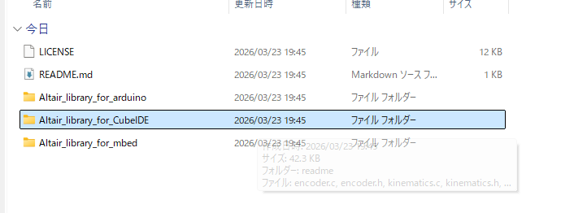
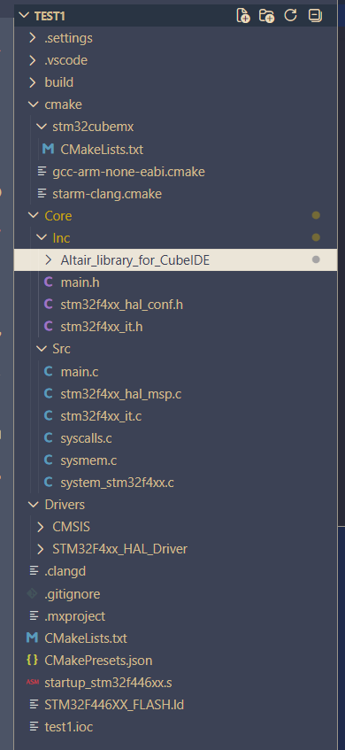
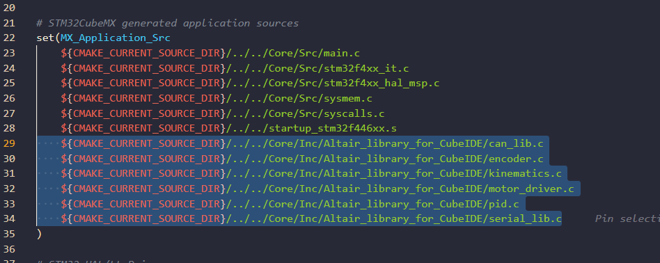
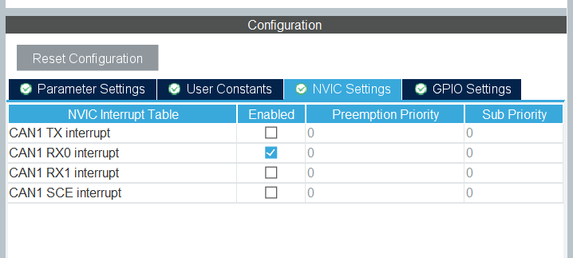
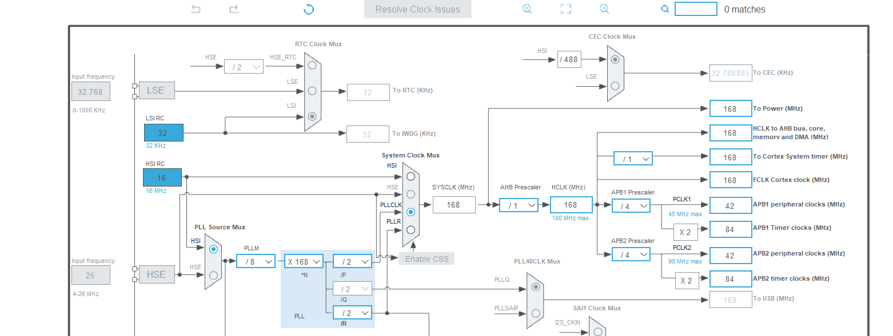

# Altair_library_for_CubeIDE

STM32CubeIDE (CMake プロジェクト) 向けライブラリです。

## 含まれるライブラリ

| ファイル | 概要 | 詳細ドキュメント |
|---|---|---|
| `can_lib` | CAN 通信 | [CAN 通信](https://github.com/Altairu/Altair_library/blob/main/Altair_library_for_CubeIDE/readme/can_lib.md) |
| `encoder` | エンコーダ | [エンコーダー](https://github.com/Altairu/Altair_library/blob/main/Altair_library_for_CubeIDE/readme/encoder.md) |
| `kinematics` | 運動学 | [運動学](https://github.com/Altairu/Altair_library/blob/main/Altair_library_for_CubeIDE/readme/kinematics.md) |
| `motor_driver` | モータドライバ | [モータドライバ](https://github.com/Altairu/Altair_library/blob/main/Altair_library_for_CubeIDE/readme/motor_driver.md) |
| `pid` | PID 制御 | [PID 制御](https://github.com/Altairu/Altair_library/blob/main/Altair_library_for_CubeIDE/readme/pid.md) |
| `serial_lib` | シリアル通信 | [シリアル通信](https://github.com/Altairu/Altair_library/blob/main/Altair_library_for_CubeIDE/readme/Serial.md) |

## 導入手順

### 1. リポジトリをダウンロード

[https://github.com/Altairu/Altair_library](https://github.com/Altairu/Altair_library) よりダウンロードします。



### 2. フォルダをコピー

`Altair_library_for_CubeIDE` フォルダを選択してコピーします。



### 3. プロジェクトに配置

STM32CubeIDE プロジェクトの `Core/Inc` 内に貼り付けます。

```
Core/
└── Inc/
    └── Altair_library_for_CubeIDE/   ← ここに配置
        ├── altair.h
        ├── can_lib.h / can_lib.c
        ├── encoder.h / encoder.c
        ├── kinematics.h / kinematics.c
        ├── motor_driver.h / motor_driver.c
        ├── pid.h / pid.c
        └── serial_lib.h / serial_lib.c
```



### 4. CMakeLists.txt を編集

`cmake/stm32cubemx/CMakeLists.txt` を以下のように編集します。

```cmake
# STM32CubeMX generated include paths
set(MX_Include_Dirs
    ${CMAKE_CURRENT_SOURCE_DIR}/../../Core/Inc
    ${CMAKE_CURRENT_SOURCE_DIR}/../../Core/Inc/Altair_library_for_CubeIDE  # ← 追加
    ${CMAKE_CURRENT_SOURCE_DIR}/../../Drivers/STM32F4xx_HAL_Driver/Inc
    ${CMAKE_CURRENT_SOURCE_DIR}/../../Drivers/STM32F4xx_HAL_Driver/Inc/Legacy
    ${CMAKE_CURRENT_SOURCE_DIR}/../../Drivers/CMSIS/Device/ST/STM32F4xx/Include
    ${CMAKE_CURRENT_SOURCE_DIR}/../../Drivers/CMSIS/Include
)

# STM32CubeMX generated application sources
set(MX_Application_Src
    ${CMAKE_CURRENT_SOURCE_DIR}/../../Core/Src/main.c
    ${CMAKE_CURRENT_SOURCE_DIR}/../../Core/Src/stm32f4xx_it.c
    ${CMAKE_CURRENT_SOURCE_DIR}/../../Core/Src/stm32f4xx_hal_msp.c
    ${CMAKE_CURRENT_SOURCE_DIR}/../../Core/Src/sysmem.c
    ${CMAKE_CURRENT_SOURCE_DIR}/../../Core/Src/syscalls.c
    ${CMAKE_CURRENT_SOURCE_DIR}/../../startup_stm32f446xx.s
    # ↓ 使うライブラリの .c を追加
    ${CMAKE_CURRENT_SOURCE_DIR}/../../Core/Inc/Altair_library_for_CubeIDE/can_lib.c
    ${CMAKE_CURRENT_SOURCE_DIR}/../../Core/Inc/Altair_library_for_CubeIDE/encoder.c
    ${CMAKE_CURRENT_SOURCE_DIR}/../../Core/Inc/Altair_library_for_CubeIDE/kinematics.c
    ${CMAKE_CURRENT_SOURCE_DIR}/../../Core/Inc/Altair_library_for_CubeIDE/motor_driver.c
    ${CMAKE_CURRENT_SOURCE_DIR}/../../Core/Inc/Altair_library_for_CubeIDE/pid.c
    ${CMAKE_CURRENT_SOURCE_DIR}/../../Core/Inc/Altair_library_for_CubeIDE/serial_lib.c
)
```




### 5. main.c にインクルード

`main.c` の先頭に以下を追加するだけで全ライブラリが使用可能になります。

```c
#include "Altair_library_for_CubeIDE/altair.h"
```

### CAN 通信を使う場合の追加設定

CubeMX で以下を設定しないと通信が不安定になったり止まったりします。

| パラメータ | 推奨値 |
|---|---|
| `AutoRetransmission` | `ENABLE` |
| `AutoBusOff` | `ENABLE` |
| `SyncJumpWidth` | `CAN_SJW_4TQ` |

#### ハードウェア注意事項

- **終端抵抗**: バスの両端に **120Ω** が必要。ないとビットエラーが多発して通信が不安定になる。
- **ボーレート**: 全ノードで一致していること。ボーレートの計算式は can_lib.md を参照。
- **ACK**: バスに自分以外のノードが最低1つ存在しないと ACK エラーになり Bus-Off に至る。単体テスト時は CubeMX で `Mode = CAN_MODE_LOOPBACK` に設定する。

## CAN通信

### can_lib 使い方

CAN送受信をシンプルに扱えるライブラリ。  
メールボックスの空き待ちなどの面倒な処理はライブラリ内部で完結している。

#### CubeMX 必須設定

以下の3つは **CubeMX (MX_CAN1_Init) 側で設定する**こと。ライブラリでは触れない。

| パラメータ | 推奨値 | 理由 |
|---|---|---|
| `AutoRetransmission` | `ENABLE` | エラー時に自動再送。フレームが黙って捨てられなくなる |
| `AutoBusOff` | `ENABLE` | Bus-Off 状態からハードウェアが自動復帰する |
| `SyncJumpWidth` | `CAN_SJW_4TQ` | ノード間のクロックずれ許容量を増やして安定性向上 |

CubeMXで設定後、生成されたコードが自動的に適用される。
以下のように設定する






#### ボーレートの確認

ボーレート = APB1クロック ÷ (Prescaler × (1 + TimeSeg1 + TimeSeg2))

デフォルト設定例（HSI 168MHz、APB1 = 42MHz）:
- Prescaler=3, BS1=11TQ, BS2=2TQ → **1Mbps**

相手ノードのボーレートと一致していること。

#### 使い方

##### 初期化

```c
#include "Altair_library_for_CubeIDE/altair.h"

// MX_CAN1_Init() の後に呼ぶ
Can_Init(&hcan1);
```

##### 送信

```c
uint8_t data[8] = {1, 2, 3, 4, 5, 6, 7, 8};
Can_Transmit(&hcan1, 0x125, data, 8);
```

- メールボックスが満杯な場合は内部で最大 `CAN_TX_TIMEOUT_MS`(デフォルト10ms) 待機する
- タイムアウトした場合は `HAL_TIMEOUT` を返す（無視してもよい）

##### 受信

受信は割り込みで自動処理される。`g_can1_rx_data` を参照する。

```c
extern CanRxData g_can1_rx_data;

if (g_can1_rx_data.new_data_flag) {
    g_can1_rx_data.new_data_flag = 0;  // フラグをクリア

    uint32_t id  = g_can1_rx_data.std_id;
    uint8_t  dlc = g_can1_rx_data.dlc;
    // g_can1_rx_data.data[0] ～ [dlc-1] にデータが入っている
}
```

---

#### タイムアウト時間の変更

`can_lib.h` の先頭にある定義を変更する。

```c
#define CAN_TX_TIMEOUT_MS  10   // 任意の値に変更可
```


## エンコーダー

### 1. 概要

エンコーダは、モーターなどの回転物の位置や速度、回転数を測定するために使用されます。このライブラリでは、STM32のタイマーをエンコーダモードで動作させ、エンコーダからの2相信号（A相とB相）を利用してカウントデータを取得し、計算処理を行います。

### 2. ライブラリファイル

- **encoder.h**: エンコーダライブラリの関数プロトタイプ、データ構造、設定が含まれているヘッダファイルです。
- **encoder.c**: エンコーダライブラリの関数の実装が含まれているソースファイルです。

### 3. データ構造

#### EncoderData

エンコーダの計測データを格納する構造体です。

```c
typedef struct {
    int count;         // エンコーダのカウント数
    double rot;        // 回転数（回転の合計数、単位は回）
    double deg;        // 回転角度（度数）
    double distance;   // 移動距離（回転数とホイール直径から計算）
    double velocity;   // 移動速度（mm/s、距離と時間間隔から計算）
    double rps;        // 毎秒の回転数（回転数/秒）
} EncoderData;
```

#### Encoder

エンコーダの設定や状態を保持する構造体です。

```c
typedef struct {
    TIM_HandleTypeDef* htim;  // タイマーのハンドル
    int ppr;                  // エンコーダのパルス数（1回転あたりのパルス数）
    double diameter;          // エンコーダに接続されるホイールの直径（mm）
    int period;               // 読み取り周期（ms）
    int limit;                // カウントオーバーフローのリミット
    double before_rot;        // 前回の回転数（速度計算用）
} Encoder;
```

### 4. 関数の説明

#### Encoder_Init

エンコーダを初期化する関数です。この関数は、指定されたタイマーをエンコーダモードに設定し、エンコーダのパラメータを初期化します。

- **プロトタイプ**:
  
  ```c
  void Encoder_Init(Encoder* encoder, TIM_HandleTypeDef* htim, double diameter, int ppr, int period);
  ```

- **引数**:
  - `encoder`: エンコーダの設定と状態を格納する構造体のポインタ
  - `htim`: エンコーダ用のタイマー（例: TIM5）のハンドル
  - `diameter`: ホイールの直径（mm）
  - `ppr`: 1回転あたりのパルス数（エンコーダの分解能）
  - `period`: 読み取り周期（ms）

- **説明**:
  タイマーをエンコーダモードで動作させ、A相とB相の信号をカウントします。また、エンコーダのパラメータ（直径やPPR）を設定します。


#### Encoder_Read

エンコーダのカウント値を読み取る関数です。

- **プロトタイプ**:
  
  ```c
  int Encoder_Read(Encoder* encoder);
  ```

- **引数**:
  - `encoder`: エンコーダの構造体のポインタ

- **戻り値**:
  - エンコーダのカウント値（現在のカウンタ値）

- **説明**:
  タイマーの現在のカウント値を取得し、エンコーダの位置情報として利用します。

#### Encoder_Interrupt

エンコーダのデータを計算・更新する関数です。定期的に呼び出して、回転数や角度、移動距離、速度などを計算します。

- **プロトタイプ**:
  
  ```c
  void Encoder_Interrupt(Encoder* encoder, EncoderData* encoder_data);
  ```

- **引数**:
  - `encoder`: エンコーダの設定と状態を格納する構造体のポインタ
  - `encoder_data`: エンコーダの計測データを格納する構造体のポインタ

- **説明**:
  `Encoder_Read`で取得したカウント値から、以下のデータを計算して`encoder_data`に格納します。
  - `rot`: 総回転数（回）
  - `deg`: 回転角度（度数）
  - `distance`: 移動距離（mm）
  - `velocity`: 移動速度（mm/s）
  - `rps`: 毎秒の回転数（回転数/秒）

#### Encoder_Reset

エンコーダのカウンタ値をリセットする関数です。

- **プロトタイプ**:
  
  ```c
  void Encoder_Reset(Encoder* encoder);
  ```

- **引数**:
  - `encoder`: エンコーダの構造体のポインタ

- **説明**:
  タイマーのカウンタをリセットして、エンコーダのカウントを0に戻します。オーバーフロー対策として利用することができます。


### 5. 使用例

以下に、エンコーダの初期化とデータの読み取りの例を示します。

```c
#include "Altair_library_for_CubeIDE/altair.h"
#include "stm32f4xx_hal.h"

// タイマーとエンコーダの構造体を定義
TIM_HandleTypeDef htim5;
Encoder encoder;
EncoderData encoder_data;

void main(void) {
    HAL_Init();
    SystemClock_Config();
    MX_TIM5_Init();  // TIM5の初期化関数

    // エンコーダの初期化
    Encoder_Init(&encoder, &htim5, 100.0, 8192, 10);  // 直径100mm, パルス数8192, 読み取り周期10ms

    while (1) {
        // エンコーダのデータを更新
        Encoder_Interrupt(&encoder, &encoder_data);

        // データを使用
        printf("Count: %d, Rotation: %.2f, Degree: %.2f, Distance: %.2f, Velocity: %.2f\n",
               encoder_data.count, encoder_data.rot, encoder_data.deg,
               encoder_data.distance, encoder_data.velocity);

        HAL_Delay(10);  // 10msごとにデータ取得
    }
}
```

### 6. 注意事項

- **カウンタのオーバーフロー**: タイマーのカウンタはオーバーフローすることがあります。高精度なエンコーダを使用する場合、カウンタオーバーフローに注意し、`Encoder_Reset`関数で適宜リセットするか、カウント範囲の確認が必要です。
- **浮動小数点数のサポート**: 浮動小数点数（`%f`）を使って`printf`で表示する場合、STM32CubeIDEで浮動小数点サポートを有効にする設定（`-u _printf_float`）が必要です。

```
The float formatting support is not enabled, check your MCU Settings from "Project Properties > C/C++ Build > Settings > Tool Settings", or add manually "-u _printf_float" in linker flags.
```
`printf`や`snprintf`で浮動小数点数（`%f`などのフォーマット指定子）を使う場合に発生することがあります。STM32の標準設定では、浮動小数点のサポートが無効化されているため、明示的に有効にする必要があります。

以下の手順で、浮動小数点のサポートを有効にしましょう。

#### 手順 1: プロジェクトの設定を変更

1. **プロジェクトを右クリック**し、**[Properties]**（プロパティ）を選択します。
2. 左側のメニューから**[C/C++ Build] > [Settings]**に移動します。
3. **[Tool Settings]**タブを選択し、以下のように設定します。

##### リンカオプションの設定

- **[MCU GCC Linker] > [Miscellaneous]** の項目に移動します。
- **[Linker flags]** の欄に、`-u _printf_float`を追加します。

   - 具体的には、リンクオプションのフィールドに次のように入力してください:
     ```
     -u _printf_float
     ```

#### 手順 2: ビルドの再実行

この設定を追加したら、プロジェクトを再ビルドしてください。これで`printf`や`snprintf`で浮動小数点数を含むフォーマット指定子（`%f`など）が正しく使用できるようになるはずです。

シリアル見方
```bash
sudo apt update
sudo apt install screen
screen /dev/ttyUSB0 115200
```

## 運動学

`kinematics`ライブラリは、3輪・4輪のオムニホイールやメカナムホイールのロボット向けの運動学計算を行い、指定された速度ベクトル (Vx, Vy, ω) を各ホイールの速度に変換するためのライブラリです。

### 特徴

- **対応ホイールモード**:
    - **OMNI_3**: 3輪オムニホイール
    - **OMNI_4**: 4輪オムニホイール
    - **MEKANUM**: メカナムホイール

- **入力**: 
    - `Vx` (前後方向の速度)
    - `Vy` (左右方向の速度)
    - `ω` (回転速度)

- **出力**:
    - 各ホイールの目標速度（浮動小数点）

### 構成ファイル

- `kinematics.h`: ライブラリのヘッダーファイル。関数プロトタイプや構造体の定義が含まれます。
- `kinematics.c`: 運動学の計算ロジックを実装したソースファイル。

### 使用方法

#### 1. ライブラリの初期化

最初に、`Kinematics`構造体のインスタンスを作成し、ロボットの各パラメータを設定します。

```c
#include "Altair_library_for_CubeIDE/altair.h"

// 運動学インスタンスの初期化
Kinematics kinematics;

```

```c
int main(void)
{
  HAL_Init();
  SystemClock_Config();

  kinematics.mode = OMNI_3;            // モードを選択 (OMNI_3, OMNI_4, MEKANUM)
  kinematics.robot_diameter = 150.0;   // ロボットの直径 (mm)
  kinematics.wheel_radius = 30.0;      // ホイール半径 (mm)

```

#### 2. 目標ホイール速度の取得

ロボットの目標速度`Vx`, `Vy`, `ω`から各ホイールの速度を計算します。`Kinematics_GetTargetSpeeds`関数を呼び出し、個々のホイール速度を取得します。

```c
float speedFR, speedFL, speedBR, speedBL; // 各ホイールの速度変数
float Vx = 100.0, Vy = 0.0, omega = 0.5;  // 入力するロボットの目標速度

Kinematics_GetTargetSpeeds(&kinematics, Vx, Vy, omega, &speedFR, &speedFL, &speedBR, &speedBL);
```

- **引数説明**:
    - `&kinematics`: `Kinematics`構造体のポインタ
    - `Vx`: 前後方向の速度 (mm/s)
    - `Vy`: 左右方向の速度 (mm/s)
    - `omega`: 回転速度 (rad/s)
    - `speedFR`, `speedFL`, `speedBR`, `speedBL`: 各ホイールの出力速度の格納場所


#### 3. 計算されたホイール速度の使用

出力される`speedFR`, `speedFL`, `speedBR`, `speedBL`は、ホイールの回転速度 (rad/s) です。これを各モーターに設定することで、指定したロボットの速度に基づいて移動できます。

#### 使用例
PID制御を使用せずにオムニ３輪を制御する例。

```c
Kinematics kinematics;

float speedFR, speedFL, speedBR;
float Vx = 100.0;   // 前方向速度
float Vy = 50.0;    // 横方向速度
float omega = 0.2;  // 回転速度

int main(void)
{
  kinematics.mode = OMNI_3;
  kinematics.robot_diameter = 150.0;
  kinematics.wheel_radius = 30.0;

  Kinematics_GetTargetSpeeds(&kinematics, Vx, Vy, omega, &speedFR, &speedFL, &speedBR, NULL);

  // 各モーターに速度を設定
  MotorDriver_setSpeed(&motorFR, (int)speedFR);
  MotorDriver_setSpeed(&motorFL, (int)speedFL);
  MotorDriver_setSpeed(&motorBR, (int)speedBR);

```

## モータドライバ

この`motor_driver`ライブラリは、STM32マイコンを使用してDCモーターをPWM制御するためのライブラリです。タイマーのチャンネルを使用してモーターの正転と逆転、速度を制御することができます。

### 初期設定と前提条件

#### ハードウェア設定
- モーターはSTM32のGPIOピンとタイマーによるPWM制御を使って駆動します。
- 各モーターには2つのPWM出力が必要です（正転と逆転用）。
- 必要に応じて、`htim`および`TIM_CHANNEL_x`の設定を合わせます。

なお、モータドライバ基板のバージョンによって推奨PWM周波数が異なります。

- **ALTAIR_MD_V7** の場合: ライブラリのデフォルト設定（約 980 Hz）のままで問題ありません。
- **ALTAIR_MD_V8** の場合: PWM周波数を **200 Hz** に変更してください。

周波数の変更方法の例:

- プロジェクト全体で 200 Hz を使いたい場合は、Altair ライブラリをインクルードする前に次のように定義します。

  ```c
  #define MOTOR_DRIVER_DEFAULT_PWM_HZ 200U
  #include "Altair_library_for_CubeIDE/altair.h"
  ```

- もしくは、初期化後に任意の周波数へ変更する関数を使います。

  ```c
  MotorDriver motor;
  MotorDriver_Init(&motor, &htim13, TIM_CHANNEL_1, &htim14, TIM_CHANNEL_1);
  MotorDriver_setPwmFrequency(&motor, 200U); // ALTAIR_MD_V8 用に 200 Hz に設定
  ```


### `motor_driver.h` - 関数リスト

#### MotorDriver_Init

**説明**  
指定されたタイマーおよびチャンネルを用いてモータードライバを初期化します。

**宣言**
```c
void MotorDriver_Init(MotorDriver *motor, TIM_HandleTypeDef *htimA, uint32_t channelA, TIM_HandleTypeDef *htimB, uint32_t channelB);
```

**パラメータ**
- `motor`: 初期化するモーターの構造体ポインタ。
- `htimA`: 正転用PWM出力のタイマー構造体。
- `channelA`: 正転用PWM出力のタイマーチャンネル。
- `htimB`: 逆転用PWM出力のタイマー構造体。
- `channelB`: 逆転用PWM出力のタイマーチャンネル。

**使用例**
```c
MotorDriver motor;
MotorDriver_Init(&motor, &htim13, TIM_CHANNEL_1, &htim14, TIM_CHANNEL_1);
```

#### MotorDriver_setSpeed

**説明**  
指定された速度でモーターを回転させます。速度はパーセントで指定し、負の値は逆回転を示します。

**宣言**
```c
void MotorDriver_setSpeed(MotorDriver *motor, int speed);
```

**パラメータ**
- `motor`: 設定するモーターの構造体ポインタ。
- `speed`: -100〜100の範囲で指定。正の値で正転、負の値で逆転。

**使用例**
```c
MotorDriver_setSpeed(&motor, 50);  // 50%速度で正転
MotorDriver_setSpeed(&motor, -50); // 50%速度で逆転
```


### `motor_driver.c` - 実装の概要

#### 構造体

```c
typedef struct {
    TIM_HandleTypeDef *htimA;
    uint32_t channelA;
    TIM_HandleTypeDef *htimB;
    uint32_t channelB;
} MotorDriver;
```

#### MotorDriver_Init

この関数は、指定されたタイマーとチャンネルを使ってモーターを初期化します。正転と逆転用のチャンネルを分けることで、モーターの方向を簡単に制御できます。

#### MotorDriver_setSpeed

指定したパーセンテージでPWM信号を出力し、モーターの速度と方向を制御します。関数は`speed`の値が正の場合は`htimA`と`channelA`にPWMを出力し、負の場合は`htimB`と`channelB`に出力します。

- `speed`が0の場合、両方のチャンネルが0に設定され、モーターは停止します。

#### エラーハンドリング
`Error_Handler()`を利用して、初期化やPWM出力でエラーが発生した場合のデバッグを支援します。


### 使用例

#### モーター単体テストコード

以下のコードは、モーターが2秒間正転し、1秒停止し、2秒間逆転する動作を繰り返します。

```c
#include "motor_driver.h"

MotorDriver motor;
MotorDriver_Init(&motor, &htim13, TIM_CHANNEL_1, &htim14, TIM_CHANNEL_1);

while (1) {
    MotorDriver_setSpeed(&motor, 50);  // 50%速度で正転
    HAL_Delay(2000);                   // 2秒待機

    MotorDriver_setSpeed(&motor, 0);   // 停止
    HAL_Delay(1000);                   // 1秒待機

    MotorDriver_setSpeed(&motor, -50); // 50%速度で逆転
    HAL_Delay(2000);                   // 2秒待機

    MotorDriver_setSpeed(&motor, 0);   // 停止
    HAL_Delay(1000);                   // 1秒待機
}
```

#### トラブルシューティング
- **モーターが動作しない場合**: 
  - `htimA`、`htimB`の設定が正しいことを確認します。
  - PWM出力の設定が正しく、クロックが有効になっていることを確認します。

## PID 制御

PID制御用ライブラリである`pid.h`と`pid.c`の使用方法について説明します。PID制御は、目標値と現在値の差（誤差）を基に、システムを目標値に近づけるように調整するための制御アルゴリズムです。このライブラリを使用することで、モーターなどの速度や位置を効率的に制御できます。

### 1. ライブラリファイル

- **pid.h**: PID制御ライブラリの関数プロトタイプ、データ構造、および設定が含まれているヘッダファイル。
- **pid.c**: PID制御ライブラリの関数の実装が含まれているソースファイル。

### 2. データ構造

#### Pid

PID制御のパラメータや状態を保持する構造体です。この構造体には、制御のために必要なゲインや誤差、積分値、微分値に加えて、積分成分の上限（アンチワインドアップ用）や出力の反転設定が含まれます。

```c
typedef struct {
    double integral_error;    // 積分誤差の累積値
    double before_error;      // 前回の誤差
    double kp;                // 比例ゲイン
    double ki;                // 積分ゲイン
    double kd;                // 微分ゲイン
    double d_error;           // 微分誤差
    double p_control;         // P制御成分
    double i_control;         // I制御成分
    double d_control;         // D制御成分
    double time_constant;     // 微分フィルタの時定数（0でフィルタなし）
    double integral_limit;    // 積分誤差の絶対値上限（0で無制限）
    int    output_invert;     // 出力の符号（1: 正常, -1: 反転）
} Pid;
```

### 3. 関数の説明

#### Pid_Init

PID制御構造体を初期化する関数です。この関数では、積分誤差やゲインなどの初期値を設定します。

- **プロトタイプ**:
  ```c
  void Pid_Init(Pid* pid);
  ```

- **引数**:
  - `pid`: 初期化対象のPID制御構造体のポインタ

- **説明**:
  `Pid_Init`は、積分誤差や前回誤差などの内部変数をゼロクリアし、PID制御の準備を行います。`output_invert`は既定で`1`（反転なし）に設定されます。

#### Pid_setGain

PID制御に使用するゲイン（比例、積分、微分）を設定します。また、必要に応じて微分制御のフィルタ時定数を設定します。

- **プロトタイプ**:
  ```c
  void Pid_setGain(Pid* pid, double p_gain, double i_gain, double d_gain, double time_constant);
  ```

- **引数**:
  - `pid`: ゲインを設定するPID制御構造体のポインタ
  - `p_gain`: 比例ゲイン（P）
  - `i_gain`: 積分ゲイン（I）
  - `d_gain`: 微分ゲイン（D）
  - `time_constant`: 微分フィルタの時定数（0でフィルタなし）

- **説明**:
  PID制御で使用するゲインとフィルタの時定数を設定します。時定数を設定すると、微分成分にフィルタが適用され、制御の安定性を高めることができます。積分成分に上限を設けたい場合は、代わりに`Pid_setGainWithLimit`を使用してください。

#### Pid_setGainWithLimit

PID制御に使用するゲイン（比例、積分、微分）と、積分誤差の絶対値上限（アンチワインドアップ用）を設定します。

- **プロトタイプ**:
  ```c
  void Pid_setGainWithLimit(Pid* pid,
                            double p_gain,
                            double i_gain,
                            double d_gain,
                            double time_constant,
                            double integral_limit);
  ```

- **引数**:
  - `pid`: ゲインを設定するPID制御構造体のポインタ
  - `p_gain`: 比例ゲイン（P）
  - `i_gain`: 積分ゲイン（I）
  - `d_gain`: 微分ゲイン（D）
  - `time_constant`: 微分フィルタの時定数（0でフィルタなし）
  - `integral_limit`: 積分誤差の絶対値上限（0以下を指定した場合は無制限）

- **説明**:
  PID制御で使用するゲインとフィルタの時定数に加え、積分誤差の絶対値上限を設定します。内部では、`Pid_control`／`Pid_controlError`の中で、`integral_error`に対してこの上限でクリップ（±`integral_limit`）が行われます。

#### Pid_setInvert

PIDの出力の符号（正転／反転）を設定します。

- **プロトタイプ**:
  ```c
  void Pid_setInvert(Pid* pid, int invert);
  ```

- **引数**:
  - `pid`: 対象のPID制御構造体のポインタ
  - `invert`: 出力の符号。`1`で通常、`-1`で反転

- **説明**:
  センサやモータの配線方向の違いなどで、制御が正帰還になってしまう場合に、PIDの出力符号だけを簡単に反転させるために使用します。既定値は`1`（反転なし）です。

#### Pid_control

PID制御を実行する関数です。目標値と現在値を引数に取り、その差（誤差）に基づいて制御量を計算して返します。

- **プロトタイプ**:
  ```c
  double Pid_control(Pid* pid, double target, double now, int control_period);
  ```

- **引数**:
  - `pid`: PID制御構造体のポインタ
  - `target`: 目標値
  - `now`: 現在の値
  - `control_period`: 制御周期（ms）

- **戻り値**:
  - 計算された制御量（次の操作量として設定すべき値）

- **説明**:
  目標値と現在値の差から制御量を計算し、目標値に近づけるようにします。制御周期が大きく変動する場合は、`control_period`の値を調整することで積分・微分成分に反映させます。`Pid_setGainWithLimit`で積分上限を指定している場合は、内部で積分誤差が±`integral_limit`にクリップされます。また、`Pid_setInvert`で出力を反転している場合は、最終出力に対して符号反転が適用されます。

#### Pid_controlError

直接誤差を指定して制御を実行する関数です。この関数は、誤差が既に計算されている場合に使用します。

- **プロトタイプ**:
  ```c
  double Pid_controlError(Pid* pid, double error, int control_period);
  ```

- **引数**:
  - `pid`: PID制御構造体のポインタ
  - `error`: 目標値と現在値の差（誤差）
  - `control_period`: 制御周期（ms）

- **戻り値**:
  - 計算された制御量

- **説明**:
  与えられた誤差と制御周期を基に、制御量を計算します。`Pid_setGainWithLimit`や`Pid_setInvert`で設定した内容は、この関数にも反映されます。

#### Pid_reset

積分誤差や微分誤差などをリセットする関数です。制御の開始やリセットを行いたいときに使用します。

- **プロトタイプ**:
  ```c
  void Pid_reset(Pid* pid);
  ```

- **引数**:
  - `pid`: リセット対象のPID制御構造体のポインタ

- **説明**:
  積分誤差や微分誤差の累積値をゼロに戻し、制御を再開します。

#### Pid_getControlValue

P制御、I制御、D制御それぞれの成分を取得する関数です。

- **プロトタイプ**:
  ```c
  double Pid_getControlValue(Pid* pid, ControlType control_type);
  ```

- **引数**:
  - `pid`: PID制御構造体のポインタ
  - `control_type`: 取得する制御成分の種類（P, I, Dのいずれか）

- **戻り値**:
  - 指定された制御成分の値（`P`、`I`、または`D`）

- **説明**:
  制御成分（P、I、Dのいずれか）を取得し、デバッグやチューニングに利用できます。

### 4. 使用例

以下は、PID制御を使用してモーター角度の制御を行う簡単な例です。積分の暴走を防ぐために`Pid_setGainWithLimit`を使用し、必要に応じて`Pid_setInvert`で出力の符号を反転できます。

```c
#include "pid.h"
#include "encoder.h"
#include "motor_driver.h"
#include <stdio.h>

TIM_HandleTypeDef htim3;
TIM_HandleTypeDef htim5;
MotorDriver motor;
Encoder encoder;
EncoderData encoder_data;
Pid pid;

void main(void) {
    HAL_Init();
    SystemClock_Config();
    MX_TIM3_Init();
    MX_TIM5_Init();

    MotorDriver_Init(&motor, &htim3, TIM_CHANNEL_1, TIM_CHANNEL_2);
    Encoder_Init(&encoder, &htim5, 100.0, 8192, 10);

    Pid_Init(&pid);
    // 比例・積分・微分ゲイン、時定数、積分誤差の上限を設定（例: ±100）
    Pid_setGainWithLimit(&pid, 1.0, 0.1, 0.01, 0.0, 100.0);
    // 必要に応じて出力の符号を反転（1: 正常, -1: 反転）
    Pid_setInvert(&pid, 1);

    double target_angle = 90.0;  // 目標角度 (度)

    while (1) {
        Encoder_Interrupt(&encoder, &encoder_data);
        double current_angle = encoder_data.deg;

        double control_value = Pid_control(&pid, target_angle, current_angle, 10);

        MotorDriver_setSpeed(&motor, (int)control_value);

        // デバッグ出力
        printf("Target Angle: %.2f, Current Angle: %.2f, Control Value: %.2f\n",
               target_angle, current_angle, control_value);

        HAL_Delay(10);  // 制御周期 10ms
    }
}
```

## シリアル通信

ヘッダ付きで複数のデータを簡単に送受信することができます。

### 1. 概要

`serial_lib`ライブラリは、UART経由でのデータ通信を容易に行うためのライブラリです。以下の機能を提供しています。

- 2バイトのヘッダ付きデータパケットの送信
- ヘッダ付きデータパケットの受信とデータの整列
- データ数が可変のため、柔軟なデータパケットを作成可能

### 2. ライブラリの使用方法

#### 2.1 必要なファイル

`serial_lib.h`と`serial_lib.c`をプロジェクトに追加してください。

#### 2.2 `serial_lib.h`のインクルード

メインプログラムで以下のように`serial_lib.h`をインクルードします。

```c
#include "serial_lib.h"
```

#### 2.3 初期化

シリアル通信を初期化するには、UARTハンドルを`Serial_Init`に渡します。

```c
UART_HandleTypeDef huart2;
Serial_Init(&huart2);
```

### 3. ライブラリ関数の説明

#### 3.1 `Serial_Init`

```c
void Serial_Init(UART_HandleTypeDef *huart);
```

**説明**: UARTを使ってシリアル通信を行うための初期設定を行います。

**パラメータ**

- `huart`: UARTのハンドルポインタ

#### 3.2 `Serial_SendData`

```c
void Serial_SendData(UART_HandleTypeDef *huart, int16_t *data, uint8_t data_count);
```

**説明**: データ数に応じて指定された`data`を、ヘッダ付きでUARTから送信します。

**パラメータ**

- `huart`: UARTのハンドルポインタ
- `data`: 送信したいデータ配列
- `data_count`: 送信するデータの数（データの要素数）

**使用例**

```c
int16_t data_to_send[3] = {100, 200, -150};
Serial_SendData(&huart2, data_to_send, 3);
```

この例では、100、200、-150という3つのデータを送信します。

#### 3.3 `Serial_ReceiveData`

```c
uint8_t Serial_ReceiveData(UART_HandleTypeDef *huart, int16_t *data, uint8_t data_count);
```

**説明**: UARTからデータを受信します。ヘッダを確認し、正しい形式であればデータを`data`配列に格納します。

**パラメータ**

- `huart`: UARTのハンドルポインタ
- `data`: 受信データを格納する配列
- `data_count`: 期待するデータの数（配列要素数）

**戻り値**

- `1`: 正常にデータを受信した場合
- `0`: データが不正または受信エラーの場合

**使用例**

```c
int16_t received_data[3];
if (Serial_ReceiveData(&huart2, received_data, 3)) {
    // 受信成功、`received_data`にデータが格納されています
}
```

### 4. メインプログラムの例

以下のコードは、シリアル通信で3つのデータ（例：Vx, Vy, ω）を受信し、運動学を使用して各モーター速度を計算し、それを送り返す例です。

```c
#include "main.h"
#include "motor_driver.h"
#include "serial_lib.h"
#include "kinematics.h"

UART_HandleTypeDef huart2;
Kinematics kinematics;
MotorDriver motorFR, motorFL, motorBR;

int16_t Vx, Vy, omega;
float speedFR, speedFL, speedBR;

void SystemClock_Config(void);
void MX_GPIO_Init(void);
void MX_USART2_UART_Init(void);

int main(void) {
    HAL_Init();
    SystemClock_Config();
    MX_GPIO_Init();
    MX_USART2_UART_Init();

    Serial_Init(&huart2);
    
    while (1) {
        int16_t control_data[3];

        if (Serial_ReceiveData(&huart2, control_data, 3)) {
            Vx = control_data[0];
            Vy = control_data[1];
            omega = control_data[2];

            Kinematics_GetTargetSpeeds(&kinematics, (float)Vx, (float)Vy, (float)omega, &speedFR, &speedFL, &speedBR, NULL);

            int16_t motor_speeds[3] = {(int16_t)speedFR, (int16_t)speedFL, (int16_t)speedBR};
            Serial_SendData(&huart2, motor_speeds, 3);
        }
    }
}
```

### 5. Python側の送受信例

以下のPythonスクリプトは、Vx, Vy, ωの3つのデータをSTM32に送信し、受信データを表示する例です。

```python
import serial
import struct
import time

# シリアルポートの設定
port = "/dev/ttyACM0"  # Linuxの場合
baudrate = 115200

try:
    ser = serial.Serial(port, baudrate, timeout=0.1)
    print("Connected to", port)

    while True:
        # 3つのデータ (Vx, Vy, ω) を送信
        Vx = 100
        Vy = 200
        omega = -50
        send_data = struct.pack('>BBhhh', 0xA5, 0xA5, Vx, Vy, omega)
        ser.write(send_data)

        # 8バイト受信: ヘッダー2バイト + データ6バイト
        if ser.in_waiting >= 8:
            received_data = ser.read(8)
            if received_data[0] == 0xA5 and received_data[1] == 0xA5:
                _, _, speedFR, speedFL, speedBR = struct.unpack('>BBhhh', received_data)
                print("Received from STM32:", speedFR, speedFL, speedBR)

        time.sleep(0.1)

except serial.SerialException as e:
    print("Serial error:", e)

finally:
    if ser.is_open:
        ser.close()
        print("Connection closed")
```

## その他　GPIOの使い方など

### 1. ピンのON/OFF

#### 概要

GPIOピンをON（High）、OFF（Low）に制御することで、LED点灯や他のデバイスの制御を行うことができます。

#### 設定方法

1. **STM32CubeMXでの設定**
   - GPIOのピンを指定し、モードを`Output`に設定します。
   - 使用するピン番号を確認し、用途に合わせて設定します（例：`PC13`など）。

2. **コードの実装**
   - `HAL_GPIO_WritePin`関数を使って、ピンをONまたはOFFにします。

```c
#include "main.h"

int main(void) {
    HAL_Init();
    SystemClock_Config();
    MX_GPIO_Init();  // GPIOの初期化関数

    while (1) {
        HAL_GPIO_WritePin(GPIOC, GPIO_PIN_13, GPIO_PIN_SET);   // ピンをONに設定
        HAL_Delay(500);                                        // 500ms待機
        HAL_GPIO_WritePin(GPIOC, GPIO_PIN_13, GPIO_PIN_RESET); // ピンをOFFに設定
        HAL_Delay(500);                                        // 500ms待機
    }
}
```

### 2. ピンでのPWM信号出力

#### 概要

PWM (Pulse Width Modulation) は、出力のデューティ比を制御することで、LEDの明るさ調整やモーターの速度制御に利用できます。

#### 設定方法

1. **STM32CubeMXでの設定**
   - タイマー（例：`TIM1`）を有効化し、モードを`PWM`に設定します。
   - PWM出力ピンを指定します（例：`PA8`など）。

2. **コードの実装**
   - `HAL_TIM_PWM_Start`関数でPWM出力を開始し、デューティ比を`__HAL_TIM_SET_COMPARE`で設定します。

```c
#include "main.h"

TIM_HandleTypeDef htim1;

void SystemClock_Config(void);
static void MX_TIM1_Init(void);

int main(void) {
    HAL_Init();
    SystemClock_Config();
    MX_TIM1_Init();  // タイマー初期化

    HAL_TIM_PWM_Start(&htim1, TIM_CHANNEL_1);  // PWM開始

    while (1) {
        __HAL_TIM_SET_COMPARE(&htim1, TIM_CHANNEL_1, 32768); // デューティ比50%
        HAL_Delay(1000);  // 1秒待機
        __HAL_TIM_SET_COMPARE(&htim1, TIM_CHANNEL_1, 16384); // デューティ比25%
        HAL_Delay(1000);  // 1秒待機
    }
}

static void MX_TIM1_Init(void) {
    TIM_OC_InitTypeDef sConfigOC = {0};
    htim1.Instance = TIM1;
    htim1.Init.Prescaler = 0;
    htim1.Init.CounterMode = TIM_COUNTERMODE_UP;
    htim1.Init.Period = 65535;
    htim1.Init.ClockDivision = TIM_CLOCKDIVISION_DIV1;
    HAL_TIM_PWM_Init(&htim1);
    sConfigOC.OCMode = TIM_OCMODE_PWM1;
    sConfigOC.Pulse = 0;
    HAL_TIM_PWM_ConfigChannel(&htim1, &sConfigOC, TIM_CHANNEL_1);
}
```

### 3. ピンからのインプット読み取り

#### 概要

ボタンやスイッチの状態を読み取るために、GPIOピンをインプットモードで設定し、`HAL_GPIO_ReadPin`関数でピンの状態を取得します。

#### 設定方法

1. **STM32CubeMXでの設定**
   - GPIOピンをインプットモードに設定します（例：`PA0`をボタン入力用に設定）。

2. **コードの実装**
   - `HAL_GPIO_ReadPin`関数でピンの状態を読み取り、処理を行います。

```c
#include "main.h"

int main(void) {
    HAL_Init();
    SystemClock_Config();
    MX_GPIO_Init();  // GPIOの初期化

    while (1) {
        // PA0がHighならLEDをONにする
        if (HAL_GPIO_ReadPin(GPIOA, GPIO_PIN_0) == GPIO_PIN_SET) {
            HAL_GPIO_WritePin(GPIOC, GPIO_PIN_13, GPIO_PIN_SET);  // LED ON
        } else {
            HAL_GPIO_WritePin(GPIOC, GPIO_PIN_13, GPIO_PIN_RESET); // LED OFF
        }
    }
}
```

### 4. ディレイの設定

#### 概要

ディレイ関数を使用して、指定時間待機することで動作を制御します。`HAL_Delay`関数を使うと、指定したミリ秒だけ待機します。

#### 使用方法

`HAL_Delay`関数は、引数にミリ秒単位で待機時間を指定します。

```c
#include "main.h"

int main(void) {
    HAL_Init();
    SystemClock_Config();
    MX_GPIO_Init();  // GPIOの初期化

    while (1) {
        HAL_GPIO_TogglePin(GPIOC, GPIO_PIN_13); // ピンをトグル
        HAL_Delay(1000);                        // 1秒待機
    }
}
```
