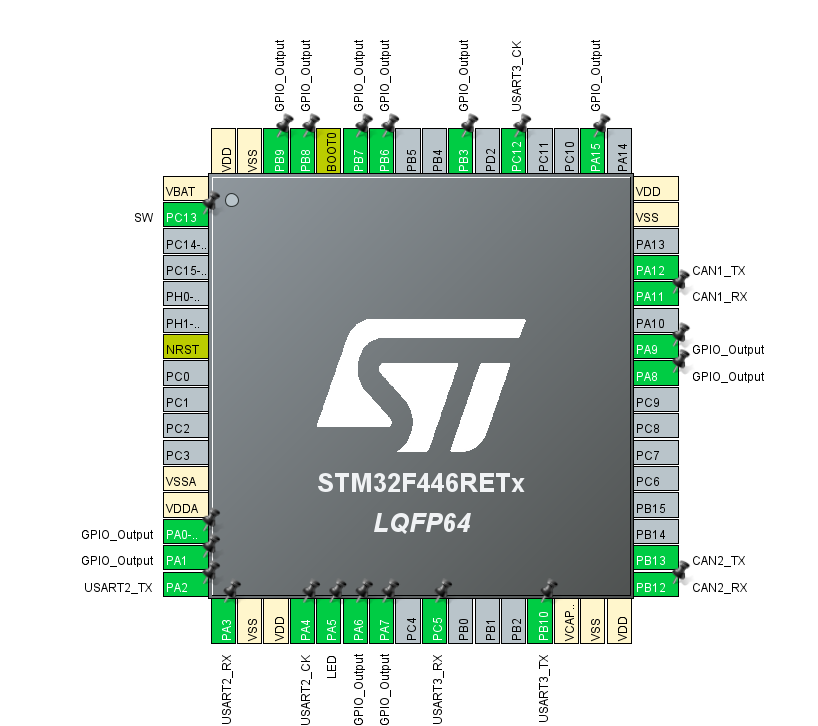

# Altair_module_system

CAN バスで統一された、ロボット向けアクチュエータ制御モジュール群です。  
ROS2 PC から USB-to-CAN アダプタを介し、**モータ（MDD）・サーボ（Servo）・電磁弁（Solenoid Valve）** の 3 種類のモジュールを制御します。

すべてのモジュールは **STM32F446** をコントローラとし、**CAN1 (1 Mbps)** で通信を行います。

## 使い方

[https://github.com/Altairu/Altair_module_system](https://github.com/Altairu/Altair_module_system)
上記URLより構築済みモジュールコードをダウンロードします．


ダウンロードが完了すると中身が以下画像のようなフォルダー構造になります．(2026/4/16現在)


回路に書き込む際は各フォルダー（MDDやServo）単体でVScodeで開くほうがビルド設定などが楽です．簡単なため初心者にはお勧めです．


## 目次

- [Altair\_module\_system](#altair_module_system)
  - [使い方](#使い方)
  - [目次](#目次)
  - [システム全体像](#システム全体像)
  - [CAN ID マップ](#can-id-マップ)
  - [MDD (モータドライバードライバ)](#mdd-モータドライバードライバ)
    - [概要](#概要)
    - [ピン割り当て](#ピン割り当て)
    - [メインループ処理フロー](#メインループ処理フロー)
    - [CAN 通信仕様 (すべて CAN1, 1 Mbps)](#can-通信仕様-すべて-can1-1-mbps)
      - [A. パラメータ設定 (PC → MDD)](#a-パラメータ設定-pc--mdd)
      - [B. 目標値指令 (PC → MDD)](#b-目標値指令-pc--mdd)
      - [C. ステータス返信 (MDD → PC)](#c-ステータス返信-mdd--pc)
    - [エラーコード](#エラーコード)
  - [Servo (サーボモータ)](#servo-サーボモータ)
    - [概要](#概要-1)
    - [サーボ出力ピン](#サーボ出力ピン)
    - [PWM 制御仕様](#pwm-制御仕様)
    - [CAN 受信仕様 (PC → MCU)](#can-受信仕様-pc--mcu)
    - [通信時の動作](#通信時の動作)
  - [Solenoid Valve (電磁弁)](#solenoid-valve-電磁弁)
    - [概要](#概要-2)
    - [出力ピン割り当て](#出力ピン割り当て)
    - [CAN 受信仕様 (PC → MCU)](#can-受信仕様-pc--mcu-1)
    - [通信時の動作](#通信時の動作-1)
  - [GUIツール一覧](#guiツール一覧)
    - [1. モジュール個別 GUI (Python)](#1-モジュール個別-gui-python)
      - [依存環境の準備](#依存環境の準備)
      - [使い方](#使い方-1)
    - [2. 統合 GUI (Altair Unified GUI — Python)](#2-統合-gui-altair-unified-gui--python)
      - [特徴](#特徴)
      - [使い方](#使い方-2)
    - [3. Altair Web Controller (ブラウザ)](#3-altair-web-controller-ブラウザ)
      - [アクセス URL](#アクセス-url)
      - [対応環境](#対応環境)
      - [主な機能](#主な機能)
      - [UI の特徴](#ui-の特徴)
      - [使い方](#使い方-3)

---

## システム全体像

```
┌──────────────┐    USB-to-CAN　     CAN Bus　回路 (赤色のやつ)
│  ROS2 PC     │◄──────────────►═══════════════════════════
│  (GUI/制御)  │                   ║         ║          ║
└──────────────┘                   ▼         ▼          ▼
                              ┌────────┐ ┌───────┐ ┌──────────┐
                              │  MDD   │ │ Servo │ │ Solenoid │
                              │ 4ch DC │ │ 6ch   │ │  12ch    │
                              │ Motor  │ │ PWM   │ │  Valve   │
                              └────────┘ └───────┘ └──────────┘
```

---

## CAN ID マップ

| CAN ID | 方向 | モジュール | 内容 |
|---|---|---|---|
| `0x100` | PC → MCU | Servo | 6ch 角度指令 (6B) |
| `0x200`–`0x203` | PC → MCU | MDD | Motor1-4 パラメータ設定 (各 8B) |
| `0x210` | PC → MCU | MDD | 4ch モード設定 (4B) |
| `0x220` | PC → MCU | MDD | 4ch 目標値指令 (8B) |
| `0x230` | MCU → PC | MDD | ステータス返信 (6B) |
| `0x300` | PC → MCU | Solenoid Valve | 12ch 電磁弁 ON/OFF (2B) |

> **Note**: 各 CAN ID はモジュール側のファームウェアにハードコードされていますが、GUIツール（統合GUI・Web Controller）では Base CAN ID を変更可能です。複数の同種モジュールを使用する場合は、ファームウェア側の CAN ID も合わせて変更してください。

---

## MDD (モータドライバードライバ)

回路名: **Altair_MDD_V3**

CAN1 で ROS2 からパラメータ/目標値を受信し、STM32F446 でエンコーダフィードバック付き PID 制御を実行するモータドライバモジュールです。

### 概要

| 項目 | 内容 |
|---|---|
| MCUプロジェクト | `MDD/` |
| 対象MCU | STM32F446 |
| モータ出力数 | 4ch |
| 制御モード | パラメータ設定モード / 制御実行モード |
| 使用CAN | CAN1 のみ |
| 状態LED | PA5 |

### ピン割り当て

| 区分 | 信号 | ピン / タイマ |
|---|---|---|
| LED | STATUS LED | PA5 |
| Encoder | Encoder1 | PA0 / PA1 (TIM5) |
| Encoder | Encoder2 | PB6 / PB7 (TIM4) |
| Encoder | Encoder3 | PC6 / PC7 (TIM3) |
| Encoder | Encoder4 | PB3 / PA15 (TIM2) |
| Motor | Motor1 | PB14 (TIM12 CH1), PB15 (TIM12 CH2) |
| Motor | Motor2 | PA8 (TIM1 CH1), PA9 (TIM1 CH2) |
| Motor | Motor3 | PA6 (TIM13 CH1), PA7 (TIM14 CH1) |
| Motor | Motor4 | PB8 (TIM10 CH1), PB9 (TIM11 CH1) |
| Limit SW | SW1–SW4 | PC0, PC1, PC2, PC3 |
| Serial | USART2 | TX=PA2, RX=PA3 |
| Serial | USART3 | TX=PB10, RX=PC5 |
| CAN | CAN1 | TX=PA12, RX=PA11 |
| CAN | CAN2 | TX=PB13, RX=PB12 (本仕様では未使用) |

### メインループ処理フロー

1. **初期化** — HAL/CubeMX 初期化後、Altair_library_for_CubeIDE を用いて MotorDriver/Encoder/CAN1 を初期化し、パラメータ設定モードで起動。
2. **パラメータ設定モード** — CAN ID `0x200`–`0x203` の各パラメータと CAN ID `0x210` のモード設定を受信。4モータ分のパラメータ設定が完了するまで、制御用目標値は受信しません。
3. **制御実行モードへの遷移** — 4モータ分パラメータ設定完了で `APP_MODE_CONTROL` へ移行。移行後はパラメータ設定を受信しません。変更する場合はマイコンの再起動が必要です。
4. **制御実行モード** — 1ms 周期でエンコーダ差分から速度/角度/位置を更新し、モード（速度/角度/位置）に応じて PID 演算して PWM へ反映。目標値は CAN ID `0x220` (8B) で受信。
5. **ステータス返信** — 10ms 周期で CAN ID `0x230` を常時送信（パラメータ設定/制御実行の状態に関わらず）。
6. **LED 制御** — パラメータ設定完了後（制御実行モード）に ON。

### CAN 通信仕様 (すべて CAN1, 1 Mbps)

#### A. パラメータ設定 (PC → MDD)

**CAN ID**: Motor1=`0x200`, Motor2=`0x201`, Motor3=`0x202`, Motor4=`0x203`

Payload: 8B (little-endian int16)

| バイト | 内容 |
|---|---|
| Byte0-1 | P ゲイン ×1000 |
| Byte2-3 | I ゲイン ×1000 |
| Byte4-5 | D ゲイン ×1000 |
| Byte6-7 | 車輪径/出力方向 |

Byte6-7 の解釈:
- 絶対値 = 車輪径 [mm]
- 符号: 正=通常方向, 負=反転方向
- 例: `0x0064` (100) → 車輪径 100mm, 通常方向 / `0xFF9C` (-100) → 車輪径 100mm, 反転方向

**CAN ID `0x210`** (モード設定): Payload 4B — Byte0–3 が M1–M4 のモード値 (0=速度, 1=角度, 2=位置)

#### B. 目標値指令 (PC → MDD)

制御実行モードでのみ有効。

**CAN ID `0x220`**: Payload 8B (little-endian int16)

| バイト | 内容 |
|---|---|
| Byte0-1 | M1 目標 ×10 |
| Byte2-3 | M2 目標 ×10 |
| Byte4-5 | M3 目標 ×10 |
| Byte6-7 | M4 目標 ×10 |

スケール: 速度モード=rps×10, 角度モード=deg×10, 位置モード=mm×10

#### C. ステータス返信 (MDD → PC)

**CAN ID `0x230`**: Payload 6B（常時送信）

| バイト | 内容 |
|---|---|
| Byte0–3 | Limit SW1–SW4 |
| Byte4 | エラーコード |
| Byte5 | システム状態 (0=パラメータ設定, 1=制御実行) |

### エラーコード

| 値 | 名称 | 内容 |
|---|---|---|
| `0x00` | NORMAL | 正常 |
| `0x01` | INIT_TIMEOUT | 初期化タイムアウト |
| `0x02` | CAN_RX_TIMEOUT | 一定時間 CAN 受信なし |
| `0x04` | CAN_TX_FAIL | フィードバック送信失敗 |

> エラーコードはビットフラグで、同時に複数立つ場合があります。

---

## Servo (サーボモータ)

回路名: **ALTAIR_SERVO_MODULE_V6**

ROS2 PC から USB-to-CAN を介して目標角度を送信し、STM32 が 6ch のサーボ PWM を生成するモジュールです。

### 概要

| 項目 | 内容 |
|---|---|
| MCUプロジェクト | `Servo/` |
| 対象MCU | STM32F446 |
| サーボ出力数 | 6ch |
| 使用CAN | CAN1 (受信) |
| 搭載CANポート | 2 系統 |
| 状態LED | PA5 |

### サーボ出力ピン

PIN 設定  


| サーボ | ピン | タイマ |
|---|---|---|
| Servo1 | PA6 | TIM3 CH1 |
| Servo2 | PA7 | TIM3 CH2 |
| Servo3 | PA8 | TIM1 CH1 |
| Servo4 | PA9 | TIM1 CH2 |
| Servo5 | PB8 | TIM2 CH1 |
| Servo6 | PB9 | TIM2 CH2 |

### PWM 制御仕様

| 項目 | 値 |
|---|---|
| 制御周期 | 20ms (50Hz) |
| パルス幅範囲 | 0.5ms ～ 2.5ms |
| 角度入力範囲 | 0 ～ 180 度 |
| 角度-パルス幅変換 | `pulse_us = 500 + (2000 × angle_deg / 180)` |

### CAN 受信仕様 (PC → MCU)

| 項目 | 値 |
|---|---|
| 使用CAN | CAN1 |
| CAN ID | `0x100` (標準ID) |
| DLC | 6 |

Payload (6B): Byte0–Byte5 = Servo1–Servo6 角度 [0..180]

注記:
- Byte 値が 180 を超える場合は MCU 側で 180 にクリップ
- 受信ノイズ対策として各軸にデッドバンド 2deg を適用
- 同一候補値が 3 回連続したときのみ目標値へ反映

### 通信時の動作

| 条件 | 動作 |
|---|---|
| CAN フレーム受信時 | LED(PA5) を ON |
| 200ms 以上無受信時 | LED(PA5) を OFF |
| 通信途絶時 | 最後の反映済み目標角度を保持して出力継続 |
| 起動直後 | 全軸 90deg で PWM 開始 |

---

## Solenoid Valve (電磁弁)

回路名: **ALTAIR_SOLENOID_VALVE_MODULE**

ROS2 PC から USB-to-CAN を介して ON/OFF 指令を送信し、STM32 が最大 12 個の電磁弁（ソレノイドバルブ）を駆動するモジュールです。

### 概要



| 項目 | 内容 |
|---|---|
| MCUプロジェクト | `solenoid_valve/` |
| 対象MCU | STM32F446 |
| 出力数 | 12ch (GPIO) |
| 使用CAN | CAN1 (受信) |
| CAN ID | `0x300` (標準ID) |
| 状態LED | PA5 |

### 出力ピン割り当て

| 電磁弁 | ピン |
|---|---|
| Valve 1 | PA0 |
| Valve 2 | PA1 |
| Valve 3 | PA6 |
| Valve 4 | PA7 |
| Valve 5 | PA8 |
| Valve 6 | PA9 |
| Valve 7 | PA15 |
| Valve 8 | PB3 |
| Valve 9 | PB6 |
| Valve 10 | PB7 |
| Valve 11 | PB8 |
| Valve 12 | PB9 |

### CAN 受信仕様 (PC → MCU)

| 項目 | 値 |
|---|---|
| 使用CAN | CAN1 |
| CAN ID | `0x300` (標準ID) |
| DLC | 2 以上 |

Payload (2B): 12 個の電磁弁の ON/OFF をビットで割り当て

- **Byte0** (Valve 1–8):
  - bit0: Valve 1 (PA0) ～ bit7: Valve 8 (PB3)
- **Byte1** (Valve 9–12):
  - bit0: Valve 9 (PB6) ～ bit3: Valve 12 (PB9)
  - bit4-7: 未使用

### 通信時の動作

| 条件 | 動作 |
|---|---|
| `0x300` 受信時 | ビット状態に従い GPIO 出力を設定、LED ON |
| 200ms 以上無受信時 | LED OFF（ピン出力状態は保持） |

---

## GUIツール一覧

Altair Module System では、用途に応じて **3 種類** の制御ツールを用意しています。

| ツール | 環境 | 対応モジュール | 特徴 |
|---|---|---|---|
| モジュール個別 GUI | Python (Ubuntu/Windows) | 各 1 種類 | シンプル。単一モジュールのテストに最適 |
| 統合 GUI (Unified/Advanced) | Python (Ubuntu/Windows) | MDD + Servo + Solenoid | タブ切替で全モジュール一括操作 |
| **Altair Web Controller** | **ブラウザ (Chrome/Edge)** | **MDD + Servo + Solenoid** | **インストール不要。動的モジュール追加、Blockly 自動化、ゲームコントローラー対応** |

### 1. モジュール個別 GUI (Python)

各モジュールのディレクトリに、UbuntuとWindows用のGUIスクリプトが用意されています。単一モジュールの動作テストに最適です。

| モジュール | Ubuntu | Windows | ディレクトリ |
|---|---|---|---|
| MDD | `mdd_gui_ubuntu.py` | `mdd_gui_win.py` | `MDD/` |
| Servo | `servo_gui_ubuntu.py` | `servo_gui_win.py` | `Servo/` |
| Solenoid Valve | `solenoid_valve_gui_ubuntu.py` | `solenoid_valve_gui_win.py` | `solenoid_valve/` |

#### 依存環境の準備

**Ubuntu:**
```bash
sudo apt install python3-tk
pip install python-can
```

**Windows:**
```powershell
pip install python-can pyserial
```
> 使用する CAN インターフェースに応じたドライバ（PCAN ドライバ等）をあらかじめインストールしてください。  
> slcan（COM ポート経由の CAN アダプタ）を使用する場合は `pyserial` が必須です。

#### 使い方

```bash
# Ubuntu の例 (MDD)
cd MDD
python3 mdd_gui_ubuntu.py

# Windows の例 (Solenoid Valve)
cd solenoid_valve
python solenoid_valve_gui_win.py
```

1. **接続**: CAN インターフェース・チャネル・ビットレートを指定して接続
2. **操作**: 各モジュール固有の制御 UI で操作
   - **MDD**: PID パラメータ設定 → 制御実行モード → スライダーで目標値送信
   - **Servo**: スライダーで 0–180 度の角度を設定、単発/周期送信
   - **Solenoid Valve**: チェックボックスで 12ch の ON/OFF を設定、単発/周期送信

---

### 2. 統合 GUI (Altair Unified GUI — Python)

MDD・Servo・Solenoid Valve の 3 モジュールを **1 つの画面でタブ切り替え** して操作できる統合ツールです。1 回の CAN 接続操作で、すべてのモジュールの送信テストを一括して行えます。

| スクリプト | 対応OS | デフォルト設定 |
|---|---|---|
| `Altair_module_system_Ubuntu.py` | Ubuntu | socketcan / can0 |
| `Altair_module_system_win.py` | Windows | slcan / COM3 |
| `Altair_module_system_advanced_Ubuntu.py` | Ubuntu (拡張版) | socketcan / can0 |

#### 特徴

- **タブ切り替え**: MDD / Servo / Solenoid Valve の各画面をシームレスに切り替え
- **独立周期送信**: MDD・Servo は 10ms 周期、Solenoid Valve は 100ms 周期（それぞれ独立して ON/OFF 可能）
- **共有ログ**: 全モジュールの送受信ログを画面下部で一元管理
- **拡張版 (Advanced)**: 動的モジュール追加、可変 CAN ID、マクロ・トリガー制御に対応

#### 使い方

**Ubuntu:**
```bash
pip install python-can
python3 Altair_module_system_Ubuntu.py
```

**Windows:**
```powershell
pip install python-can pyserial
python Altair_module_system_win.py
```

接続後、Interface / Channel / Bitrate を指定して「接続」ボタンを押してください。

---

### 3. Altair Web Controller (ブラウザ)

> **別リポジトリ**: [Altair_module_system_control](https://github.com/Altairu/Altair_module_system_control)

MDD・Servo・Solenoid Valve を **ブラウザからインストール不要で直接制御** できるウェブアプリケーションです。  
Python やドライバのインストールが不要で、URL を開くだけで動作します。

#### アクセス URL

🌐 **https://altairu.github.io/Altair_module_system_control/**

#### 対応環境

| 項目 | 要件 |
|---|---|
| ブラウザ | パソコン版 **Google Chrome** または **Microsoft Edge** |
| CAN インターフェース | slcan プロトコル（USB を COM ポートとして認識するもの） |
| 通信方式 | Web Serial API（ブラウザ標準機能） |

> **注意**: Firefox / Safari / スマートフォンブラウザでは Web Serial API が利用できないため動作しません。  
> PCAN や SocketCAN 等の専用ドライバが必要なデバイスには対応していません。

#### 主な機能

| 機能 | 説明 |
|---|---|
| **ダッシュボード** | MDD・Servo・Solenoid のモジュールカードを動的に追加し、スライダーやチェックボックスでリアルタイム制御 |
| **動的モジュール構成** | モジュールを無制限に追加可能。Base CAN ID を自由に設定でき、同種モジュール複数台もサポート |
| **Automation (Blockly)** | Google Blockly を用いた Scratch ライクなマクロ・トリガー作成機能。MDD のリミットスイッチ等を条件に、他のモジュールを自動制御 |
| **Game Controller** | USB / Bluetooth 接続のゲームコントローラー入力をマッピングし、ボタンやスティックでモジュールを操作 |
| **システムログ** | 送受信ログをリアルタイムで表示・確認 |
| **設定の保存** | ブラウザの LocalStorage に設定を自動保存。次回アクセス時に復元 |

#### UI の特徴

- **Glassmorphism + ダークテーマ** を採用したモダンなデザイン
- **サイドバーナビゲーション**: Dashboard / Automation / Controller / Logs をワンクリックで切り替え
- **レスポンシブレイアウト**: モジュールカードが画面サイズに応じてグリッド配置

#### 使い方

1. 上記の URL に Chrome または Edge でアクセス
2. サイドバーの **Connection** セクションで Bitrate を選択し、「**Connect USB**」ボタンをクリック
3. OS のダイアログで slcan デバイス（COM ポート）を選択して接続
4. サイドバーの **Modules** セクションで「**Add Module**」をクリックし、モジュールタイプ・名前・Base CAN ID を指定して追加
5. **Dashboard** 上に表示されるモジュールカードで制御操作を行う


??? Note
    著者:Shion Noguchi