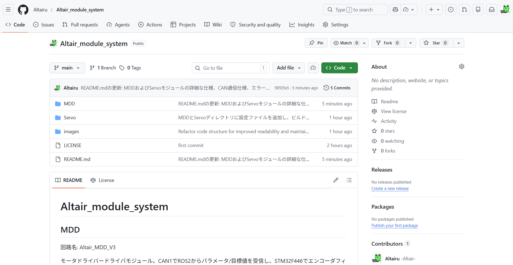
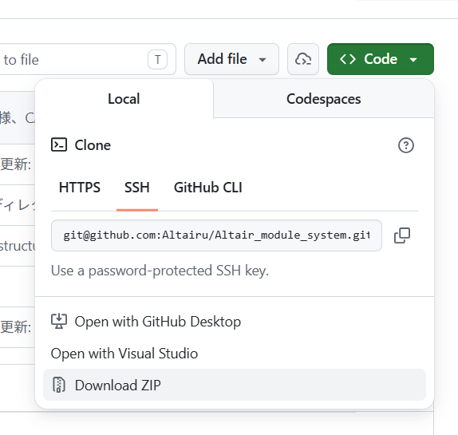
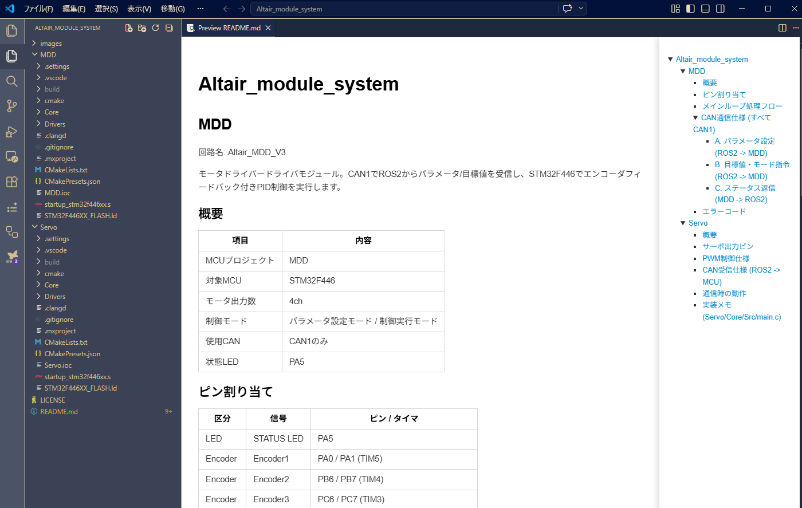
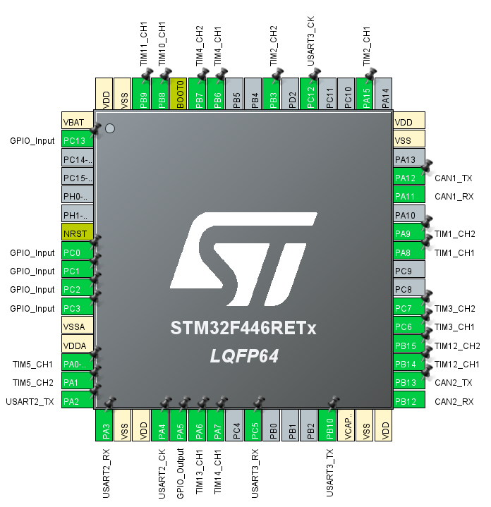
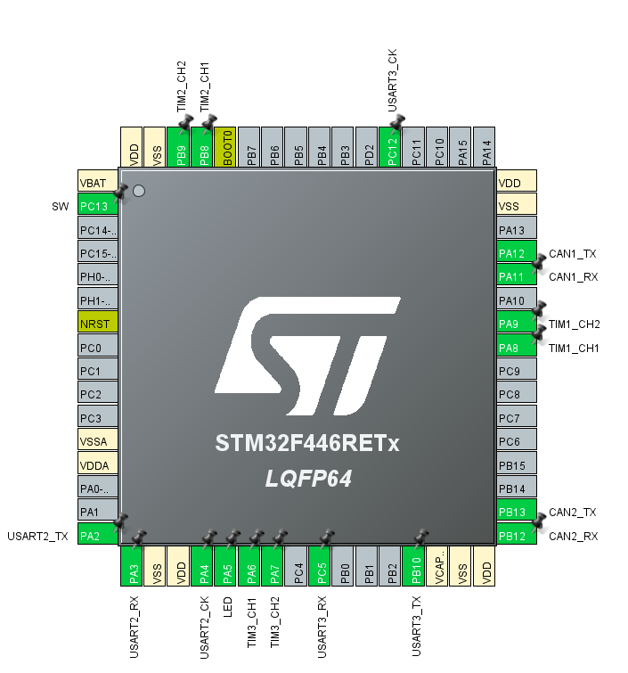

# Altair_module_system

## 使い方

[https://github.com/Altairu/Altair_module_system](https://github.com/Altairu/Altair_module_system)
上記URLより構築済みモジュールコードをダウンロードします．

ダウンロードが完了すると中身が以下画像のようなフォルダー構造になります．(2026/4/16現在)

回路に書き込む際は各フォルダー（MDDやServo）単体でVScodeで開くほうがビルド設定などが楽です．簡単なため初心者にはお勧めです．

## MDD

回路名: Altair_MDD_V3

モータドライバードライバモジュール。CAN1でROS2からパラメータ/目標値を受信し、STM32F446でエンコーダフィードバック付きPID制御を実行します。

### 概要

| 項目 | 内容 |
|---|---|
| MCUプロジェクト | MDD |
| 対象MCU | STM32F446 |
| モータ出力数 | 4ch |
| 制御モード | パラメータ設定モード / 制御実行モード |
| 使用CAN | CAN1のみ |
| 状態LED | PA5 |

### ピン割り当て

| 区分 | 信号 | ピン / タイマ |
|---|---|---|
| LED | STATUS LED | PA5 |
| Encoder | Encoder1 | PA0 / PA1 (TIM5) |
| Encoder | Encoder2 | PB6 / PB7 (TIM4) |
| Encoder | Encoder3 | PC6 / PC7 (TIM3) |
| Encoder | Encoder4 | PB3 / PA15 (TIM2) |
| Motor | Motor1 | PB14 (TIM12 CH1), PB15 (TIM12 CH2) |
| Motor | Motor2 | PA8 (TIM1 CH1), PA9 (TIM1 CH2) |
| Motor | Motor3 | PA6 (TIM13 CH1), PA7 (TIM14 CH1) |
| Motor | Motor4 | PB8 (TIM10 CH1), PB9 (TIM11 CH1) |
| Limit SW | SW1 | PC0 |
| Limit SW | SW2 | PC1 |
| Limit SW | SW3 | PC2 |
| Limit SW | SW4 | PC3 |
| Serial | USART2 | TX=PA2, RX=PA3 |
| Serial | USART3 | TX=PB10, RX=PC5 |
| CAN | CAN1 | TX=PA12, RX=PA11 |
| CAN | CAN2 | TX=PB13, RX=PB12 (本仕様では未使用) |

### メインループ処理フロー

1. 初期化
   HAL/CubeMX初期化後、Altair_library_for_CubeIDEを用いてMotorDriver/Encoder/CAN1を初期化し、パラメータ設定モードで起動します。
2. パラメータ設定モード
   CAN ID 0x200, 0x201, 0x203, 0x204 の各パラメータを待機し、4モータ分がそろえば制御実行モードへ遷移します。
3. タイムアウト時の遷移
   起動後2秒以内に全パラメータがそろわない場合は、デフォルトゲインで制御実行モードへ移行し、INIT_TIMEOUTをセットします。
4. 制御実行モード
   1ms周期でエンコーダ差分から速度/角度を更新し、モード(速度/角度)に応じてPID演算してPWMへ反映します。
5. ステータス返信
   10ms周期でリミット状態とモータ系ステータスをCAN1へ送信します。
6. LED制御
   エラーなしでON、エラーありでOFFにします。

### CAN通信仕様 (すべて CAN1)

#### A. パラメータ設定 (ROS2 -> MDD)

CAN ID:
- Motor1: 0x200
- Motor2: 0x201
- Motor3: 0x203
- Motor4: 0x204

Payload: 8B (little-endian int16)
- Byte0-1: Pゲイン x100
- Byte2-3: Iゲイン x100
- Byte4-5: Dゲイン x100
- Byte6-7: 車輪径/出力方向

Byte6-7の解釈:
- 絶対値: 車輪径[mm]
- 符号: PID出力方向 (正=通常, 負=反転)

例:
- 0x0064 (100) -> 車輪径 100mm, 通常方向
- 0xFF9C (-100) -> 車輪径 100mm, 反転方向

#### B. 目標値・モード指令 (ROS2 -> MDD)

CAN ID: 0x210 (目標値)

Payload: 8B (little-endian int16)
- Byte0-1: M1目標 x10
- Byte2-3: M2目標 x10
- Byte4-5: M3目標 x10
- Byte6-7: M4目標 x10

スケール:
- 速度モード時: 目標速度[rps] x10
- 角度モード時: 目標角度[deg] x10

CAN ID: 0x211 (モード指令)

Payload: 8B (little-endian int16)
- Byte0-1: M1モード
- Byte2-3: M2モード
- Byte4-5: M3モード
- Byte6-7: M4モード

モード値:
- 0: 速度制御
- 1: 角度制御

備考:
- モードは受信後に保持され、次に0x211を受信するまで継続します。

#### C. ステータス返信 (MDD -> ROS2)

CAN ID: 0x120 (リミットスイッチ)

Payload: 4B
- Byte0: Limit SW1
- Byte1: Limit SW2
- Byte2: Limit SW3
- Byte3: Limit SW4

CAN ID: 0x121 (Motor系ステータス)

Payload: 6B
- Byte0: Motor1モード
- Byte1: Motor2モード
- Byte2: Motor3モード
- Byte3: Motor4モード
- Byte4: エラーコード
- Byte5: システム状態 (0=パラメータ設定, 1=制御実行)

### エラーコード

| 値 | 名称 | 内容 |
|---|---|---|
| 0x00 | NORMAL | 正常 |
| 0x01 | INIT_TIMEOUT | 起動時に必要パラメータ未受信のままタイムアウト |
| 0x02 | CAN_RX_TIMEOUT | 一定時間CAN受信なし |
| 0x04 | CAN_TX_FAIL | フィードバック送信失敗 |

注記:
- エラーコードはビットフラグで、同時に複数立つ場合があります。

## Servo

回路名: ALTAIR_SERVO_MODULE_V6

サーボモーター用モジュール。ROS2 PC から USB to CAN を介して目標角度を送信し、STM32 が 6ch のサーボ PWM を生成する。

### 概要

| 項目 | 内容 |
|---|---|
| MCUプロジェクト | Servo |
| 対象MCU | STM32F446 |
| サーボ出力数 | 6ch |
| 使用CAN | CAN1 (受信) |
| 搭載CANポート | 2系統 |
| 状態LED | PA5 |

### サーボ出力ピン

PIN設定

| サーボ | ピン | タイマ |
|---|---|---|
| Servo1 | PA6 | TIM3 CH1 |
| Servo2 | PA7 | TIM3 CH2 |
| Servo3 | PA8 | TIM1 CH1 |
| Servo4 | PA9 | TIM1 CH2 |
| Servo5 | PB8 | TIM2 CH1 |
| Servo6 | PB9 | TIM2 CH2 |

### PWM制御仕様

| 項目 | 値 |
|---|---|
| 制御周期 | 20ms (50Hz) |
| パルス幅範囲 | 0.5ms から 2.4ms |
| 目標角度 | 0 から 180 [deg] |
| 角度-パルス幅変換 | pulse_us = 500 + (1900 * angle_deg / 180) |

### CAN受信仕様 (ROS2 -> MCU)

| 項目 | 値 |
|---|---|
| 使用CAN | CAN1 |
| CAN ID | 100 (標準ID) |
| DLC | 6 |

Payload (6B)
- Byte0: Servo1角度 [0..180]
- Byte1: Servo2角度 [0..180]
- Byte2: Servo3角度 [0..180]
- Byte3: Servo4角度 [0..180]
- Byte4: Servo5角度 [0..180]
- Byte5: Servo6角度 [0..180]

注記:
- Byte値が180を超える場合はMCU側で180にクリップします。

### 通信時の動作

- CAN受信時: LED(PA5) をON
- 通信が途切れた場合: 最後に受信した目標角度を保持して出力を継続

### 実装メモ (Servo/Core/Src/main.c)

- CAN1フィルタをCAN ID 100に設定
- CAN FIFO0受信割り込みで6バイトを取り込み
- 受信データを6系統PWM比較値へ反映
- TIM1/TIM2/TIM3を1MHzカウンタ化 (Prescaler=83)、Period=19999で50Hz PWMを生成

??? Note
    著者:Shion Noguchi