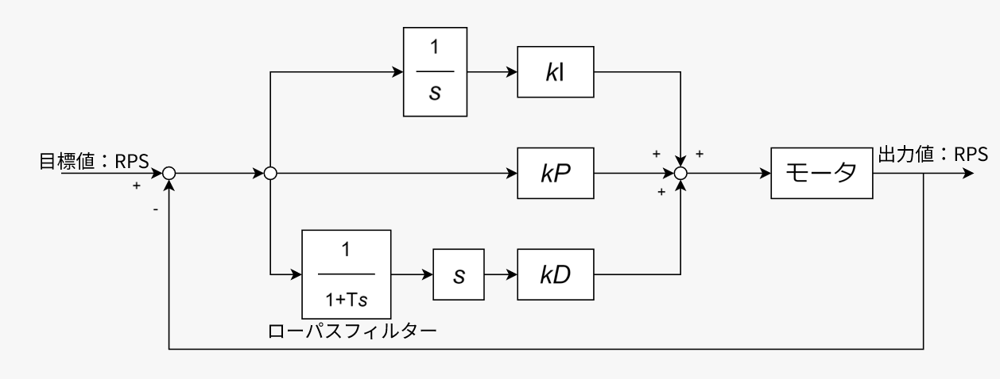

# PID制御の理論と実践

## 1. PID制御の数学的定義

PID制御は、フィードバック制御の一種であり、目標値（Set Point: $r(t)$）と現在値（Process Variable: $y(t)$）の差である**偏差 $e(t) = r(t) - y(t)$** に基づいて操作量を決定します。

連続時間系における操作量 $u(t)$ は、以下の式で定義されます。

$$u(t) = K_p e(t) + K_i \int_{0}^{t} e(\tau) d\tau + K_d \frac{de(t)}{dt}$$

ここで：
* $K_p$: 比例ゲイン (Proportional Gain)
* $K_i$: 積分ゲイン (Integral Gain)
* $K_d$: 微分ゲイン (Derivative Gain)

## 2. 各要素の役割とシステムへの影響

PIDの各項を調整した際、システムの応答（ステップ応答）がどのように変化するかを理解することが重要です。

| 項 | 名称 | 主な役割 | ゲインを上げた際の影響 |
| :--- | :--- | :--- | :--- |
| **P** | **比例** | 現在の誤差に反応 | 立ち上がり時間が短くなるが、**残留偏差（オフセット）**が残る。 |
| **I** | **積分** | 過去の誤差を累積 | **残留偏差をゼロにする**。ただし、上げすぎるとオーバーシュートや振動を招く。 |
| **D** | **微分** | 将来の誤差を予測 | 応答の振れ（オーバーシュート）を抑え、**速やかに収束させる**。ノイズに弱い。 |

## 3. ゲイン調整（チューニング）の手法

実際にロボットや回路を動かす際、最適なゲインを見つけるのは容易ではありません。代表的な手法を紹介します。

### 限界感度法（ジグラー・ニコルス法）
1.  最初に $K_i=0, K_d=0$ とします。
2.  $K_p$ を徐々に上げていき、出力が一定の振幅で振動し始める（限界安定状態）ゲイン $K_u$ と、その時の振動周期 $T_u$ を測定します。
3.  以下の表に基づいてゲインを決定します。

| 制御の種類 | $K_p$ | $K_i$ | $K_d$ |
| :--- | :--- | :--- | :--- |
| **P制御** | $0.5 K_u$ | - | - |
| **PI制御** | $0.45 K_u$ | $1.2 K_p / T_u$ | - |
| **PID制御** | $0.6 K_u$ | $2 K_p / T_u$ | $K_p T_u / 8$ |

### ステップ応答法（CHR法）
制御対象にステップ入力を与え、その応答波形の最大傾斜や無駄時間から計算で求める手法です。

## 4. デジタル実装における離散化

マイコン（SpresenseやSTM32など）で実装する場合、連続的な数式をサンプリング周期 $\Delta t$ で離散化する必要があります。

$$u_n = K_p e_n + K_i \sum_{k=0}^{n} e_k \Delta t + K_d \frac{e_n - e_{n-1}}{\Delta t}$$

プログラム上では、積分項は「過去の誤差の累積変数」、微分項は「前回誤差との差分」として保持します。

## 5. 実践的な注意点：アンチワインドアップ (Anti-windup)

実際のシステムには、モータの電圧限界などの「飽和（サチュレーション）」が存在します。
偏差が長時間残ると、積分項が肥大化し続け、目標値を通り過ぎても制御が止まらなくなる現象（積分飽和）が起こります。これを防ぐために、**操作量が上限に達した際は積算を停止する**等の処理が実用上不可欠です。

??? Note
    著者:Shion Noguchi