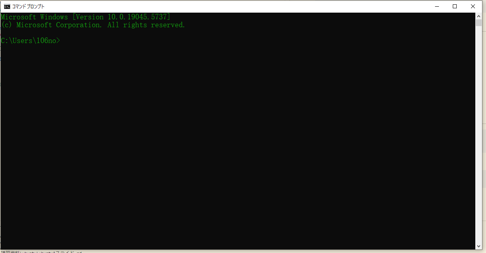
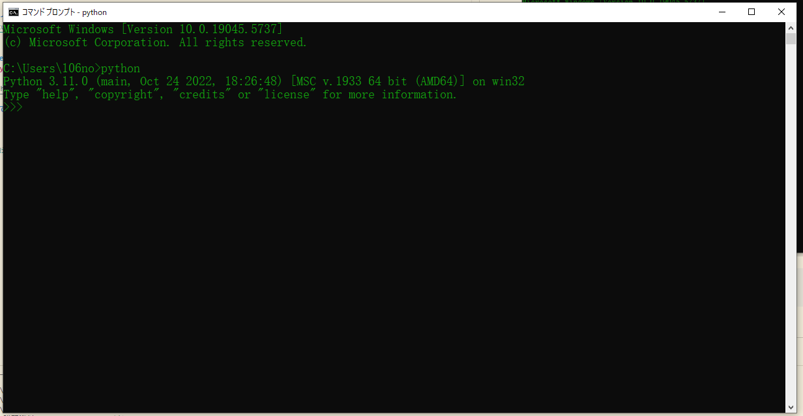

# 🐍 Windows 11 に Python 開発環境を構築する手順

##  1. Python のインストール

### 公式サイトからダウンロード
1. [https://www.python.org/downloads/](https://www.python.org/downloads/) にアクセス
2. 最新の **Python 3.x.x** をダウンロード
3. インストーラを実行

### インストール時のオプション設定
- ✅ 「**Add Python 3.x to PATH**」にチェックを入れる（重要！）
- ▶ 「Customize installation」でパスやオプションを変更してもOK
-  「Install Now」でインストール

!!! Tip
    「**Add Python 3.x to PATH**」にチェックを入れる

### 動作確認（ターミナル）
- コマンドプロントを開く



そこで

```bash
python
```
と入力


!!! Failure
   もしこの画面が出ない場合は， "Add Python 3.x to PATH" をチェックしなかった，Pythonがインストールされていないのどちらかです


## 2. エディタのインストール（例：VS Code）

### Visual Studio Code のインストール
1. [https://code.visualstudio.com/](https://code.visualstudio.com/) からダウンロード
2. インストール実行

### 拡張機能の追加（VS Code起動後）
-  「Python」で検索し、**Python extension（Microsoft製）** をインストール

[日本語化はこちらを参考に](https://www.javadrive.jp/vscode/install/index4.html)

