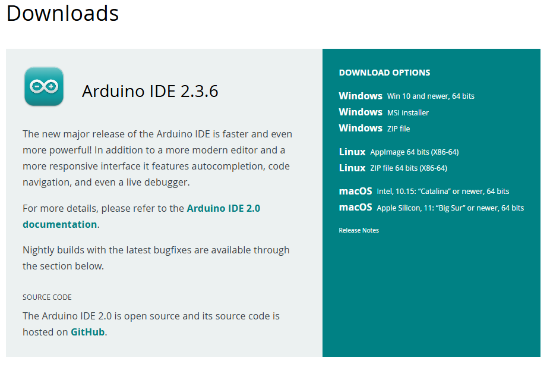
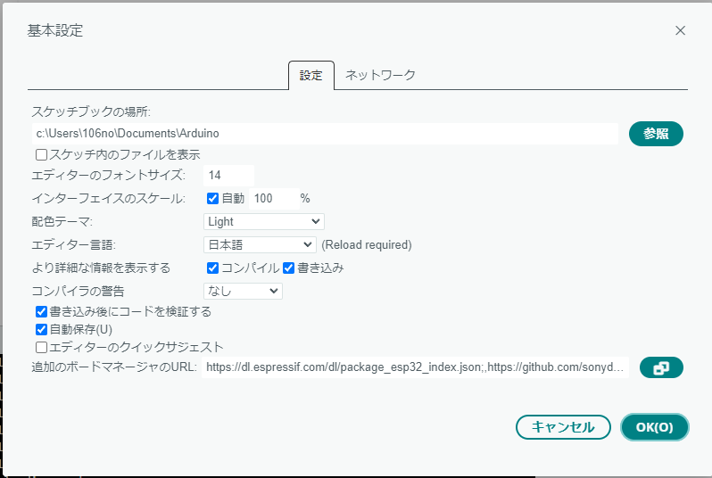
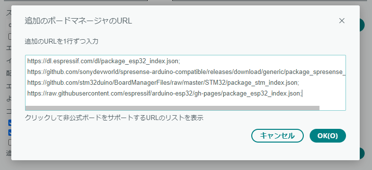

# ESP32をArduino IDEで使うための環境構築ガイド

- Arduino IDE（バージョン 1.8以上推奨）
- ESP32開発ボード（例：ESP32 DevKitC, ESP32-WROOM-32など）
- USBケーブル（マイコン接続用）
- インターネット環境

## 🧩 Step 1：Arduino IDEのインストール

### Windows / Mac / Linux 共通
以下のリンクからArduino IDEをダウンロード＆インストールしてください。

🔗 [Arduino IDE ダウンロードページ](https://www.arduino.cc/en/software)



## Step 2：ESP32ボードのボードマネージャ設定

1. Arduino IDEを開き、メニューから  
　`ファイル > 環境設定（Preferences）`を選択。

2. 「追加のボードマネージャのURL」に以下を追加：

```
https://espressif.github.io/arduino-esp32/package_esp32_index.json
```






!!! Tip
    画像ではESP以外の設定も入っています．すでに他のURLがある場合は、カンマ区切りで追加してください．

## Step 3：ESP32ボードパッケージのインストール

1. `ツール > ボード > ボードマネージャ`を開く。

2. 検索欄に「esp32」と入力。

3. 「esp32 by Espressif Systems」が表示されたら「インストール」をクリック。

##  Step 4：ボードの選択とポート設定

1. `ツール > ボード`から、自分のESP32ボード（例：`ESP32 Dev Module`）を選択。

2. `ツール > シリアルポート`から、ESP32が接続されているポート（例：COM3、/dev/ttyUSB0など）を選ぶ。

##  Step 5：LED点滅テスト（Lチカ）

ESP32に内蔵されているLED（多くはGPIO2）を点滅させて動作確認を行います。

### コード例：`LED_Blink.ino`

```cpp
// LEDが接続されているGPIOピン
#define LED_PIN 2

void setup() {
  pinMode(LED_PIN, OUTPUT); // ピンを出力モードに設定
}

void loop() {
  digitalWrite(LED_PIN, HIGH); // LED ON
  delay(500);                  // 500ミリ秒待機
  digitalWrite(LED_PIN, LOW);  // LED OFF
  delay(500);                  // 500ミリ秒待機
}
```


!!! Tip
    GPIOの番号はボードによって異なる場合があります．ボードの回路図などで確認してください．

## Step 6：書き込み＆実行

1. プログラムをArduino IDEに貼り付け。
2. `→`（アップロード）ボタンをクリック。
3. コンパイルと書き込み完了後、LEDが点滅すれば成功！


!!! Tip
    書き込み時に「BOOT」ボタンを長押しする必要があるボードもあります（例：ESP32 DevKitC）。


## トラブルシューティング

- ポートが表示されない → ドライバのインストールを確認
- 書き込みに失敗する → BOOTボタンを押しながら書き込みを試す
- LEDが点滅しない → GPIO番号を確認（ボードによって異なる）

