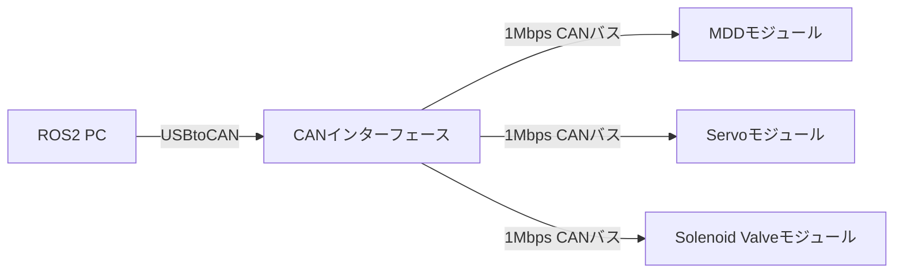

# Altair Module System 全体概要

Altair Module Systemはロボット向けのアクチュエータ制御モジュール群です。
すべてのモジュールがCANバスで通信し、ROS2を搭載したPCからUSBやEthernetを経由して一括制御を行います。
ロボットの構成が変わってもプログラムを大幅に書き換える必要がなく、用途に応じてモジュールを追加したり減らしたりできるのが特徴です。

## システムの構成図

PC側からCANインターフェースを通して各モジュールへ指令を送ります。

各モジュールには制御用のマイクロコントローラとしてSTM32F446が搭載されています。
通信速度は1Mbpsに統一されており高速な制御が可能です。

## 提供されているモジュールの種類

用途に応じて3種類のモジュールが用意されています。

### MDD
モータを駆動するためのモジュールです。
4つのモータを同時に制御でき、エンコーダからのフィードバックを利用したPID制御をモジュール単体で実行します。
速度制御、角度制御、位置制御のモードを備えています。

### Servo
サーボモータを動かすためのモジュールです。
PCから送られてきた角度指令をもとに6つのサーボモータへPWM信号を出力します。

### Solenoid Valve
電磁弁を制御するためのモジュールです。
最大12個の電磁弁のオンオフをPCから切り替えることができ、空気圧シリンダなどの制御に使用します。

### 書き込み
これらのモジュールの書き込み環境は以下で構築しよう

- [STM32CubeIDE環境構築](https://altairu.github.io/sken_training_materials/training_materials/%E8%AC%9B%E7%BF%92%E8%B3%87%E6%96%99/STM32CubeIDE/1/%E7%92%B0%E5%A2%83%E6%A7%8B%E7%AF%89/)
書き込み環境の構築用の記事です

- [モジュールプログラム](https://altairu.github.io/sken_training_materials/training_materials/%E8%AC%9B%E7%BF%92%E8%B3%87%E6%96%99/STM32CubeIDE/4/%E3%83%A2%E3%82%B8%E3%83%A5%E3%83%BC%E3%83%AB%E4%BD%BF%E3%81%84%E6%96%B9/)
書き込みコードについての記事です．