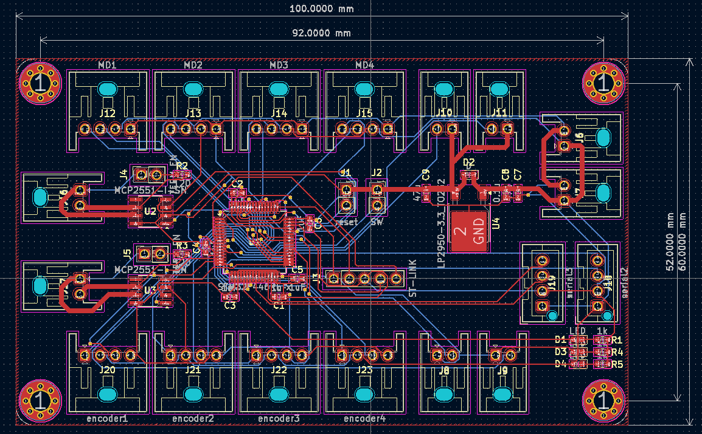
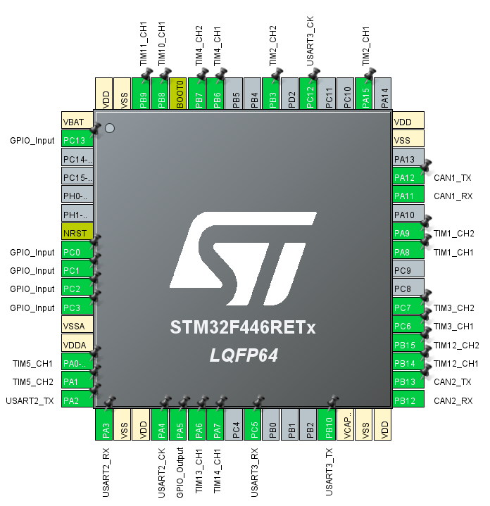
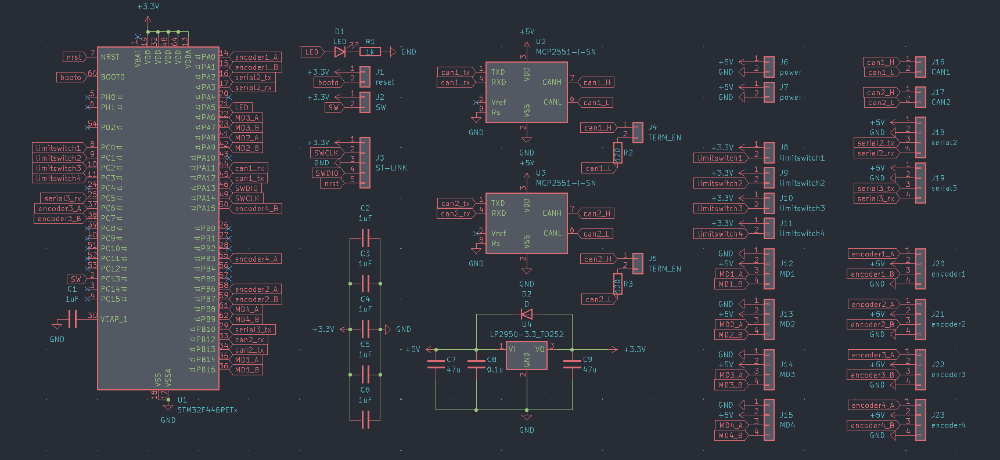
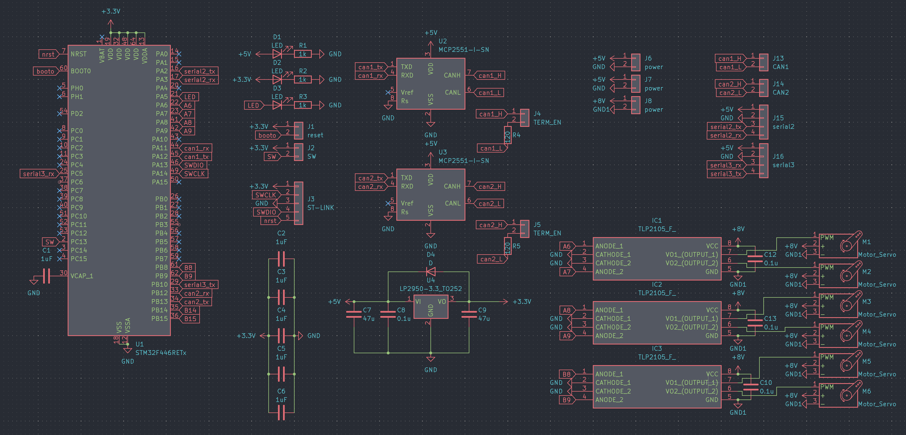
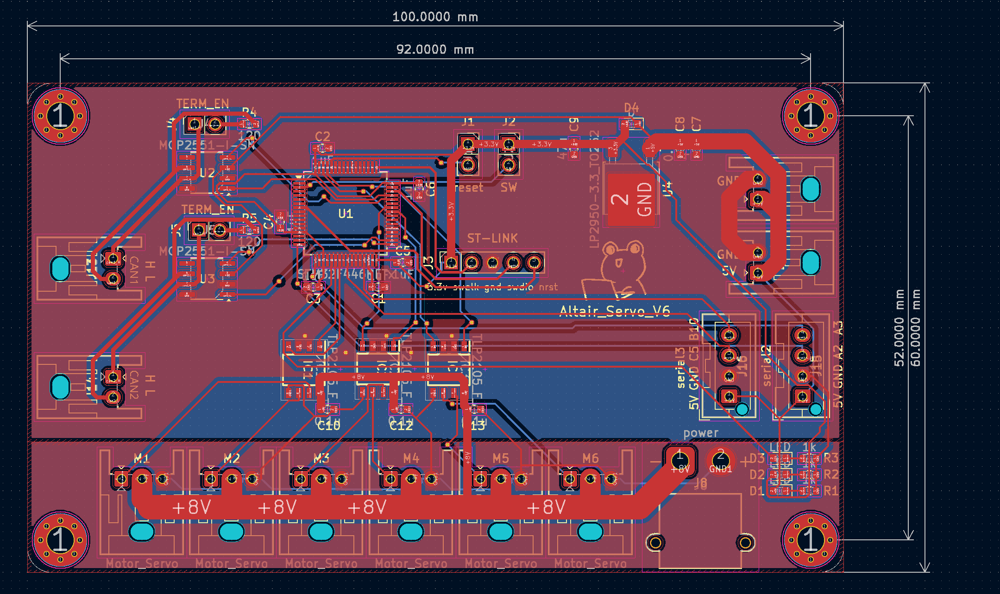
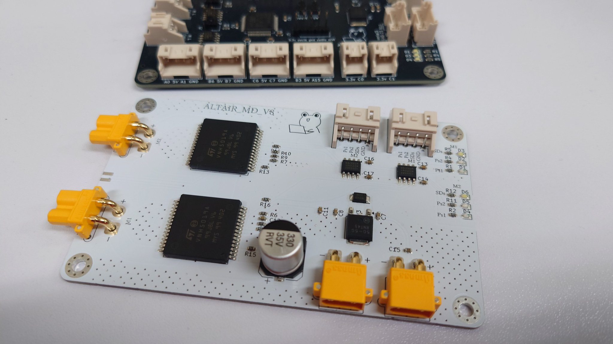
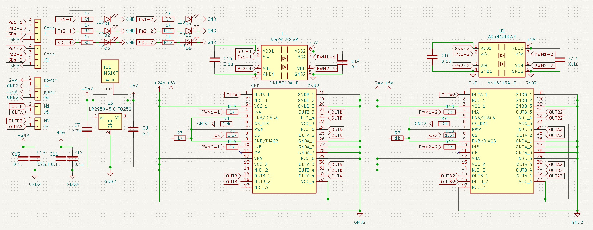
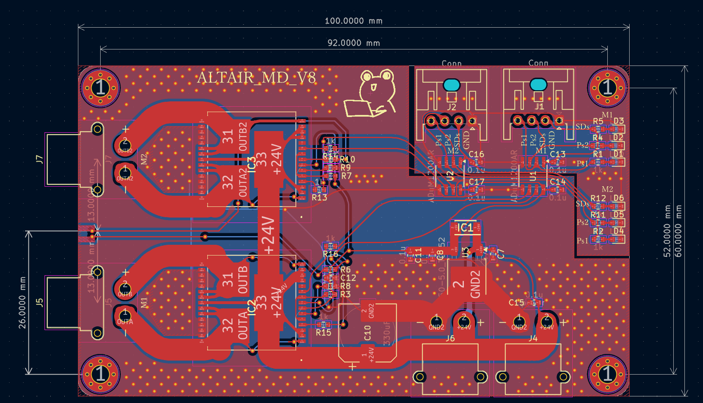

# 回路モジュール

S-研で使用している回路モジュールです。
[Circuit Module Readme](https://github.com/SkenHub/Circuit-Module-Readme "Circuit Module Readme")

## 世代別モジュール一覧

旧世代モジュール

**作者: [Altair](https://github.com/Altairu "Altairu")**

- [ALTAIR_CAN_SHIELD_V1](https://github.com/Altairu/ALTAIR_CAN_SHIELD-_V1 "ALTAIR_CAN_SHIELD_V1")
> CAN通信用拡張シールド
- [ALTAIR_MDD_V2](https://github.com/Altairu/ALTAIR_MDD_V2 "ALTAIR_MDD_V2")
> モータードライバードライバー　モータードライバー×4　エンコーダー×4　シリアル×2
- [ALTAIR_SERVO_MODULE_V3](https://github.com/Altairu/ALTAIR_SERVO_MODULE_V3 "ALTAIR_SERVO_MODULE_V3")
> サーボモータモジュール　サーボ×8　シリアル×2
- [ALTAIR_SERVO_MODULE_V4](https://github.com/Altairu/ALTAIR_SERVO_MODULE_V4 "ALTAIR_SERVO_MODULE_V4")
> サーボモータモジュール　サーボ×8　シリアル×2
- [ALTAIR_SERVO_MODULE_V5](https://github.com/Altairu/ALTAIR_SERVO_MODULE_V5 "ALTAIR_SERVO_MODULE_V5")
> サーボモータモジュール　サーボ×8　シリアル×2
- [AltairMD_V7](https://github.com/Altairu/AltairMD_V7 "AltairMD_V7")
> モータードライバー モーター×１

**作者: [makizusi](https://github.com/makizusi "makizusi")**

- [センサモジュール](https://github.com/makizusi/-circuit/tree/main "センサモジュール")
- [電源モジュール](https://github.com/makizusi/-circuit/tree/main "電源モジュール")
- [電磁弁モジュール](https://github.com/makizusi/-circuit/tree/main "電磁弁モジュール")

**作者: [Hori296](https://github.com/Hori296 "Hori296")**

- [ethernet_can](https://github.com/Hori296/ethernet_can "ethernet_can")
>ethernet can 変換モジュール

新世代モジュール

**作者: [Altair](https://github.com/Altairu "Altairu")**

- [ALTAIR_MDD_V3](https://github.com/Altairu/ALTAIR_MDD_V3 "ALTAIR_MDD_V3")
> モータードライバードライバー　モータードライバー×４　エンコーダー×４ リミットスイッチ×4　CAN×2　シリアル×2
- [AltairMD_V8](https://github.com/Altairu/ALTAIR_MD_V8 "AltairMD_V8")
> モータードライバー モーター×2
- [ALTAIR_SERVO_MODULE_V6](https://github.com/Altairu/ALTAIR_SERVO_MODULE_V6 "ALTAIR_SERVO_MODULE_V6")
> サーボモータモジュール　サーボ×6

## モジュール仕様

### 新モジュール

以下MDD V3

100[mm]×60[mm]を規格とする

CANは以下のようにハブに接続すること．スター配線は非推奨である．

#### [ALTAIR_MDD_V3](https://github.com/Altairu/ALTAIR_MDD_V3 "ALTAIR_MDD_V3")

> encoder

 * A0 A1 TIMER5
  
 * B3 A15 TIMER2
  
 * B6 B7 TIMER4
  
 * C6 C7 TIMER3

> MD

 * B14(TIMER12 CH1) B15(TIMER12 CH2)
  
 * A8(TIMER1  CH1)     A9(TIMER1  CH2)
  
 * A6(TIMER13 CH1)     A7(TIMER14 CH1)
  
 * B8(TIMER10 CH1)     B9(TIMER11 CH1)

> limit switch

 * C0
  
 * C1
  
 * C2
  
 * C3

> Serial

* tx:A2  rx:A3  SERIAL2 

* tx:B10  rx:C5  SERIAL3

> CAN

* tx:A12  rx:A11  CAN1

* tx:B13  rx:B12  CAN2

 回路図

 PCB

#### [ALTAIR_SERVO_MODULE_V6](https://github.com/Altairu/ALTAIR_SERVO_MODULE_V6 "ALTAIR_SERVO_MODULE_V6")

> servo

 * A6
 * A7
 * A8
 * A9
 * B8
 * B9

> Serial

* tx:A2  rx:A3  SERIAL2 
* tx:B10  rx:C5  SERIAL3

> CAN

* tx:A12  rx:A11  CAN1
* tx:B13  rx:B12  CAN2

回路図

実態配線図

#### [AltairMD_V8](https://github.com/Altairu/ALTAIR_MD_V8 "AltairMD_V8")
**High-Power Isolated Motor Driver Board**

<blockquote class="twitter-tweet">
NEWもたどら <a href="https://t.co/xIfIAs8RRS">pic.twitter.com/xIfIAs8RRS</a>
&mdash; -Altair- (@Flying___eagle) <a href="https://twitter.com/Flying___eagle/status/2016806401205797079?ref_src=twsrc%5Etfw">January 29, 2026</a></blockquote> 

 概要 (Overview)
**ALTAIR_MD_V8** は、STMicroelectronics製の車載用高出力フルブリッジドライバー **VNH5019A-E** を搭載したDCモータードライバーモジュールです。

制御信号ラインにデジタルアイソレータ (**ADuM121N**) を採用することで、モーター駆動系（24V系）とマイコン制御系（3.3V/5V系）のGNDを完全に分離（絶縁）しています。

特徴 (Features)

*   **高出力駆動**: 連続12A / 最大30A の大電流駆動が可能（VNH5019A-E仕様に基づく）。
*   **完全絶縁設計**: Analog Devices製 デジタルアイソレータ ADuM121N を採用し、ロジック側とパワー側のGNDを分離。
*   **広範囲なロジック電圧**: 1.8V ～ 5V のロジック入力に対応（マイコンを選ばない設計）。
*   **保護機能**:
    *   過電圧・低電圧シャットダウン
    *   過熱保護 (Thermal Shutdown)
    *   電流センシング機能 (Current Sense Output)

仕様 (Specifications)

| 項目 | 仕様 | 備考 |
| :--- | :--- | :--- |
| **メインドライバー** | STMicroelectronics VNH5019A-E | AEC-Q100準拠 (車載グレード) |
| **絶縁素子** | Analog Devices ADuM121N | 2ch デジタルアイソレータ (計2個使用) |
| **入力電源電圧** | DC 5.5V ～ 24V | パワー側電源 (VCC/VBAT) |
| **ロジック入力電圧** | DC 1.8V ～ 5.5V | マイコン側I/O電圧 |
| **最大出力電流** | 連続 12A / ピーク 30A | 放熱条件に依存 |
| **電流センシング** | アナログ電圧出力 | 1.5kΩ抵抗接続時 (約0.14V/A) |

回路図 (Schematic)

主な構成

*   **絶縁回路**: マイコンからの制御信号（PWM1, PWM2, ENABLE）は、ADuM121N を介して VNH5019A-E に伝送されます。
    
*   **電源生成**: 24V入力からオンボードの降圧レギュレータにより、絶縁二次側（ドライバー側）用の5V電源を生成しています。
  
*   **保護設定**:
    *   **CP (Charge Pump)**: オープン（未接続）
    *   **VBAT**: VCCと短絡（逆接保護MOSFETなし構成のため）
  
PCB Layout

インターフェース (Interface)

入力ピン (CN1 / マイコン側)

| ピン名 | 機能 | 説明 |
| :--- | :--- | :--- |
| **PWM1** | INA 入力 | モーター回転方向制御 A (正転/逆転) |
| **PWM2** | INB 入力 | モーター回転方向制御 B (正転/逆転) |
| **SD** | 動作許可 (PWM Pin) | **HIGH**: 動作許可, **LOW**: フリーラン停止 (全OFF) |
| **GND** | ロジックGND | マイコン側のGNDと接続 |

出力ピン (CN2 / モーター・電源側)

| ピン名 | 機能 | 説明 |
| :--- | :--- | :--- |
| **+24V** | 電源入力 (+) | モーター用メイン電源 (最大24V) |
| **GND_P** | パワーGND (-) | 電源およびモーターのグラウンド |
| **OUT A** | モーター出力 A | モーターの端子へ接続 |
| **OUT B** | モーター出力 B | モーターの端子へ接続 |
| **CS** | 電流センス出力 | 電流値に応じたアナログ電圧を出力 (ADCで読取可) |

制御ロジック (Truth Table)

VNH5019A-E の仕様に基づく真理値表です。
**SD (Shutdown/Enable)** ピンが HIGH の時のみモーターが駆動します。

| SD (Enable) | PWM1 (INA) | PWM2 (INB) | OUT A | OUT B | 動作モード |
| :---: | :---: | :---: | :---: | :---: | :--- |
| **L** | X | X | OPEN | OPEN | **フリーラン停止 (All OFF)** |
| **H** | **H** | **L** | **H** | **L** | **正転 (CW)** |
| **H** | **L** | **H** | **L** | **H** | **逆転 (CCW)** |
| **H** | **L** | **L** | **L** | **L** | **ブレーキ (GNDショート)** |
| **H** | **H** | **H** | **H** | **H** | **ブレーキ (VCCショート)** |

*   速度制御を行う場合は、回転方向に応じて PWM1 または PWM2 に PWM信号を入力し、もう片方を LOW にしてください。
  
*   惰性走行させたい場合は、SDピンを LOW にしてください。

電流センシング (Current Sense)

CSピンからは、モーター電流に比例した電流が出力されます。基板上の 1.5kΩ 抵抗により電圧に変換されています。

*   **計算式**: $V_{CS} \approx \frac{I_{OUT}}{K} \times 1.5k\Omega$

*   **K係数**: Typ. 7000 (VNH5019A-E datasheet)
  
*   **目安**: モーター電流 1A あたり 約 0.21V の出力

組み立て・使用上の注意

1.  **電源投入順序**: 
    ロジック回路(ADuM121N)は一次側・二次側両方に電源が必要です。+24V電源を投入することで二次側5Vが生成され、システムが動作可能になります。
2.  **放熱**:
    30A近い電流を流す場合、IC底面の放熱パッド（ヒートスラッグ）への熱設計が重要です。必要に応じてヒートシンクや強制空冷を行ってください。
3.  **配線**:
    電源ラインとモーター出力ラインは、大電流が流れるため可能な限り太く短い配線を使用してください。

旧モジュール

