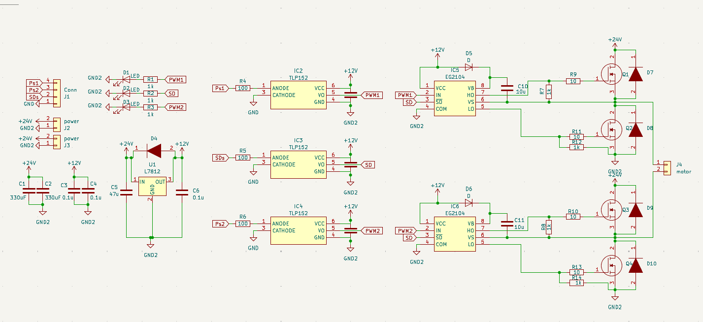
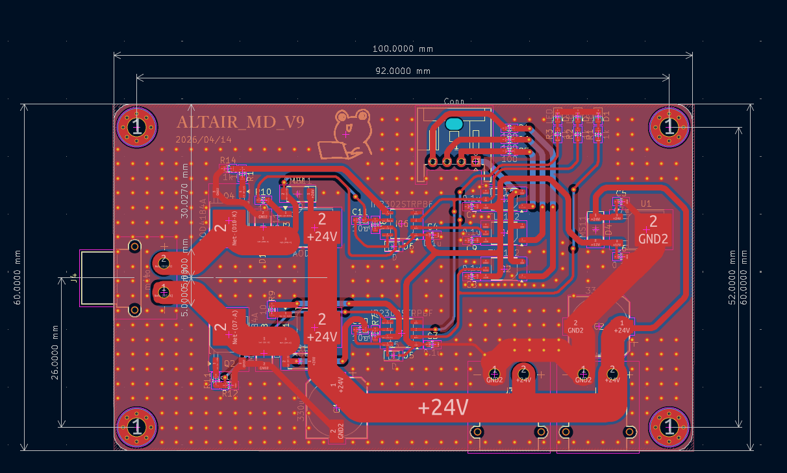
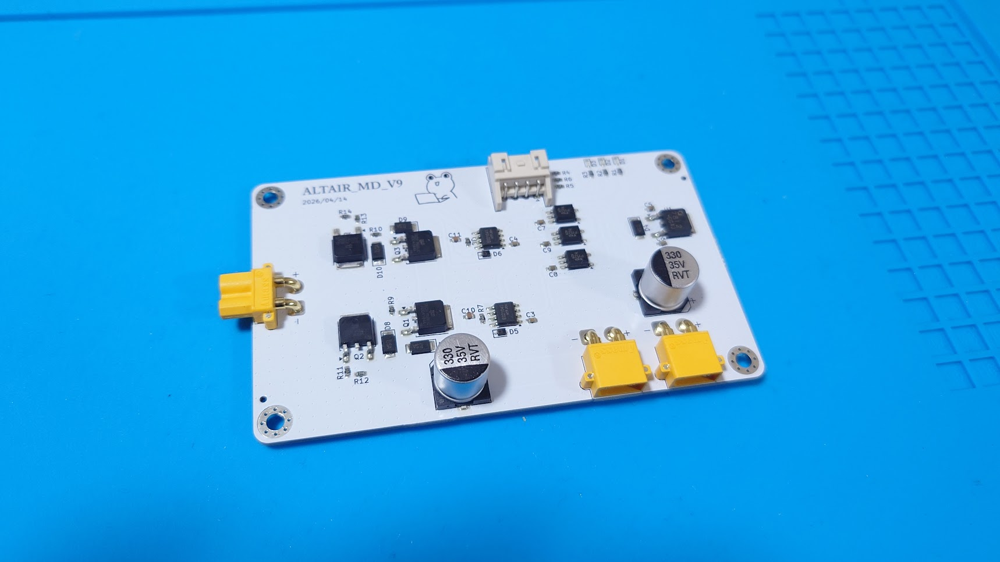

# AltairMD_V8 (High Current H-Bridge Motor Driver)

`AltairMD_V8` は、小型かつ高出力なモーター制御を目的とした、MOSFET方式のHブリッジモータードライバーです。

V7の回路に非常に近いです．

https://github.com/Altairu/AltairMD_V7

## 🛠 主な仕様

* **MOSFET:** AOD4184A (N-channel, 40V / 50A)
* **Gate Driver:** EG2104 (Half-bridge driver with SD input)
* **Logic Voltage:** 3.3V / 5V 互換
* **Motor Voltage:** 12V 〜 30V (推奨)
* **Interface:** PWM (Speed Control) + DIR (Direction Control)

## ⚡ 特徴と設計のポイント

### 1. パワフルなスイッチング

AOD4184Aを採用することで、低オン抵抗（標準 $7.0\text{m}\Omega$）を実現。小型ながら大きな電流を扱える設計になっています。

### 2. EG2104による安定した駆動

EG2104ゲートドライバを搭載することで、ブートストラップ方式によるハイサイドMOSFETの確実な駆動を可能にしています。これにより、24V系でもスイッチング損失を抑えた効率的な動作が可能です。

### 3. PCBレイアウト

大電流パスには太い配線と十分なビアを配置し、D-PAKパッケージの底面から基板への放熱を最適化しています。

## ⚠️ 使用上の注意（重要）

* **最大電流の限界:**
    データシート上の定格は50Aですが、本ボードのサイズ（自然空冷）では**連続5A〜10A程度**を目安に使用してください。15Aを超える連続通電を行う場合は、ヒートシンクの貼り付けやファンによる強制空冷が必須です。
* **ジャンクション温度:**
    内部シリコン温度が **175°C** を超えると素子が破壊されます。高温時はオン抵抗が増大し、さらに発熱が加速する（熱暴走）ため、温度管理に注意してください。
* **デッドタイム:**
    EG2104は内部デッドタイム（約520ns）を保持していますが、高周波PWM駆動時はスイッチング損失による発熱を確認しながら周波数を決定してください。

## 回路 

回路図

PCB

実装後
