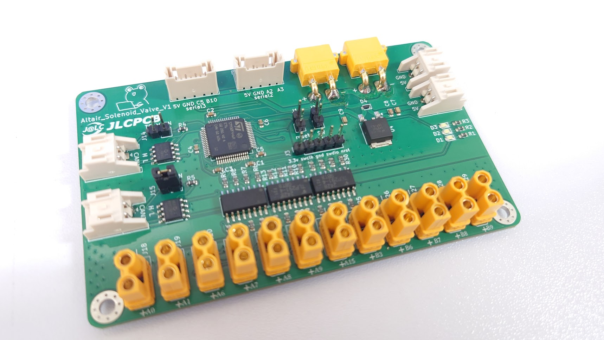
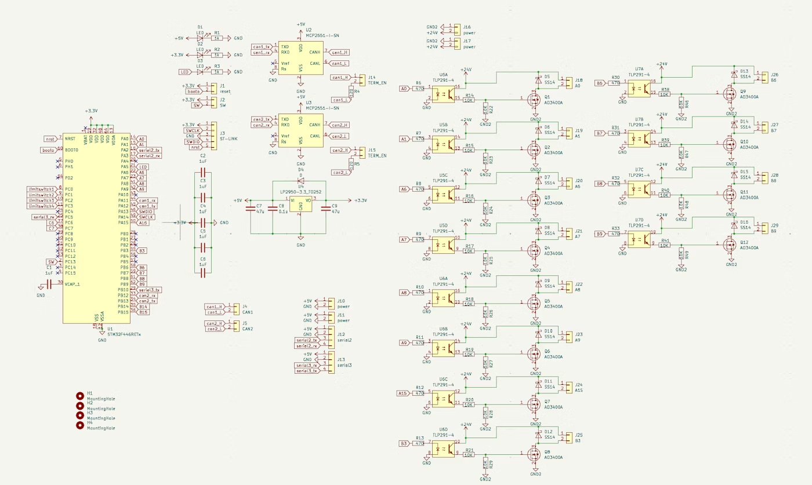
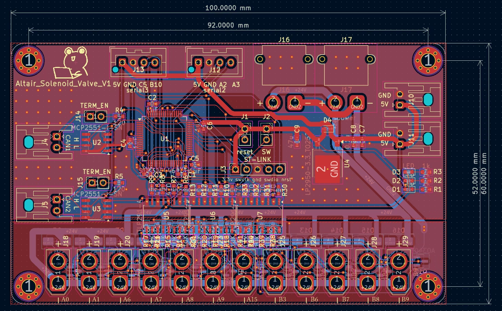

# Altair_solenoid_valve_V1

[Altair_solenoid_valve_V1](https://github.com/Altairu/Altair_solenoid_valve_V1)

* **メインMCU**: STM32F446
* **通信方式**: CAN1 (1 Mbps)
* **駆動ch数**: 最大12ch（GPIO独立制御）
* **主な用途**: エアシリンダや人工筋肉を動かすための電磁弁のON/OFF駆動

## 回路図

## 実態配線図

