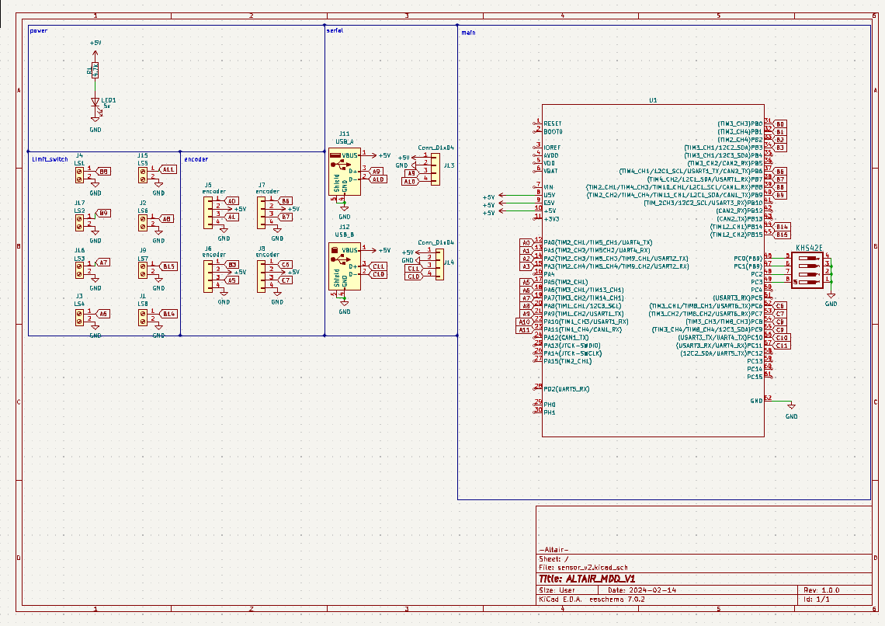
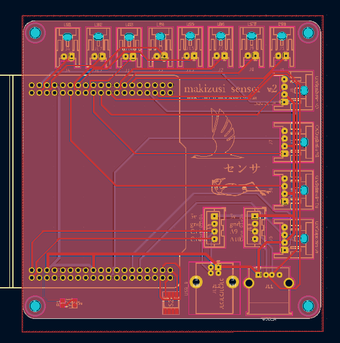

https://github.com/makizusi/-circuit/tree/main
# **センサモジュール**
## PIN配置
リミットスイッチ(8個)

A6,A7,A8,A11,B8,B9,B14,B15 

エンコーダー

E1 A0,A1  

E2 B3,A5 

E3 B6,B7 

E4 C6,C7

MDD同様,マイコンとコネクタの対応するPINを接続
リミットスイッチ8個エンコーダー4個に対応

## sch

## pcb

