# KiCad 環境構築手順

## 1. KiCadのダウンロード
以下の公式サイトからKiCadをダウンロードします。  
[KiCad公式サイト](https://www.kicad.org/)

1. サイトにアクセスし、トップページの「Download」ボタンをクリックします。
   

2. 使用しているOS（Windows, macOS, Linux）に対応したインストーラーを選択します。
   
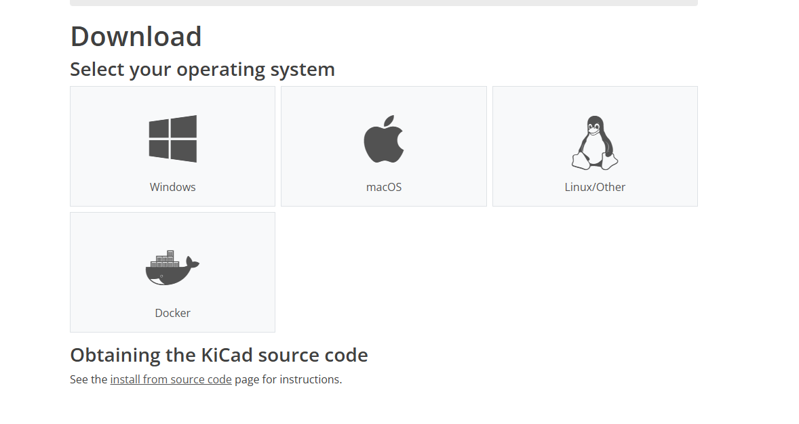

3. Europe CERN - Switzerland　をクリックし、インストーラーをダウンロードします。
   

結構でかい

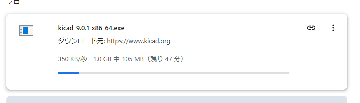

## 2. KiCadのインストール
1. ダウンロードしたインストーラーをダブルクリックして実行します。

   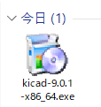

2. インストールウィザードに従い、以下の手順を進めます。
   - 使用許諾契約に同意する。
   - インストール先フォルダを指定する（デフォルトのままで問題ありません）。
   - 必要なコンポーネントを選択する（通常はデフォルト設定でOK）。
   基本的にNextを押す

   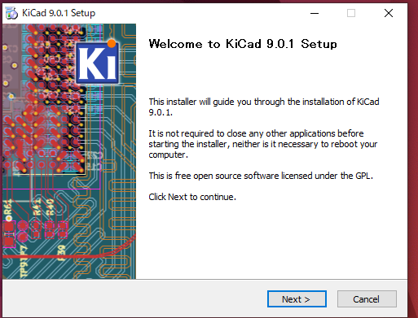

   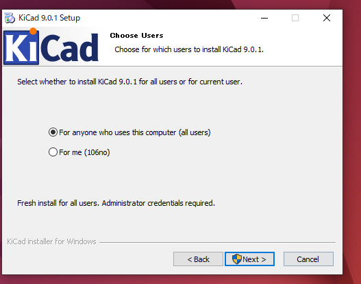

   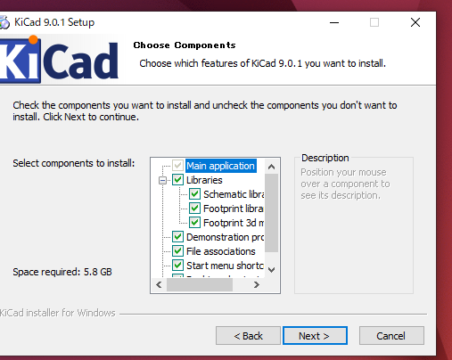

   install

   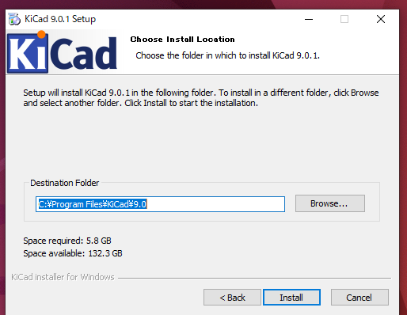

   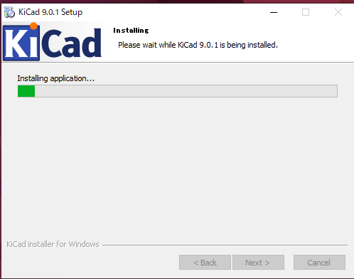

3. インストールが完了したら、「Finish」をクリックします。

   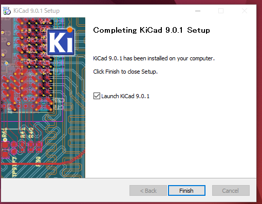

## 3. 初期設定
1. KiCadを起動します。
   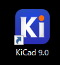

2. 初回起動時に表示される設定ウィザードで、以下を確認・設定します。
   - 言語設定（日本語を選択可能）。
   - ライブラリのパスを確認（デフォルト設定で問題ない場合が多い）。
   - 
  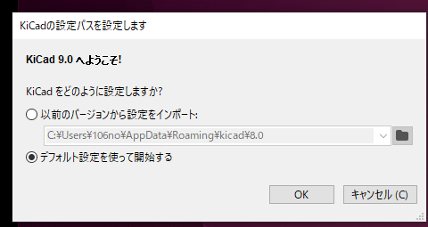

3. 設定が完了したら、メイン画面が表示されます。

??? Note
    著者:Shion Noguchi