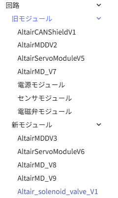
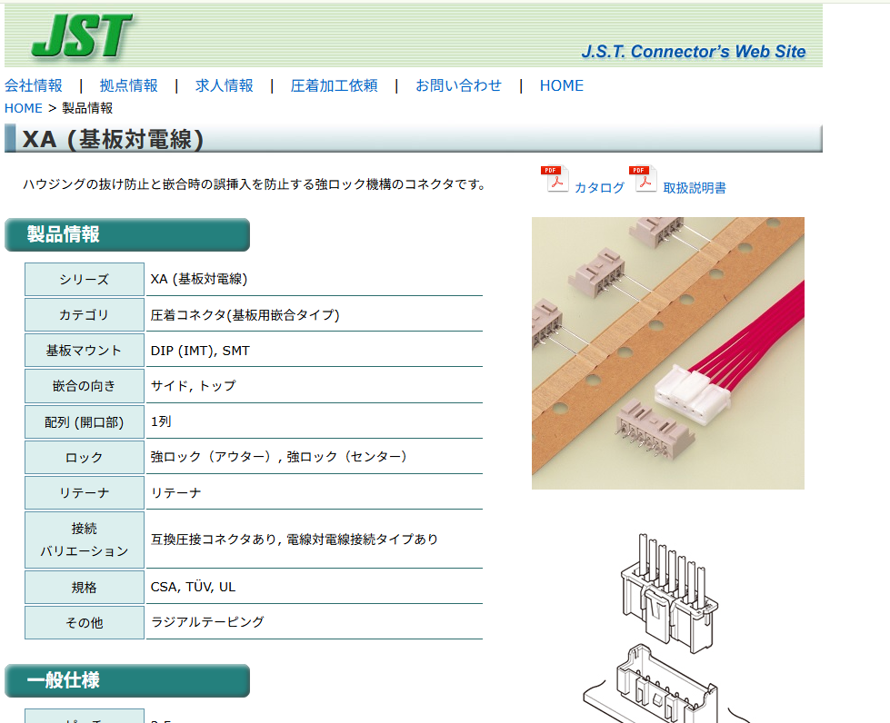
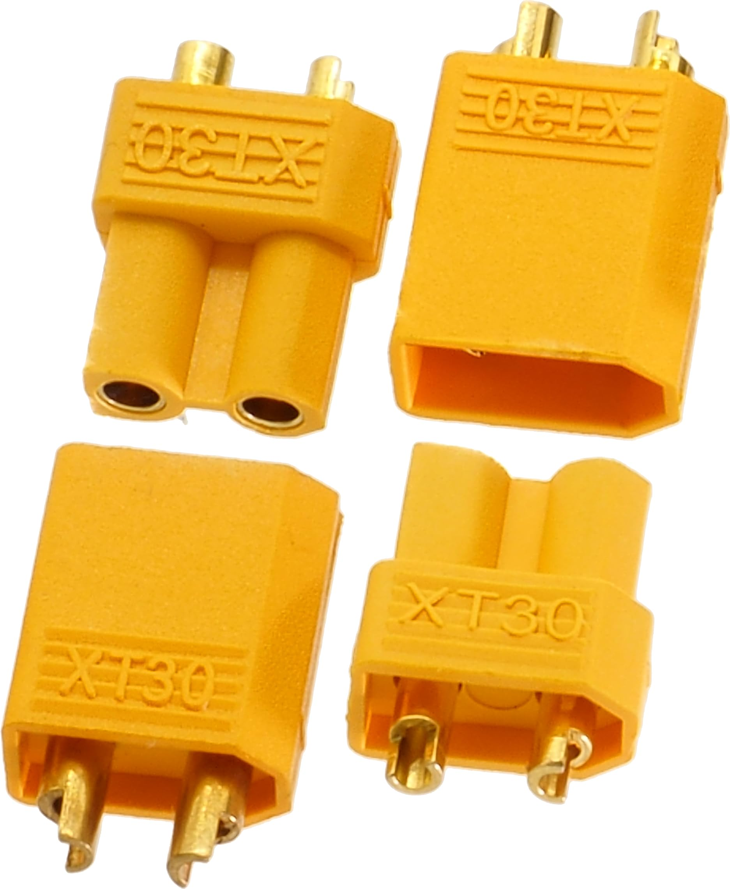
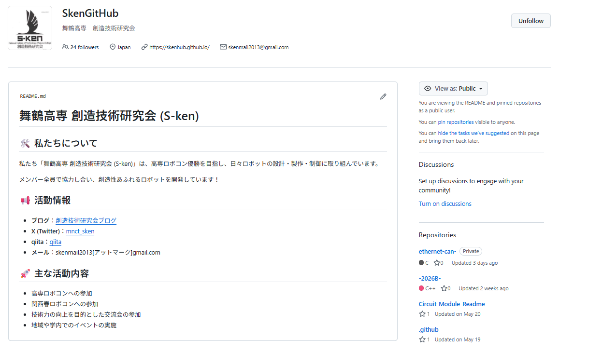

# 電気班になったらやること

## モジュールについて知る
ロボットを自作するとき、モータ、サーボ、電磁弁などのアクチュエータが増えるにつれて、回路を新しくつくのが面倒という問題がありましたがモジュール化によって新たに設計する必要がなくなりました．また，その内部についてもすでに作っておけばプログラムを新たに作る必要はありません．
それぞれの回路についてはwikiの以下を見るとよいでしょう

https://altairu.github.io/sken_training_materials/training_materials/%E8%AC%9B%E7%BF%92%E8%B3%87%E6%96%99/STM32CubeIDE/4/%E3%83%A2%E3%82%B8%E3%83%A5%E3%83%BC%E3%83%AB%E4%BD%BF%E3%81%84%E6%96%B9/

## 配線を作れるようになる
モジュールに使う配線を準備したり，ロボットに実際に配線をつなげたりする作業を行います．
Skenでは2026現在　XT30 XT60 XAコネクタ　を主として使用しています
配線を作る際は大きく，はんだを使うものと圧着するものの２種類があります．

XAコネクタ

XT30　

具体的な配線の作り方については，部室で先輩に自ら聞いて教えてもらおう．

## GitHubの使い方を学ぶ

- https://github.com/SkenHub
- https://github.com/Altairu

毎年のコードや回路，設計図などGitHubに資料として挙げられているので，ぜひ活用しよう
また，自身で開発する際などにバックアップとして活用してみたり，チームで開発するときなどは便利である．

以下のサイトなどが参考になる

- https://altairu.github.io/sken_training_materials/training_materials/%E8%AC%9B%E7%BF%92%E8%B3%87%E6%96%99/github/github1/
- https://zenn.dev/kd_gamegikenblg/articles/b220e23b0b7ef9
- https://qiita.com/yuchi0999/items/477a47dffec98a1611b1

## マイコンの書き込み環境を用意する
Skenでは以下の環境で開発している
上から順に使う機会が多い

- STM32CubeIDE　新モジュールの書き込み　

https://altairu.github.io/sken_training_materials/training_materials/%E8%AC%9B%E7%BF%92%E8%B3%87%E6%96%99/STM32CubeIDE/1/%E7%92%B0%E5%A2%83%E6%A7%8B%E7%AF%89/

- PlatformIO　CANバスなどの書き込み

https://altairu.github.io/sken_training_materials/training_materials/%E8%AC%9B%E7%BF%92%E8%B3%87%E6%96%99/PlatformIO/PlatformIO%E7%92%B0%E5%A2%83%E6%A7%8B%E7%AF%89/PlatformIO%E3%81%AE%E7%92%B0%E5%A2%83%E6%A7%8B%E7%AF%89/

- SW4STM32 旧モジュールの書き込み　Skenライブラリ

https://altairu.github.io/sken_training_materials/training_materials/%E8%AC%9B%E7%BF%92%E8%B3%87%E6%96%99/%E3%83%9E%E3%82%A4%E3%82%B3%E3%83%B3SW/%E3%83%9E%E3%82%A4%E3%82%B3%E3%83%B31/

マイコンに書き込む環境をPCに入れておこう．
特に新モジュールなどでは，プログラムは公開されているのでそれを書き込むだけで動く．

https://github.com/Altairu/Altair_module_system

## 回路設計を学ぶ
基本的にはモジュール化により新たに回路を作る機会は減ったもののそれでも臨機応変に作ることはある．
そこでいつでも仕様を決めて回路設計し，基板切削もしくは発注できるようにする必要がある．
以下で回路設計できるように環境構築し，時間があれば実際に作ってみるとよいだろう．

- 環境構築

https://altairu.github.io/sken_training_materials/training_materials/%E8%AC%9B%E7%BF%92%E8%B3%87%E6%96%99/%E5%9B%9E%E8%B7%AF/%E7%92%B0%E5%A2%83%E6%A7%8B%E7%AF%89/

- 使い方

https://altairu.github.io/sken_training_materials/training_materials/%E8%AC%9B%E7%BF%92%E8%B3%87%E6%96%99/%E5%9B%9E%E8%B7%AF/%E5%9B%9E%E8%B7%AF%E8%AC%9B%E7%BF%920/

## ROS2について学ぶ
ロボコンで無線を使って遠隔操縦したり，自動ロボットなどを使う際に使用する．
また，新モジュールもROS2を用いて開発されているので使いこなせると便利である．

https://github.com/Altairu/altair_framework

ROS2の開発には実際に中古PCなどでいいのでUbunutOSを入れて実機で学習するとよいがWSLなどを利用してもよいだろう．

Ubuntu 22.04 LTSでのROS2 Humble Hawksbillのインストール手順

https://altairu.github.io/sken_training_materials/training_materials/%E8%AC%9B%E7%BF%92%E8%B3%87%E6%96%99/ROS%202/ROS2_%E4%BA%8B%E5%A7%8B/

また，ROSを使ってコードを書くのでC++やPythonなどを随時学習することをお勧めする
(最近はAIがあるのでコード生成はある程度楽になったものの、動かないことや予期せぬエラーなども多発するので、デバッグが重要です)